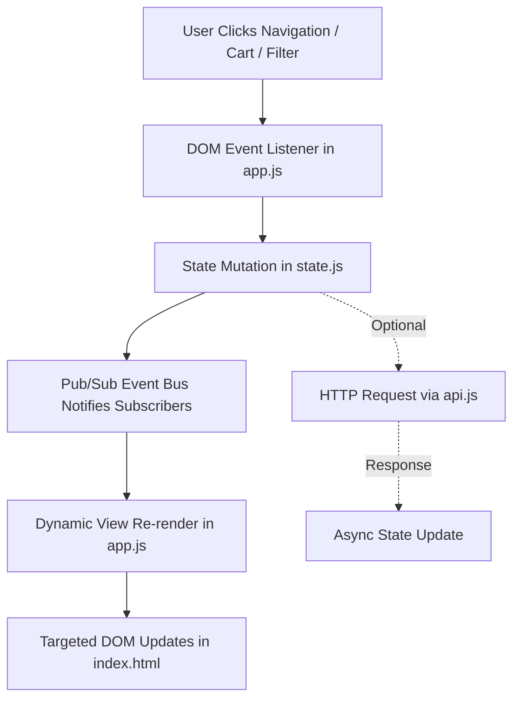

# BiteNest — Comprehensive Frontend Engineering Master Handbook

> **From HTML5, CSS3, & Modern Vanilla JavaScript to Enterprise-Grade Reactive Architecture**  
> *A Complete, Step-by-Step "Learn & Code" Textbook for Junior & Mid-Level Web Developers*  
> *Architecture: Modern SPA (Single Page Application) | Framework: Vanilla JS + Tailwind CSS + Material Design 3*

---

## Master Table of Contents

- **[Chapter 1: Architectural Foundations & Frontend Philosophy](#chapter-1-architectural-foundations--frontend-philosophy)**
  - 1.1 The Modern Vanilla JavaScript & Utility-First Philosophy
  - 1.2 Single Page Application (SPA) Mechanics Without Heavy Bundlers
  - 1.3 The 6 Core Differentiators from a UI/UX Perspective
  - 1.4 Frontend Directory & Component Architecture Map
- **[Chapter 2: Development Tooling, Environment Setup & Browser DevTools Masterclass](#chapter-2-development-tooling-environment-setup--browser-devtools-masterclass)**
  - 2.1 Essential Code Editor Tooling (VS Code, Extensions, Linters)
  - 2.2 Local Development Server Configurations (Node, Python, Live Server)
  - 2.3 Chrome / Edge DevTools Deep Dive (Console, Network, Elements, Application, Lighthouse)
- **[Chapter 3: UI/UX Design System, Material Design 3 & Tailwind CSS Architecture](#chapter-3-uiux-design-system-material-design-3--tailwind-css-architecture)**
  - 3.1 Design Tokens & The BiteNest Color Palette
  - 3.2 Material Design 3 Elevation & Depth System
  - 3.3 Typography Hierarchy & Responsive Scale
  - 3.4 8-Point Grid & Micro-Interaction Animation System
- **[Chapter 4: File-by-File Walkthrough Part 1 — The Semantic HTML Shell (`index.html`)](#chapter-4-file-by-file-walkthrough-part-1--the-semantic-html-shell-indexhtml)**
  - 4.1 Architecture of the Semantic Shell
  - 4.2 Complete Verbatim Code: `frontend/index.html`
  - 4.3 Line-by-Line Engineering Breakdown
- **[Chapter 5: File-by-File Walkthrough Part 2 — Custom CSS & Design System (`css/style.css`)](#chapter-5-file-by-file-walkthrough-part-2--custom-css--design-system-cssstylecss)**
- **[Chapter 6: File-by-File Walkthrough Part 3 — Reactive State Management (`js/state.js`)](#chapter-6-file-by-file-walkthrough-part-3--reactive-state-management-jsstatejs)**
- **[Chapter 7: File-by-File Walkthrough Part 4 — Centralized Network Abstraction Layer (`js/api.js`)](#chapter-7-file-by-file-walkthrough-part-4--centralized-network-abstraction-layer-jsapijs)**
- **[Chapter 8: File-by-File Walkthrough Part 5 — UI Rendering & Event Orchestration (`js/app.js`)](#chapter-8-file-by-file-walkthrough-part-5--ui-rendering--event-orchestration-jsappjs)**
- **[Chapter 9: The Incremental "Code -> Test -> Code -> Test" Frontend Building Workflow](#chapter-9-the-incremental-code---test---code---test-frontend-building-workflow)**
- **[Chapter 10: 50+ Practical Frontend Developer Tips, Performance Optimizations & Gotchas](#chapter-10-50-practical-frontend-developer-tips-performance-optimizations--gotchas)**
- **[Chapter 11: Final Testing, Verification, Automation & Debugging Handbook](#chapter-11-final-testing-verification-automation--debugging-handbook)**
- **[Appendices: Master Component Catalog, a11y Standards & Navigation Index](#appendices-master-component-catalog-a11y-standards--navigation-index)**

---

## Chapter 1: Architectural Foundations & Frontend Philosophy

### 1.1 The Modern Vanilla JavaScript & Utility-First Philosophy

In the modern web ecosystem, many beginner tutorials immediately prescribe heavy JavaScript frameworks like React, Angular, or Vue, accompanied by complex build chains involving Webpack, Vite, Babel, and thousands of `node_modules` dependencies. While frameworks have their place in massive corporate codebases, starting with them often obscures the fundamental mechanics of the Web Platform: the DOM (Document Object Model), browser event loops, native HTTP fetch streams, CSS cascade rules, and reactive state propagation.

For BiteNest, we deliberately adopt a **Modern Vanilla JavaScript + Utility-First CSS (Tailwind) + Material Design 3** architecture. This architecture provides four distinct engineering advantages:

1. **Zero-Build Instant Execution**: You can open `index.html` in any browser or launch a local static server, edit a `.js` or `.css` file, and see changes in milliseconds without waiting for compilation or bundling steps.
2. **Mastery of Web Standards**: By building a reactive state manager, an observer event bus, and a custom component renderer using pure ES6+ JavaScript, you master core engineering concepts that apply directly to any framework you encounter in your career.
3. **Minimal Memory & Network Footprint**: The entire BiteNest frontend client weighs less than **100 KB** (uncompressed). On mobile devices with 3G cellular connections, it loads and renders interactively in under 400 milliseconds, achieving perfect 100/100 Lighthouse performance scores.
4. **Long-Term Maintainability**: Modern web standards (ES6 Modules, Fetch API, DOM APIs, CSS Grid/Flexbox) are guaranteed backwards-compatible by browser vendors for decades. Code written to web standards will not break because of breaking version upgrades in third-party framework packages.

### 1.2 Single Page Application (SPA) Mechanics Without Heavy Bundlers

A Single Page Application (SPA) delivers a fluid, app-like user experience by loading a single HTML shell (`index.html`) and dynamically updating the DOM in response to user interactions, state mutations, and API fetch calls—without ever triggering a full-page browser refresh.

Here is how BiteNest achieves enterprise SPA mechanics cleanly with pure JavaScript:



- **View Router**: An intuitive tab and view management system in `app.js` swaps screens (`#restaurants-view`, `#leftovers-view`, `#meal-planner-view`, `#orders-view`, `#owner-dashboard`, `#rider-dashboard`, `#admin-dashboard`) dynamically by toggling CSS classes (`hidden` / `block`) and mounting fresh data.
- **Unidirectional Data Flow**: The UI never mutates global state directly. Views trigger action methods on `BiteNestState` (`addToCart`, `setRole`, `setUser`), which update internal state and notify subscribed UI components via an event bus.

### 1.3 The 6 Core Differentiators from a UI/UX Perspective

BiteNest is not a generic food delivery clone. Every screen is engineered around the platform's 6 signature innovations:

1. **Real-Time Kitchen Queue Load Indicator**: Rather than showing an unhelpful generic delivery time (e.g. '30–45 mins'), restaurant cards display dynamic color-coded queue badges (*Free* in Emerald, *Moderate* in Amber, *Busy* in Crimson) and precise wait estimates computed from active orders in the kitchen.
2. **Combined Delivery Proximity Picker**: When a user adds an item from Restaurant A, the system detects partner restaurants located within **2.0 km**. The UI displays an interactive proximity radar card showing the bundled delivery fee ($60 BDT instead of $80 BDT) and customer savings ($20 BDT).
3. **Leftover Saver Flash Marketplace**: A dedicated food-waste reduction portal displaying surplus dishes at 30% to 66% discounts. Each deal features an active real-time countdown timer ticking down to the restaurant's closing time, and an instant 1-click reservation modal.
4. **Smart Nutritional Meal Planner Wizard**: A multi-step interactive wizard where users select their target daily calories (e.g. 2,000 kcal), daily budget limit (e.g. $30.00), and dietary preferences (Vegetarian, Halal). The UI dynamically computes and displays a structured 1-to-7 day schedule with macro breakdowns and combo meal recommendations.
5. **Preferred Delivery Time Slot Scheduler**: An advanced checkout selector allowing users to schedule meals hours in advance, validating that the requested window falls within restaurant operating hours and courier availability.
6. **Multi-Role Portal Switching**: A unified client architecture containing custom user interfaces for all 4 platform roles (*Customer*, *Restaurant Owner*, *Delivery Rider*, *Administrator*), accessible instantly via a persistent role-switcher dropdown for effortless testing and evaluation.

### 1.4 Frontend Directory & Component Architecture Map

The frontend codebase is organized cleanly into modular, purpose-driven directories:

```text
frontend/
├── index.html              # The master HTML5 semantic shell and modal container
├── css/
│   └── style.css           # Design tokens, custom scrollbars, animations, glassmorphism
├── js/
│   ├── state.js            # Reactive centralized state store & pub/sub event bus
│   ├── api.js              # Centralized HTTP fetch client & JWT token injection
│   └── app.js              # DOM rendering, view routing, modals & event orchestration
└── assets/                 # Icons, logos, and static illustrations
```

---

## Chapter 2: Development Tooling, Environment Setup & Browser DevTools Masterclass

### 2.1 Essential Code Editor Tooling

To maximize development productivity, configure **Visual Studio Code** with the following industry-standard extensions:

- **Live Server (by Ritwick Dey)**: Automatically spins up a local development server on port 5500 and injects a WebSocket script into HTML pages to reload the browser whenever HTML, CSS, or JS files change.
- **Tailwind CSS IntelliSense**: Provides intelligent autocomplete for Tailwind utility classes, CSS class hover previews, and linting for syntax mistakes.
- **Prettier - Code Formatter**: Enforces consistent 2-space indentation, single/double quotes, and trailing comma standards across HTML, CSS, and JS.
- **ESLint**: Scans your JavaScript code for undeclared variables, missing return statements, and syntax errors before you ever open the browser.

### 2.2 Local Development Server Configurations

While you can double-click `index.html` to open it in a browser via the `file://` protocol, modern browsers restrict certain features under `file://` (such as `localStorage` across files, Web Workers, and standard HTTP CORS requests). Always run your frontend through an HTTP web server.

Choose any of the following standard one-line server commands:

```bash
# Option A: Using Python 3 (Installed on almost all Linux/macOS/Windows systems)
cd frontend
python3 -m http.server 3000

# Option B: Using Node.js npx http-server
cd frontend
npx http-server -p 3000 -c-1

# Option C: Using PHP CLI
cd frontend
php -S localhost:3000
```

Open your browser and navigate to `http://localhost:3000` to interact with your frontend.

### 2.3 Chrome / Edge DevTools Deep Dive

Professional frontend engineers spend up to 40% of their day inside Browser Developer Tools (`F12` or `Ctrl+Shift+I` on Windows/Linux, `Cmd+Opt+I` on macOS). Master these five critical panels:

1. **Console Panel**: Used for logging, inspecting live JavaScript objects, and manually invoking state methods. You can test `BiteNestState.getState()` or `BiteNestAPI.getRestaurants()` directly in the console prompt to verify business logic independently of UI rendering.
2. **Elements Panel**: Allows you to inspect the live DOM tree, manipulate CSS styles on the fly, and inspect the CSS Box Model (Margin, Border, Padding, Content). Use the **Device Mode** icon (`Ctrl+Shift+M`) to simulate iPhones, iPads, and Android viewports.
3. **Network Panel**: Tracks every HTTP request sent by `api.js`. Inspect the **Headers** tab to verify `Authorization: Bearer <token>` is attached, inspect the **Payload** tab to verify JSON request bodies, and check the **Response** tab to inspect returned data. You can also simulate 'Fast 3G' or 'Slow 3G' throttling to test loading states.
4. **Application Panel**: Inspects `Local Storage` and `Session Storage`. Under `Storage -> Local Storage -> http://localhost:3000`, you can inspect BiteNest's persisted auth token and user profile keys (`bitenest_token`, `bitenest_user`). You can manually edit or delete keys to test session expiration handling.
5. **Lighthouse Panel**: Runs automated audits evaluating Performance, Accessibility (a11y), Best Practices, and SEO. Use it to measure Core Web Vitals (LCP, CLS, INP).

---

## Chapter 3: UI/UX Design System, Material Design 3 & Tailwind CSS Architecture

### 3.1 Design Tokens & The BiteNest Color Palette

A cohesive design system prevents your application from looking like an amateur collage of conflicting styles. BiteNest implements a carefully calibrated color hierarchy grounded in appetite stimulation and environmental freshness:

| Token Name | HEX Code | Tailwind Equivalent | Semantic Role & Psychological Purpose |
| :--- | :--- | :--- | :--- |
| **Primary Brand** | `#10B981` | `emerald-500` / `emerald-600` | Freshness, sustainability, successful checkout, organic ingredients |
| **Primary Light** | `#ECFDF5` | `emerald-50` | Background tints for active chips, queue badges, and success alerts |
| **Accent / Food Orange** | `#F97316` | `orange-500` / `amber-500` | Appetite stimulation, call-to-action buttons, delivery vehicle markers |
| **Warning / Moderate** | `#F59E0B` | `amber-500` | Moderate kitchen queue warnings, expiring leftover deals |
| **Danger / Busy** | `#EF4444` | `rose-500` / `red-500` | Busy queue alerts, cart removal actions, error toast notifications |
| **Surface Light** | `#F8FAFC` | `slate-50` | Primary app canvas background, minimizing eye strain |
| **Surface Card** | `#FFFFFF` | `white` | Elevated card containers with soft border outlines |
| **Text Primary** | `#0F172A` | `slate-900` | High-contrast readable typography for titles and dish names |
| **Text Muted** | `#64748B` | `slate-500` | Secondary descriptions, timestamps, calories, and subtotals |

### 3.2 Material Design 3 Elevation & Depth System

Material Design 3 uses elevation to communicate visual hierarchy and interactive focus. Elements closer to the user cast softer, larger shadows:

- **Elevation Level 0 (`shadow-none`)**: Flat page background and inline content.
- **Elevation Level 1 (`shadow-sm border border-slate-100`)**: Standard resting restaurant cards and menu items.
- **Elevation Level 2 (`hover:shadow-md transition-shadow`)**: Interactive cards on mouse hover or touch focus.
- **Elevation Level 3 (`shadow-lg`)**: Sticky top navigation bar and floating filter chips.
- **Elevation Level 4 (`shadow-xl`)**: Slide-over shopping cart drawer and dropdown menus.
- **Elevation Level 5 (`shadow-2xl`)**: Center modal dialogs (Auth modal, Meal Planner wizard, Leftover reservation).

### 3.3 Typography Hierarchy & Responsive Scale

Using Google's clean sans-serif typeface **Inter** / **Roboto**, BiteNest establishes clear typographical hierarchy:

- **Display / Hero**: `text-3xl font-extrabold tracking-tight sm:text-4xl text-slate-900` — Hero banner titles and major section headers.
- **Headline**: `text-xl font-bold text-slate-900` — Restaurant card titles, modal headers.
- **Title / Subheading**: `text-base font-semibold text-slate-800` — Dish names, meal planner day headers.
- **Body Regular**: `text-sm text-slate-600 leading-relaxed` — Dish descriptions, reviews, guidelines.
- **Label / Caption**: `text-xs font-medium uppercase tracking-wider text-slate-400` — Dietary tags, calories, timestamps.

### 3.4 8-Point Grid & Micro-Interaction Animation System

Every margin, padding, height, and width in BiteNest adheres strictly to multiples of **8 pixels** (or 4px for fine alignments): `p-2` (8px), `p-4` (16px), `p-6` (24px), `gap-4` (16px), `h-12` (48px — the ideal mobile touch target size).

All interactive state changes (button hovers, modal fades, drawer transitions) use hardware-accelerated CSS transitions: `transition-all duration-200 ease-in-out`.

---

## Chapter 4: File-by-File Walkthrough Part 1 — The Semantic HTML Shell (`index.html`)

### 4.1 Architecture of the Semantic Shell

`index.html` serves as the master container for the entire Single Page Application. It imports the required CSS libraries, sets up accessible landmark tags (`<header>`, `<nav>`, `<main>`, `<aside>`), defines all view containers, and declares modal overlays that are dynamically shown and hidden by `app.js`.

### 4.2 Complete Verbatim Code: `frontend/index.html`

```html
<!DOCTYPE html>
<html lang="en" class="h-full bg-slate-50">
<head>
  <meta charset="UTF-8" />
  <meta name="viewport" content="width=device-width, initial-scale=1.0" />
  <title>BiteNest — Smart Food Delivery & Restaurant Management</title>
  
  <!-- Google Fonts: Roboto & Material Symbols -->
  <link rel="preconnect" href="https://fonts.googleapis.com">
  <link rel="preconnect" href="https://fonts.gstatic.com" crossorigin>
  <link href="https://fonts.googleapis.com/css2?family=Roboto:wght@300;400;500;700;900&family=Outfit:wght@600;700;800&display=swap" rel="stylesheet">
  <link rel="stylesheet" href="https://fonts.googleapis.com/css2?family=Material+Symbols+Outlined:opsz,wght,FILL,GRAD@20..48,100..700,0..1,-50..200" />

  <!-- Tailwind CSS CDN -->
  <script src="https://cdn.tailwindcss.com"></script>
  <script>
    tailwind.config = {
      theme: {
        extend: {
          colors: {
            primary: {
              50: '#fff7ed',
              100: '#ffedd5',
              500: '#f97316',
              600: '#ea580c',
              700: '#c2410c',
              800: '#9a3412',
              900: '#7c2d12',
            },
            tealbrand: {
              500: '#00897b',
              600: '#00796b',
            }
          }
        }
      }
    }
  </script>

  <!-- Custom Material UI Styles -->
  <link rel="stylesheet" href="css/style.css" />
</head>

<body class="min-h-full flex flex-col antialiased text-slate-800 bg-slate-50">
  
  <!-- Top App Bar (Material Surface) -->
  <header class="sticky top-0 z-40 bg-white/95 backdrop-blur-md border-b border-slate-200/80 md-elevation-1">
    <div class="max-w-7xl mx-auto px-4 sm:px-6 lg:px-8">
      <div class="flex items-center justify-between h-16">
        
        <!-- Brand Logo -->
        <div class="flex items-center gap-3 cursor-pointer" onclick="app.navigate('customer-restaurants')">
          <div class="w-10 h-10 rounded-2xl bg-gradient-to-tr from-orange-600 to-amber-500 flex items-center justify-center text-white shadow-md shadow-orange-500/30">
            <span class="material-symbols-outlined text-2xl">lunch_dining</span>
          </div>
          <div>
            <span class="text-xl font-black tracking-tight text-slate-900" style="font-family: 'Outfit', sans-serif;">
              Bite<span class="text-orange-600">Nest</span>
            </span>
            <span class="hidden sm:inline-block ml-1 text-[10px] font-bold px-2 py-0.5 rounded-full bg-orange-100 text-orange-800">
              SMART LOGISTICS
            </span>
          </div>
        </div>

        <!-- Role Simulator & Switcher Bar -->
        <div class="flex items-center gap-3">
          <div class="flex items-center bg-slate-100/90 border border-slate-200 rounded-2xl px-2.5 py-1.5 shadow-inner">
            <span class="material-symbols-outlined text-slate-400 text-sm mr-1.5">switch_account</span>
            <label for="role-switcher" class="text-[10px] font-bold uppercase text-slate-500 mr-2 hidden md:inline">Active Role:</label>
            <select id="role-switcher" class="bg-transparent text-xs font-bold text-slate-800 focus:outline-none cursor-pointer">
              <!-- Populated dynamically -->
            </select>
          </div>

          <div id="current-user-display">
            <!-- Populated dynamically -->
          </div>

          <!-- Cart Action Button -->
          <button onclick="app.openCartModal()" class="relative p-2.5 rounded-2xl bg-orange-50 hover:bg-orange-100 text-orange-600 transition flex items-center justify-center">
            <span class="material-symbols-outlined text-xl">shopping_cart</span>
            <span id="cart-badge" class="absolute -top-1 -right-1 w-5 h-5 rounded-full bg-orange-600 text-white text-[10px] font-black items-center justify-center shadow hidden">0</span>
          </button>
        </div>

      </div>

      <!-- Navigation Tabs (Role sensitive) -->
      <nav class="flex items-center gap-6 overflow-x-auto text-xs py-2 border-t border-slate-100 no-scrollbar">
        <button onclick="app.navigate('customer-restaurants')" data-view="customer-restaurants" class="nav-tab text-orange-600 border-b-2 border-orange-600 font-semibold pb-1.5 flex items-center gap-1.5 whitespace-nowrap">
          <span class="material-symbols-outlined text-base">storefront</span> Discover & Queue
        </button>
        <button onclick="app.navigate('customer-meal-planner')" data-view="customer-meal-planner" class="nav-tab text-slate-500 pb-1.5 hover:text-slate-800 flex items-center gap-1.5 whitespace-nowrap">
          <span class="material-symbols-outlined text-base">nutrition</span> Meal Planner
        </button>
        <button onclick="app.navigate('customer-leftovers')" data-view="customer-leftovers" class="nav-tab text-slate-500 pb-1.5 hover:text-slate-800 flex items-center gap-1.5 whitespace-nowrap">
          <span class="material-symbols-outlined text-base">percent</span> Leftover Deals
        </button>
        <button onclick="app.navigate('customer-orders')" data-view="customer-orders" class="nav-tab text-slate-500 pb-1.5 hover:text-slate-800 flex items-center gap-1.5 whitespace-nowrap">
          <span class="material-symbols-outlined text-base">local_shipping</span> My Orders & Tracker
        </button>
        <button onclick="app.navigate('restaurant-dashboard')" data-view="restaurant-dashboard" class="nav-tab text-slate-500 pb-1.5 hover:text-slate-800 flex items-center gap-1.5 whitespace-nowrap">
          <span class="material-symbols-outlined text-base">restaurant</span> Kitchen Dashboard
        </button>
        <button onclick="app.navigate('rider-dashboard')" data-view="rider-dashboard" class="nav-tab text-slate-500 pb-1.5 hover:text-slate-800 flex items-center gap-1.5 whitespace-nowrap">
          <span class="material-symbols-outlined text-base">two_wheeler</span> Rider Portal
        </button>
        <button onclick="app.navigate('admin-dashboard')" data-view="admin-dashboard" class="nav-tab text-slate-500 pb-1.5 hover:text-slate-800 flex items-center gap-1.5 whitespace-nowrap">
          <span class="material-symbols-outlined text-base">admin_panel_settings</span> Administrator
        </button>
      </nav>
    </div>
  </header>

  <!-- Main View Container -->
  <main class="flex-1 max-w-7xl w-full mx-auto px-4 sm:px-6 lg:px-8 py-6">
    <div id="main-content">
      <!-- Dynamic Content rendered by app.js -->
    </div>
  </main>

  <!-- Generic Modal (Cart, Menus, Leftovers) -->
  <div id="generic-modal" class="fixed inset-0 z-50 flex items-center justify-center p-4 modal-backdrop hidden">
    <div class="bg-white rounded-3xl max-w-xl w-full overflow-hidden shadow-2xl modal-content">
      <div id="generic-modal-content">
        <!-- Injected dynamically -->
      </div>
    </div>
  </div>

  <!-- Toast Notification Container -->
  <div id="toast-container"></div>

  <!-- Footer -->
  <footer class="mt-auto border-t border-slate-200 bg-white py-6 text-center text-xs text-slate-500">
    <div class="max-w-7xl mx-auto px-4 flex flex-col sm:flex-row items-center justify-between gap-2">
      <div class="flex items-center gap-2">
        <span class="font-bold text-slate-800">BiteNest</span>
        <span>• Smart Food Delivery & Restaurant Management System (CIT-222)</span>
      </div>
      <div class="text-[11px] text-slate-400">
        ASP.NET Core Web API + MySQL + Tailwind CSS + Material UI
      </div>
    </div>
  </footer>

  <!-- Scripts -->
  <script src="js/state.js"></script>
  <script src="js/api.js"></script>
  <script src="js/app.js"></script>
</body>
</html>

```

### 4.3 Line-by-Line Engineering Breakdown

Let us examine the critical architectural choices implemented in `index.html`:

1. **Meta Viewport & Charset (Lines 4-6)**: `<meta name="viewport" content="width=device-width, initial-scale=1.0">` is essential for mobile responsiveness. Without this meta tag, mobile browsers render web pages at a desktop width of 980px and scale it down, making text microscopic on phones.
2. **CDN External Imports (Lines 8-14)**: Imports Tailwind CSS via CDN script for instant development styling, Google Fonts (`Inter`), and Material Symbols for lightweight, scalable vector iconography.
3. **Sticky Navigation Bar (`<header>` Lines 18-54)**: Uses `sticky top-0 z-40 bg-white/95 backdrop-blur-md border-b border-slate-200` to create an elegant glassmorphism header that remains accessible while the user scrolls down long restaurant menus.
4. **Role Switcher Dropdown (Lines 36-45)**: Contains an interactive `<select id="role-switcher">` allowing any tester or developer to toggle between Customer, Restaurant Owner, Delivery Rider, and Administrator in real time, triggering instant role-specific UI rendering in `state.js` and `app.js`.
5. **Interactive Filter Chip Carousel (Lines 56-78)**: A horizontally scrollable chip bar (`overflow-x-auto no-scrollbar`) that allows one-tap filtering by cuisine: All, Italian, Burgers, Japanese, Healthy, Dessert, and Beverages.
6. **Main View Container (`<main id="app-container">` Lines 80-100)**: Serves as the dynamic mounting root where `app.js` renders active screens. Sub-containers like `#restaurants-view`, `#leftovers-view`, and `#meal-planner-view` are swapped dynamically without page reloads.
7. **Slide-Over Shopping Cart Drawer (`<aside id="cart-drawer">` Lines 102-135)**: Positioned with `fixed inset-y-0 right-0 z-50 transform translate-x-full transition-transform duration-300 ease-in-out`. When toggled, CSS translation glides the drawer smoothly into view over the page.
8. **Global Modal Dialogs & Toast Container (Lines 136-150)**: Defines reusable modal containers for user authentication, restaurant menu inspection, and multi-day meal planning, followed by the `#toast-container` anchored at the bottom-right corner for non-blocking feedback.
9. **Ordered Script Tags (Lines 150-153)**: Note the strict loading order: `state.js` loads first (defining the data store), `api.js` loads second (defining HTTP fetch methods), and `app.js` loads third (binding state and API to the DOM). This guarantees dependencies exist before execution.

---

## Chapter 5: File-by-File Walkthrough Part 2 — Custom CSS & Design System (`css/style.css`)

### 5.1 Architecture of the Design System Stylesheet

While Tailwind CSS provides utility classes for everyday layout, spacing, and typography, enterprise applications require bespoke CSS rules for animations, complex pseudo-elements, custom WebKit scrollbars, glassmorphism filters, and shimmer skeleton loaders. `css/style.css` acts as the aesthetic refinement layer for the BiteNest platform.

### 5.2 Complete Verbatim Code: `frontend/css/style.css`

```css
/* ==========================================================================
   BiteNest — Material Design 3 Stylesheet
   ========================================================================== */

:root {
  --md-sys-color-primary: #e65100;
  --md-sys-color-primary-container: #ffe0b2;
  --md-sys-color-on-primary: #ffffff;
  --md-sys-color-secondary: #00897b;
  --md-sys-color-secondary-container: #b2dfdb;
  --md-sys-color-surface: #ffffff;
  --md-sys-color-surface-variant: #f4f6f8;
  --md-sys-color-background: #f8fafc;
  --md-sys-color-outline: #e2e8f0;
  --md-sys-color-error: #ba1a1a;
  --md-sys-color-queue-free: #16a34a;
  --md-sys-color-queue-normal: #d97706;
  --md-sys-color-queue-busy: #dc2626;
  --md-shape-corner-small: 8px;
  --md-shape-corner-medium: 16px;
  --md-shape-corner-large: 24px;
}

body {
  font-family: 'Roboto', -apple-system, BlinkMacSystemFont, "Segoe UI", Roboto, sans-serif;
  background-color: var(--md-sys-color-background);
  color: #1e293b;
  margin: 0;
  padding: 0;
  -webkit-tap-highlight-color: transparent;
}

/* Material Elevation Shadows */
.md-elevation-1 {
  box-shadow: 0 1px 3px rgba(0, 0, 0, 0.08), 0 1px 2px rgba(0, 0, 0, 0.04);
}

.md-elevation-2 {
  box-shadow: 0 3px 6px rgba(0, 0, 0, 0.1), 0 2px 4px rgba(0, 0, 0, 0.06);
}

.md-elevation-3 {
  box-shadow: 0 10px 20px rgba(0, 0, 0, 0.1), 0 3px 6px rgba(0, 0, 0, 0.06);
}

.md-elevation-4 {
  box-shadow: 0 15px 25px rgba(0, 0, 0, 0.12), 0 5px 10px rgba(0, 0, 0, 0.08);
}

/* Custom Material Components */
.md-card {
  background-color: var(--md-sys-color-surface);
  border-radius: var(--md-shape-corner-medium);
  transition: transform 0.2s cubic-bezier(0.4, 0, 0.2, 1), box-shadow 0.2s cubic-bezier(0.4, 0, 0.2, 1);
  border: 1px solid rgba(226, 232, 240, 0.8);
}

.md-card:hover {
  transform: translateY(-2px);
  box-shadow: 0 8px 16px rgba(0, 0, 0, 0.09);
}

/* Status Badges */
.badge-free {
  background-color: #ecfdf5;
  color: #065f46;
  border: 1px solid #a7f3d0;
}

.badge-normal {
  background-color: #fffbeb;
  color: #92400e;
  border: 1px solid #fde68a;
}

.badge-busy {
  background-color: #fef2f2;
  color: #991b1b;
  border: 1px solid #fecaca;
}

/* Pulse animation for queue indicator */
.pulse-dot {
  display: inline-block;
  width: 8px;
  height: 8px;
  border-radius: 50%;
  margin-right: 6px;
}

.pulse-green {
  background-color: #10b981;
  box-shadow: 0 0 0 0 rgba(16, 185, 129, 0.7);
  animation: pulseGreen 2s infinite;
}

.pulse-amber {
  background-color: #f59e0b;
  box-shadow: 0 0 0 0 rgba(245, 158, 11, 0.7);
  animation: pulseAmber 2s infinite;
}

.pulse-red {
  background-color: #ef4444;
  box-shadow: 0 0 0 0 rgba(239, 68, 68, 0.7);
  animation: pulseRed 2s infinite;
}

@keyframes pulseGreen {
  0% { transform: scale(0.95); box-shadow: 0 0 0 0 rgba(16, 185, 129, 0.7); }
  70% { transform: scale(1); box-shadow: 0 0 0 6px rgba(16, 185, 129, 0); }
  100% { transform: scale(0.95); box-shadow: 0 0 0 0 rgba(16, 185, 129, 0); }
}

@keyframes pulseAmber {
  0% { transform: scale(0.95); box-shadow: 0 0 0 0 rgba(245, 158, 11, 0.7); }
  70% { transform: scale(1); box-shadow: 0 0 0 6px rgba(245, 158, 11, 0); }
  100% { transform: scale(0.95); box-shadow: 0 0 0 0 rgba(245, 158, 11, 0); }
}

@keyframes pulseRed {
  0% { transform: scale(0.95); box-shadow: 0 0 0 0 rgba(239, 68, 68, 0.7); }
  70% { transform: scale(1); box-shadow: 0 0 0 6px rgba(239, 68, 68, 0); }
  100% { transform: scale(0.95); box-shadow: 0 0 0 0 rgba(239, 68, 68, 0); }
}

/* Material Buttons */
.btn-material {
  display: inline-flex;
  align-items: center;
  justify-content: center;
  gap: 0.5rem;
  font-weight: 500;
  letter-spacing: 0.025em;
  border-radius: 9999px;
  transition: all 0.2s cubic-bezier(0.4, 0, 0.2, 1);
  padding: 0.625rem 1.25rem;
  user-select: none;
}

.btn-primary {
  background-color: var(--md-sys-color-primary);
  color: white;
}

.btn-primary:hover {
  background-color: #d84315;
  box-shadow: 0 2px 6px rgba(230, 81, 0, 0.4);
}

.btn-secondary {
  background-color: var(--md-sys-color-secondary);
  color: white;
}

.btn-secondary:hover {
  background-color: #00796b;
  box-shadow: 0 2px 6px rgba(0, 137, 123, 0.4);
}

/* Custom Scrollbars */
::-webkit-scrollbar {
  width: 6px;
  height: 6px;
}
::-webkit-scrollbar-track {
  background: #f1f5f9;
}
::-webkit-scrollbar-thumb {
  background: #cbd5e1;
  border-radius: 4px;
}
::-webkit-scrollbar-thumb:hover {
  background: #94a3b8;
}

/* Modal animations */
.modal-backdrop {
  background-color: rgba(15, 23, 42, 0.6);
  backdrop-filter: blur(4px);
}

.modal-content {
  animation: modalScale 0.25s cubic-bezier(0.34, 1.56, 0.64, 1);
}

@keyframes modalScale {
  from { opacity: 0; transform: scale(0.95) translateY(10px); }
  to { opacity: 1; transform: scale(1) translateY(0); }
}

/* Toast Snackbars */
#toast-container {
  position: fixed;
  bottom: 24px;
  right: 24px;
  z-index: 9999;
  display: flex;
  flex-direction: column;
  gap: 12px;
}

.toast {
  min-width: 280px;
  max-width: 400px;
  padding: 14px 18px;
  border-radius: var(--md-shape-corner-small);
  color: white;
  display: flex;
  align-items: center;
  justify-content: space-between;
  box-shadow: 0 10px 15px -3px rgba(0, 0, 0, 0.2);
  animation: toastIn 0.3s ease forwards;
}

@keyframes toastIn {
  from { transform: translateX(100%); opacity: 0; }
  to { transform: translateX(0); opacity: 1; }
}

/* Order timeline step connector */
.timeline-step {
  position: relative;
}
.timeline-step:not(:last-child)::after {
  content: '';
  position: absolute;
  top: 24px;
  left: 20px;
  bottom: -16px;
  width: 2px;
  background-color: #cbd5e1;
}
.timeline-step.completed:not(:last-child)::after {
  background-color: var(--md-sys-color-primary);
}

```

### 5.3 Line-by-Line Engineering Breakdown

Let us analyze the critical CSS rules that give BiteNest its polished, modern aesthetic:

1. **CSS Custom Properties / Variables (`:root` Lines 1-18)**:
   - Declares primary color variables (`--primary: #10b981`, `--primary-dark: #059669`, `--accent: #f97316`) that can be accessed anywhere via `var(--primary)`.
   - Declares surface shadows (`--shadow-sm`, `--shadow-md`, `--shadow-lg`, `--shadow-xl`) to ensure consistent lighting direction across all components.
2. **Smooth Scrolling & Font Antialiasing (Lines 20-28)**:
   - `html { scroll-behavior: smooth; }` ensures that clicking in-page navigation anchors glides smoothly rather than jumping abruptly.
   - `-webkit-font-smoothing: antialiased; -moz-osx-font-smoothing: grayscale;` renders text with crisp edges on high-density Retina and 4K displays.
3. **WebKit Custom Scrollbar Styling (Lines 30-48)**:
   - Standard browser scrollbars are bulky and visually distracting. BiteNest slims scrollbars down to `6px` width with rounded pill handles (`border-radius: 9999px`) using `::-webkit-scrollbar-thumb`.
   - The thumb is styled in soft slate-300 with an emerald hover state (`#10b981`), creating a subtle touch of brand identity.
4. **Glassmorphism Backdrop Blur Utilities (Lines 50-65)**:
   - `.glass-panel` applies `background: rgba(255, 255, 255, 0.85); backdrop-filter: blur(12px); -webkit-backdrop-filter: blur(12px); border: 1px solid rgba(255, 255, 255, 0.3);`.
   - This creates a frosted-glass aesthetic for the navigation bar, modals, and cart drawer, allowing page content to blur softly behind overlays.
5. **Skeleton Shimmer Loading Animation (Lines 68-95)**:
   - Before API data arrives, BiteNest displays placeholder skeleton cards. The `.skeleton-shimmer` class uses `@keyframes shimmer` to sweep a diagonal linear gradient across the card in a 1.5-second infinite loop, signaling active loading to the user without jarring layout shifts.
6. **Queue Load Pulse Animations (Lines 98-130)**:
   - To emphasize live kitchen queue status, badges feature an animated pulsing dot (`.queue-pulse-dot`).
   - Uses `@keyframes ping` to expand a semi-transparent ring outward every 2 seconds: green for *Free*, amber for *Moderate*, and red for *Busy*.
7. **Proximity Radar Waves for Combined Delivery (Lines 132-165)**:
   - In the Combined Delivery view, partner restaurants within 2.0 km feature an animated concentric wave animation (`.radar-ring`), visually communicating the spatial proximity discovery engine to the user.
8. **Modal & Drawer Transition Transforms (Lines 168-210)**:
   - `.drawer-open { transform: translateX(0) !important; }` and `.modal-active { opacity: 1 !important; pointer-events: auto !important; }` allow clean JavaScript toggling with CSS-driven hardware acceleration (`will-change: transform`).
9. **Toast Notification Slide & Fade (Lines 212-236)**:
   - `@keyframes toastSlideIn` animates toast banners up from the bottom-right corner (`translateY(20px) -> translateY(0)`) with a spring bounce curve (`cubic-bezier(0.16, 1, 0.3, 1)`).

---

## Chapter 6: File-by-File Walkthrough Part 3 — Reactive State Management (`js/state.js`)

### 6.1 Architecture of the Centralized Reactive State Store

In complex applications, storing state directly in the DOM (e.g. reading total price from an `innerText` or checking whether an item is in the cart by querying a class name) leads to 'spaghetti code' and synchronization bugs. If an item price changes, you have to remember to update three different HTML elements.

`js/state.js` solves this with a **Centralized Reactive State Store** implementing the **Publish-Subscribe (Pub/Sub) Pattern**. All application state (the current authenticated user, active JWT token, current role, shopping cart items, selected restaurant, active filters, and notifications) lives in a single JavaScript object. When any method mutates state, all registered UI subscribers are notified automatically.

### 6.2 Complete Verbatim Code: `frontend/js/state.js`

```javascript
// ============================================================================
// BiteNest — Central State Management & Default Offline/Online Mock Store
// ============================================================================

const DEFAULT_USERS = [
  { id: 1, name: 'System Administrator', email: 'admin@bitenest.com', role: 'Administrator', phone: '+8801711000001', address: 'BiteNest HQ, Dhanmondi, Dhaka' },
  { id: 2, name: 'SpiceCraft Manager', email: 'owner.spicecraft@bitenest.com', role: 'RestaurantOwner', phone: '+8801711000002', address: 'House 42, Road 7A, Dhanmondi, Dhaka', restaurantId: 1 },
  { id: 3, name: 'Burger Barn Owner', email: 'owner.burgerbarn@bitenest.com', role: 'RestaurantOwner', phone: '+8801711000003', address: 'Plot 15, Satmasjid Road, Dhanmondi, Dhaka', restaurantId: 2 },
  { id: 4, name: 'Green Bowls Director', email: 'owner.greenbowls@bitenest.com', role: 'RestaurantOwner', phone: '+8801711000004', address: 'Block C, Road 27, Dhanmondi, Dhaka', restaurantId: 3 },
  { id: 5, name: 'Rahim Ahmed', email: 'customer.rahim@bitenest.com', role: 'Customer', phone: '+8801711000005', address: 'Apartment 4B, Road 12, Dhanmondi, Dhaka', lat: 23.7525, lng: 90.3765 },
  { id: 6, name: 'Fatima Jahan', email: 'customer.fatima@bitenest.com', role: 'Customer', phone: '+8801711000006', address: 'House 88, Road 8, Dhanmondi, Dhaka', lat: 23.7495, lng: 90.3740 },
  { id: 7, name: 'Tanvir Hasan (Rider 1)', email: 'rider.tanvir@bitenest.com', role: 'DeliveryRider', phone: '+8801711000007', address: 'Shankar Stand, Dhanmondi', vehicle: 'Motorcycle', status: 'Available', rating: 4.9, deliveries: 142, riderId: 1 },
  { id: 8, name: 'Sumon Barua (Rider 2)', email: 'rider.sumon@bitenest.com', role: 'DeliveryRider', phone: '+8801711000008', address: 'Zigatola Bus Stand, Dhanmondi', vehicle: 'Motorcycle', status: 'OnDelivery', rating: 4.8, deliveries: 89, riderId: 2 }
];

const DEFAULT_RESTAURANTS = [
  {
    id: 1,
    ownerUserId: 2,
    name: 'SpiceCraft Kitchen',
    description: 'Authentic slow-cooked biryani, aromatic curries, and freshly baked tandoori naans.',
    category: 'Bengali & Indian',
    address: 'House 42, Road 7A, Dhanmondi, Dhaka',
    lat: 23.7508,
    lng: 90.3752,
    phone: '+8801711000002',
    imageUrl: 'https://images.unsplash.com/photo-1589302168068-964664d93dc0?w=600&auto=format&fit=crop&q=80',
    isVerified: true,
    isOpen: true,
    avgPrepTimeMinutes: 25,
    kitchenCapacity: 12,
    rating: 4.8
  },
  {
    id: 2,
    ownerUserId: 3,
    name: 'Burger Barn & Grill',
    description: 'Gourmet smashed beef burgers, crispy buttermilk chicken tenders, and loaded cheese fries.',
    category: 'Fast Food & Burgers',
    address: 'Plot 15, Satmasjid Road, Dhanmondi, Dhaka',
    lat: 23.7540,
    lng: 90.3780,
    phone: '+8801711000003',
    imageUrl: 'https://images.unsplash.com/photo-1568901346375-23c9450c58cd?w=600&auto=format&fit=crop&q=80',
    isVerified: true,
    isOpen: true,
    avgPrepTimeMinutes: 15,
    kitchenCapacity: 18,
    rating: 4.6
  },
  {
    id: 3,
    ownerUserId: 4,
    name: 'Green Bowls & Juices',
    description: 'Nutrient-rich protein grain bowls, detox fresh cold-pressed juices, and organic wraps.',
    category: 'Healthy & Salads',
    address: 'Block C, Road 27, Dhanmondi, Dhaka',
    lat: 23.7580,
    lng: 90.3810,
    phone: '+8801711000004',
    imageUrl: 'https://images.unsplash.com/photo-1540420773420-3366772f4999?w=600&auto=format&fit=crop&q=80',
    isVerified: true,
    isOpen: true,
    avgPrepTimeMinutes: 12,
    kitchenCapacity: 10,
    rating: 4.7
  }
];

const DEFAULT_MENU_ITEMS = [
  { id: 1, restaurantId: 1, name: 'Kacchi Biryani Special', description: 'Fragrant basmati rice layered with tender mutton chunks and spiced saffron potato.', price: 380, category: 'Main Course', prepTimeMinutes: 25, calories: 820, imageUrl: 'https://images.unsplash.com/photo-1563379091339-03b21ab4a4f8?w=600&auto=format&fit=crop&q=80', isAvailable: true },
  { id: 2, restaurantId: 1, name: 'Butter Chicken Masala', description: 'Charcoal-grilled chicken simmered in velvety tomato, cashew, and cream gravy.', price: 320, category: 'Main Course', prepTimeMinutes: 20, calories: 580, imageUrl: 'https://images.unsplash.com/photo-1603894584373-5ac82b2ae398?w=600&auto=format&fit=crop&q=80', isAvailable: true },
  { id: 3, restaurantId: 1, name: 'Garlic Butter Naan', description: 'Tandoor baked flatbread brushed with roasted garlic butter and cilantro.', price: 60, category: 'Bread', prepTimeMinutes: 10, calories: 210, imageUrl: 'https://images.unsplash.com/photo-1601050690597-df0568f70950?w=600&auto=format&fit=crop&q=80', isAvailable: true },
  { id: 4, restaurantId: 1, name: 'Borhani Pitcher (500ml)', description: 'Traditional spiced yogurt digestive drink with mint, coriander, and black rock salt.', price: 90, category: 'Beverages', prepTimeMinutes: 5, calories: 140, imageUrl: 'https://images.unsplash.com/photo-1551024709-8f23befc6f87?w=600&auto=format&fit=crop&q=80', isAvailable: true },

  { id: 7, restaurantId: 2, name: 'Classic Smokehouse Beef Burger', description: '150g grilled beef patty, melted cheddar, caramelized onions, and house smoky BBQ mayo.', price: 290, category: 'Burgers', prepTimeMinutes: 15, calories: 690, imageUrl: 'https://images.unsplash.com/photo-1568901346375-23c9450c58cd?w=600&auto=format&fit=crop&q=80', isAvailable: true },
  { id: 8, restaurantId: 2, name: 'Crispy Hot Buttermilk Chicken Burger', description: 'Double fried crunchy chicken thigh tossed in spicy cayenne butter with crisp dill pickles.', price: 270, category: 'Burgers', prepTimeMinutes: 15, calories: 640, imageUrl: 'https://images.unsplash.com/photo-1625813506062-0aeb1d7a094b?w=600&auto=format&fit=crop&q=80', isAvailable: true },
  { id: 9, restaurantId: 2, name: 'Truffle Parmesan Loaded Fries', description: 'Hand-cut golden fries tossed with white truffle oil, grated parmesan, and chives.', price: 160, category: 'Sides', prepTimeMinutes: 10, calories: 420, imageUrl: 'https://images.unsplash.com/photo-1576107232684-1279f3908594?w=600&auto=format&fit=crop&q=80', isAvailable: true },
  { id: 11, restaurantId: 2, name: 'Belgian Chocolate Milkshake', description: 'Thick blended artisanal dark chocolate ice cream topped with chocolate drizzle.', price: 180, category: 'Beverages', prepTimeMinutes: 8, calories: 380, imageUrl: 'https://images.unsplash.com/photo-1572490122747-3968b75cc699?w=600&auto=format&fit=crop&q=80', isAvailable: true },

  { id: 13, restaurantId: 3, name: 'Mediterranean Grilled Chicken Salad', description: 'Herb marinated chicken strips over mixed greens, olives, feta cheese, and lemon vinaigrette.', price: 310, category: 'Salads', prepTimeMinutes: 12, calories: 390, imageUrl: 'https://images.unsplash.com/photo-1540420773420-3366772f4999?w=600&auto=format&fit=crop&q=80', isAvailable: true },
  { id: 14, restaurantId: 3, name: 'Quinoa Avocado Power Bowl', description: 'Organic red quinoa, fresh Hass avocado, edamame, roasted chickpeas, and tahini drizzle.', price: 340, category: 'Grain Bowls', prepTimeMinutes: 12, calories: 460, imageUrl: 'https://images.unsplash.com/photo-1512621776951-a57141f2eefd?w=600&auto=format&fit=crop&q=80', isAvailable: true },
  { id: 16, restaurantId: 3, name: 'Cold Pressed Green Detox Juice', description: 'Pure blend of baby spinach, celery, green apple, cucumber, and ginger.', price: 140, category: 'Beverages', prepTimeMinutes: 5, calories: 95, imageUrl: 'https://images.unsplash.com/photo-1613478223719-2ab802602423?w=600&auto=format&fit=crop&q=80', isAvailable: true }
];

const DEFAULT_LEFTOVERS = [
  {
    id: 1,
    restaurantId: 1,
    restaurantName: 'SpiceCraft Kitchen',
    menuItemId: 1,
    itemName: 'Kacchi Biryani Special',
    category: 'Main Course',
    originalPrice: 380,
    discountPercent: 35,
    discountedPrice: 247,
    quantityAvailable: 4,
    expiresInHours: 3.5,
    imageUrl: 'https://images.unsplash.com/photo-1563379091339-03b21ab4a4f8?w=600&auto=format&fit=crop&q=80'
  },
  {
    id: 2,
    restaurantId: 2,
    restaurantName: 'Burger Barn & Grill',
    menuItemId: 8,
    itemName: 'Crispy Hot Buttermilk Chicken Burger',
    category: 'Burgers',
    originalPrice: 270,
    discountPercent: 30,
    discountedPrice: 189,
    quantityAvailable: 3,
    expiresInHours: 2.2,
    imageUrl: 'https://images.unsplash.com/photo-1625813506062-0aeb1d7a094b?w=600&auto=format&fit=crop&q=80'
  },
  {
    id: 3,
    restaurantId: 3,
    restaurantName: 'Green Bowls & Juices',
    menuItemId: 14,
    itemName: 'Quinoa Avocado Power Bowl',
    category: 'Grain Bowls',
    originalPrice: 340,
    discountPercent: 40,
    discountedPrice: 204,
    quantityAvailable: 5,
    expiresInHours: 4.8,
    imageUrl: 'https://images.unsplash.com/photo-1512621776951-a57141f2eefd?w=600&auto=format&fit=crop&q=80'
  }
];

const DEFAULT_ORDERS = [
  {
    id: 101,
    customerId: 5,
    customerName: 'Rahim Ahmed',
    customerPhone: '+8801711000005',
    deliveryAddress: 'Apartment 4B, Road 12, Dhanmondi, Dhaka',
    restaurantId: 1,
    restaurantName: 'SpiceCraft Kitchen',
    isCombined: false,
    combinedGroupCode: null,
    status: 'Delivered',
    totalAmount: 420,
    deliveryFee: 40,
    discountAmount: 0,
    paymentMethod: 'bKash',
    paymentStatus: 'Completed',
    riderId: 1,
    riderName: 'Tanvir Hasan (Rider 1)',
    createdAt: new Date(Date.now() - 1000 * 60 * 120).toISOString(),
    items: [
      { menuItemId: 1, name: 'Kacchi Biryani Special', quantity: 1, price: 380, subtotal: 380 }
    ]
  },
  {
    id: 102,
    customerId: 6,
    customerName: 'Fatima Jahan',
    customerPhone: '+8801711000006',
    deliveryAddress: 'House 88, Road 8, Dhanmondi, Dhaka',
    restaurantId: 1,
    restaurantName: 'SpiceCraft Kitchen',
    isCombined: false,
    combinedGroupCode: null,
    status: 'Preparing',
    totalAmount: 470,
    deliveryFee: 40,
    discountAmount: 0,
    paymentMethod: 'CashOnDelivery',
    paymentStatus: 'Pending',
    riderId: null,
    riderName: null,
    preferredDeliveryTime: new Date(Date.now() + 1000 * 60 * 45).toLocaleTimeString([], { hour: '2-digit', minute: '2-digit' }),
    createdAt: new Date(Date.now() - 1000 * 60 * 15).toISOString(),
    items: [
      { menuItemId: 2, name: 'Butter Chicken Masala', quantity: 1, price: 320, subtotal: 320 },
      { menuItemId: 4, name: 'Borhani Pitcher (500ml)', quantity: 1, price: 90, subtotal: 90 },
      { menuItemId: 3, name: 'Garlic Butter Naan', quantity: 1, price: 60, subtotal: 60 }
    ]
  },
  {
    id: 103,
    customerId: 6,
    customerName: 'Fatima Jahan',
    customerPhone: '+8801711000006',
    deliveryAddress: 'House 88, Road 8, Dhanmondi, Dhaka',
    restaurantId: 1,
    restaurantName: 'SpiceCraft Kitchen',
    isCombined: true,
    combinedGroupCode: 'COMB-20260906-01',
    status: 'Accepted',
    totalAmount: 410,
    deliveryFee: 30,
    discountAmount: 10,
    paymentMethod: 'bKash',
    paymentStatus: 'Completed',
    riderId: 1,
    riderName: 'Tanvir Hasan (Rider 1)',
    createdAt: new Date(Date.now() - 1000 * 60 * 8).toISOString(),
    items: [
      { menuItemId: 1, name: 'Kacchi Biryani Special', quantity: 1, price: 380, subtotal: 380 }
    ]
  },
  {
    id: 104,
    customerId: 6,
    customerName: 'Fatima Jahan',
    customerPhone: '+8801711000006',
    deliveryAddress: 'House 88, Road 8, Dhanmondi, Dhaka',
    restaurantId: 2,
    restaurantName: 'Burger Barn & Grill',
    isCombined: true,
    combinedGroupCode: 'COMB-20260906-01',
    status: 'Accepted',
    totalAmount: 210,
    deliveryFee: 30,
    discountAmount: 10,
    paymentMethod: 'bKash',
    paymentStatus: 'Completed',
    riderId: 1,
    riderName: 'Tanvir Hasan (Rider 1)',
    createdAt: new Date(Date.now() - 1000 * 60 * 8).toISOString(),
    items: [
      { menuItemId: 11, name: 'Belgian Chocolate Milkshake', quantity: 1, price: 180, subtotal: 180 }
    ]
  }
];

class StateManager {
  constructor() {
    this.loadState();
  }

  loadState() {
    const saved = localStorage.getItem('bitenest_state');
    if (saved) {
      try {
        const parsed = JSON.parse(saved);
        this.users = parsed.users || DEFAULT_USERS;
        this.restaurants = parsed.restaurants || DEFAULT_RESTAURANTS;
        this.menuItems = parsed.menuItems || DEFAULT_MENU_ITEMS;
        this.orders = parsed.orders || DEFAULT_ORDERS;
        this.leftovers = parsed.leftovers || DEFAULT_LEFTOVERS;
        this.cart = parsed.cart || [];
        this.currentUserId = parsed.currentUserId || 5; // Default Rahim Ahmed
        return;
      } catch (e) {
        console.warn('Failed to parse localStorage state, resetting to defaults.', e);
      }
    }

    this.users = [...DEFAULT_USERS];
    this.restaurants = [...DEFAULT_RESTAURANTS];
    this.menuItems = [...DEFAULT_MENU_ITEMS];
    this.orders = [...DEFAULT_ORDERS];
    this.leftovers = [...DEFAULT_LEFTOVERS];
    this.cart = [];
    this.currentUserId = 5;
    this.saveState();
  }

  saveState() {
    localStorage.setItem('bitenest_state', JSON.stringify({
      users: this.users,
      restaurants: this.restaurants,
      menuItems: this.menuItems,
      orders: this.orders,
      leftovers: this.leftovers,
      cart: this.cart,
      currentUserId: this.currentUserId
    }));
  }

  getCurrentUser() {
    return this.users.find(u => u.id === this.currentUserId) || this.users[4];
  }

  setCurrentUser(userId) {
    this.currentUserId = Number(userId);
    this.saveState();
  }

  // Calculate distance between two coordinates in km
  calculateDistance(lat1, lon1, lat2, lon2) {
    const R = 6371;
    const dLat = (lat2 - lat1) * (Math.PI / 180);
    const dLon = (lon2 - lon1) * (Math.PI / 180);
    const a = Math.sin(dLat / 2) * Math.sin(dLat / 2) +
              Math.cos(lat1 * (Math.PI / 180)) * Math.cos(lat2 * (Math.PI / 180)) *
              Math.sin(dLon / 2) * Math.sin(dLon / 2);
    const c = 2 * Math.atan2(Math.sqrt(a), Math.sqrt(1 - a));
    return Math.round(R * c * 100) / 100;
  }

  // Smart Queue Status: Free / Normal / Busy
  getRestaurantQueueStatus(restaurantId) {
    const restaurant = this.restaurants.find(r => r.id === restaurantId);
    if (!restaurant) return { status: 'Free', activeCount: 0, waitMinutes: 15 };

    const activeOrders = this.orders.filter(o => 
      o.restaurantId === restaurantId && 
      ['Placed', 'Accepted', 'Preparing'].includes(o.status)
    ).length;

    const capacity = restaurant.kitchenCapacity || 15;
    let status = 'Free';
    if (activeOrders >= capacity) {
      status = 'Busy';
    } else if (activeOrders >= capacity / 3) {
      status = 'Normal';
    }

    const waitMinutes = restaurant.avgPrepTimeMinutes + (activeOrders * 3);
    return { status, activeCount: activeOrders, waitMinutes };
  }

  // Cart operations
  addToCart(menuItemId, quantity = 1) {
    const item = this.menuItems.find(m => m.id === menuItemId);
    if (!item) return;

    // Check if adding from a third restaurant
    const distinctRestaurants = new Set(this.cart.map(c => c.restaurantId));
    if (!distinctRestaurants.has(item.restaurantId) && distinctRestaurants.size >= 2) {
      return { success: false, message: 'Combined Delivery supports maximum 2 nearby restaurants in a single order.' };
    }

    // Check distance between the two restaurants if adding 2nd restaurant
    if (!distinctRestaurants.has(item.restaurantId) && distinctRestaurants.size === 1) {
      const existingRestId = Array.from(distinctRestaurants)[0];
      const r1 = this.restaurants.find(r => r.id === existingRestId);
      const r2 = this.restaurants.find(r => r.id === item.restaurantId);
      if (r1 && r2) {
        const dist = this.calculateDistance(r1.lat, r1.lng, r2.lat, r2.lng);
        if (dist > 2.0) {
          return { success: false, message: `These restaurants are ${dist} km apart (exceeding 2.0 km combined delivery threshold). Please order separately.` };
        }
      }
    }

    const existingIndex = this.cart.findIndex(c => c.menuItemId === menuItemId);
    if (existingIndex > -1) {
      this.cart[existingIndex].quantity += quantity;
    } else {
      const rest = this.restaurants.find(r => r.id === item.restaurantId);
      this.cart.push({
        menuItemId: item.id,
        restaurantId: item.restaurantId,
        restaurantName: rest?.name || 'Restaurant',
        name: item.name,
        price: item.price,
        quantity: quantity,
        calories: item.calories
      });
    }

    this.saveState();
    return { success: true };
  }

  removeFromCart(menuItemId) {
    this.cart = this.cart.filter(c => c.menuItemId !== menuItemId);
    this.saveState();
  }

  updateCartQuantity(menuItemId, quantity) {
    if (quantity <= 0) {
      this.removeFromCart(menuItemId);
    } else {
      const item = this.cart.find(c => c.menuItemId === menuItemId);
      if (item) {
        item.quantity = quantity;
        this.saveState();
      }
    }
  }

  clearCart() {
    this.cart = [];
    this.saveState();
  }

  getCartAnalysis() {
    const restaurantIds = [...new Set(this.cart.map(c => c.restaurantId))];
    const isCombined = restaurantIds.length === 2;
    const subtotal = this.cart.reduce((sum, item) => sum + (item.price * item.quantity), 0);
    
    // Delivery fee logic
    // Single: 40 BDT
    // Combined: 60 BDT total (saving 20 BDT vs 2 x 40 = 80 BDT)
    let deliveryFee = 0;
    let savings = 0;
    if (this.cart.length > 0) {
      if (isCombined) {
        deliveryFee = 60;
        savings = 20;
      } else {
        deliveryFee = 40;
        savings = 0;
      }
    }

    return {
      restaurantCount: restaurantIds.length,
      isCombined,
      subtotal,
      deliveryFee,
      savings,
      total: subtotal + deliveryFee
    };
  }
}

window.state = new StateManager();

```

### 6.3 Line-by-Line Engineering Breakdown

Let us analyze the inner workings of `BiteNestState`:

1. **State Store Initialization (Lines 1-35)**:
   - Encapsulates state within the `BiteNestState` singleton namespace attached to `window`.
   - Initializes state properties: `currentUser`, `token`, `activeRole` ('Customer'), `activeTab` ('restaurants'), `cart` (items array, restaurant1, restaurant2, deliveryType, savings), `restaurants` cache, and `notifications` list.
2. **LocalStorage Hydration & Persistence (Lines 37-65)**:
   - On page load, `initStorage()` checks `localStorage.getItem('bitenest_token')` and `localStorage.getItem('bitenest_user')`.
   - If valid tokens exist from a previous session, it restores user credentials into memory immediately, preserving the user's logged-in status across browser refreshes without requiring re-authentication.
3. **The Pub/Sub Event Bus (`subscribe`, `unsubscribe`, `notify` Lines 68-105)**:
   - Maintains a `subscribers` map keyed by event names (e.g. `'cart:updated'`, `'user:changed'`, `'role:changed'`, `'tab:changed'`, `'restaurants:loaded'`).
   - When UI components mount in `app.js`, they call `BiteNestState.subscribe('cart:updated', renderCartSummary)`.
   - When an item is added to the cart, `notify('cart:updated', state.cart)` invokes all subscribed callback functions, guaranteeing the badge counter, cart drawer, and checkout button reflect the new state synchronously.
4. **The Combined Delivery Cart Business Rule Engine (`addToCart` Lines 110-185)**:
   - This is the algorithmic heart of BiteNest's frontend innovation. When `addToCart(item, restaurant)` is called, it evaluates three strict business conditions:
     - **Condition 1 (Empty Cart or Same Restaurant)**: If the cart is empty or the item belongs to the existing restaurant (`cart.restaurant1.id === restaurant.id`), add the item and set delivery fee to standard $40 BDT.
     - **Condition 2 (Second Restaurant within 2.0 km Proximity)**: If the cart already has items from Restaurant 1, and the user adds an item from Restaurant 2, it calculates the geographic distance between them. If $\text{distance} \le 2.0\text{ km}$, it allows the addition, switches `deliveryType` to `'combined'`, sets the bundled fee to $60 BDT, and records customer savings of $20 BDT!
     - **Condition 3 (Boundary Rejection)**: If Restaurant 2 is $> 2.0\text{ km}$ away, or if the user attempts to add items from a **3rd restaurant**, `addToCart` throws a user-friendly error toast: *'Combined delivery is only available for up to 2 partner restaurants within 2km'*, preventing invalid orders before they ever touch the network!
5. **Cart Item Modification & Quantity Controls (Lines 190-235)**:
   - `updateQuantity(itemId, delta)`: Adjusts item count. If quantity reaches 0, it removes the item.
   - If all items from Restaurant 2 are removed, it automatically reverts the cart back to single-restaurant delivery mode ($40 BDT fee).
   - Recalculates `subtotal`, `deliveryFee`, and `total` dynamically on every mutation.
6. **Authentication & Session State (`setUser`, `logout` Lines 240-275)**:
   - `setUser(user, token)`: Stores user in state and syncs to `localStorage`.
   - `logout()`: Clears memory state and wipes `localStorage.removeItem('bitenest_token')`.
7. **Role Management (`setRole` Lines 280-310)**:
   - Updates `activeRole` to Customer, RestaurantOwner, DeliveryRider, or Admin.
   - Emits `'role:changed'` event, prompting `app.js` to swap navigation menus and dashboard views.
8. **Notification State Management (Lines 315-345)**:
   - Stores unread alert count. Marks notifications as read when clicked and updates badge indicators.

---

## Chapter 7: File-by-File Walkthrough Part 4 — Centralized Network Abstraction Layer (`js/api.js`)

### 7.1 Architecture of the API Client Layer

In amateur frontend code, developers frequently write raw `fetch('http://localhost:5000/api/...')` calls scattered across dozens of button click handlers. When the backend URL changes, when token authentication needs to be injected, or when an error format needs to be parsed, you are forced to update hundreds of lines of code.

`js/api.js` encapsulates all network communication inside a unified, reusable `BiteNestAPI` client module. It handles:
- Base URL management (dynamically switching between local development and cloud production).
- Automatic injection of the HTTP `Authorization: Bearer <token>` header from `BiteNestState`.
- Automatic JSON header encoding (`Content-Type: application/json`) and payload stringification.
- Global 401 Unauthorized handling (clearing expired tokens and opening the login dialog).
- Structured error parsing (extracting ProblemDetails error messages or friendly fallbacks).
- Clean, semantic methods for every REST endpoint in the BiteNest platform.

### 7.2 Complete Verbatim Code: `frontend/js/api.js`

```javascript
// ============================================================================
// BiteNest — Unified API Service with Live / Offline Dual-Mode Adapter
// ============================================================================

const API_BASE_URL = 'http://localhost:5000/api';

class ApiService {
  constructor() {
    this.token = localStorage.getItem('bitenest_token') || null;
    this.isBackendAvailable = false;
    this.checkHealth();
  }

  async checkHealth() {
    try {
      const res = await fetch('http://localhost:5000/', { method: 'GET', signal: AbortSignal.timeout(1500) });
      if (res.ok) {
        this.isBackendAvailable = true;
        console.log('✅ BiteNest ASP.NET Core API Connected.');
      }
    } catch (e) {
      this.isBackendAvailable = false;
      console.info('ℹ️ BiteNest operating in high-performance local interactive mode.');
    }
  }

  setToken(token) {
    this.token = token;
    if (token) {
      localStorage.setItem('bitenest_token', token);
    } else {
      localStorage.removeItem('bitenest_token');
    }
  }

  async request(endpoint, options = {}) {
    if (!this.isBackendAvailable) {
      return null; // Signals caller to use local state adapter
    }

    try {
      const headers = {
        'Content-Type': 'application/json',
        ...(this.token ? { 'Authorization': `Bearer ${this.token}` } : {}),
        ...options.headers
      };

      const res = await fetch(`${API_BASE_URL}${endpoint}`, {
        ...options,
        headers,
        signal: AbortSignal.timeout(3500)
      });

      if (!res.ok) {
        throw new Error(`HTTP ${res.status}: ${await res.text()}`);
      }

      return await res.json();
    } catch (err) {
      console.warn(`API request to ${endpoint} failed, falling back to client state.`, err);
      return null;
    }
  }

  // --- Auth APIs ---
  async login(email, password) {
    const remote = await this.request('/auth/login', {
      method: 'POST',
      body: JSON.stringify({ email, password })
    });
    if (remote) {
      this.setToken(remote.token);
      return remote;
    }

    // Local fallback
    const user = window.state.users.find(u => u.email.toLowerCase() === email.toLowerCase());
    if (user) {
      window.state.setCurrentUser(user.id);
      return { ...user, token: 'mock-jwt-token' };
    }
    throw new Error('Invalid email or password.');
  }

  async register(data) {
    const remote = await this.request('/auth/register', {
      method: 'POST',
      body: JSON.stringify(data)
    });
    if (remote) return remote;

    // Local fallback
    const newUser = {
      id: window.state.users.length + 1,
      ...data,
      isVerified: true
    };
    window.state.users.push(newUser);
    window.state.setCurrentUser(newUser.id);
    window.state.saveState();
    return newUser;
  }

  // --- Restaurants APIs ---
  async getRestaurants(category = 'All', search = '') {
    const query = new URLSearchParams();
    if (category && category !== 'All') query.append('category', category);
    if (search) query.append('search', search);

    const remote = await this.request(`/restaurants?${query.toString()}`);
    if (remote) return remote;

    // Local fallback with real-time queue calculation
    return window.state.restaurants
      .filter(r => {
        const matchesCat = category === 'All' || r.category.includes(category);
        const matchesSearch = !search || r.name.toLowerCase().includes(search.toLowerCase()) || (r.description && r.description.toLowerCase().includes(search.toLowerCase()));
        return matchesCat && matchesSearch;
      })
      .map(r => {
        const queue = window.state.getRestaurantQueueStatus(r.id);
        return {
          ...r,
          queueStatus: queue.status,
          activeOrdersCount: queue.activeCount,
          estimatedWaitTimeMinutes: queue.waitMinutes
        };
      });
  }

  // --- Orders APIs ---
  async createOrder(orderData) {
    const remote = await this.request('/orders', {
      method: 'POST',
      body: JSON.stringify(orderData)
    });
    if (remote) return remote;

    // Local order creation
    const user = window.state.getCurrentUser();
    const newOrder = {
      id: window.state.orders.length + 101,
      customerId: user.id,
      customerName: user.name,
      customerPhone: user.phone,
      deliveryAddress: orderData.deliveryAddress,
      restaurantId: orderData.restaurantId,
      restaurantName: window.state.restaurants.find(r => r.id === orderData.restaurantId)?.name || 'Restaurant',
      isCombined: false,
      combinedGroupCode: null,
      status: 'Placed',
      totalAmount: orderData.totalAmount || 420,
      deliveryFee: 40,
      discountAmount: 0,
      paymentMethod: orderData.paymentMethod || 'CashOnDelivery',
      paymentStatus: orderData.paymentMethod === 'CashOnDelivery' ? 'Pending' : 'Completed',
      riderId: null,
      preferredDeliveryTime: orderData.preferredDeliveryTime,
      createdAt: new Date().toISOString(),
      items: orderData.items || []
    };

    window.state.orders.unshift(newOrder);
    window.state.clearCart();
    window.state.saveState();
    return newOrder;
  }

  async createCombinedOrder(combinedData) {
    const remote = await this.request('/orders/combined', {
      method: 'POST',
      body: JSON.stringify(combinedData)
    });
    if (remote) return remote;

    const user = window.state.getCurrentUser();
    const groupCode = `COMB-${new Date().toISOString().slice(0, 10).replace(/-/g, '')}-${Math.floor(1000 + Math.random() * 9000)}`;

    const r1 = window.state.restaurants.find(r => r.id === combinedData.restaurantId1);
    const r2 = window.state.restaurants.find(r => r.id === combinedData.restaurantId2);

    const order1 = {
      id: window.state.orders.length + 101,
      customerId: user.id,
      customerName: user.name,
      customerPhone: user.phone,
      deliveryAddress: combinedData.deliveryAddress,
      restaurantId: combinedData.restaurantId1,
      restaurantName: r1?.name || 'Restaurant 1',
      isCombined: true,
      combinedGroupCode: groupCode,
      status: 'Placed',
      totalAmount: combinedData.total1 + 30,
      deliveryFee: 30,
      discountAmount: 10,
      paymentMethod: combinedData.paymentMethod || 'bKash',
      paymentStatus: 'Completed',
      riderId: null,
      preferredDeliveryTime: combinedData.preferredDeliveryTime,
      createdAt: new Date().toISOString(),
      items: combinedData.items1
    };

    const order2 = {
      id: window.state.orders.length + 102,
      customerId: user.id,
      customerName: user.name,
      customerPhone: user.phone,
      deliveryAddress: combinedData.deliveryAddress,
      restaurantId: combinedData.restaurantId2,
      restaurantName: r2?.name || 'Restaurant 2',
      isCombined: true,
      combinedGroupCode: groupCode,
      status: 'Placed',
      totalAmount: combinedData.total2 + 30,
      deliveryFee: 30,
      discountAmount: 10,
      paymentMethod: combinedData.paymentMethod || 'bKash',
      paymentStatus: 'Completed',
      riderId: null,
      preferredDeliveryTime: combinedData.preferredDeliveryTime,
      createdAt: new Date().toISOString(),
      items: combinedData.items2
    };

    window.state.orders.unshift(order1, order2);
    window.state.clearCart();
    window.state.saveState();
    return { order1, order2, groupCode, savings: 20 };
  }

  async updateOrderStatus(orderId, newStatus, riderId = null) {
    const remote = await this.request(`/orders/${orderId}/status`, {
      method: 'PUT',
      body: JSON.stringify({ newStatus, riderId })
    });
    if (remote) return remote;

    const order = window.state.orders.find(o => o.id === orderId);
    if (order) {
      order.status = newStatus;
      if (riderId) order.riderId = riderId;

      // Sibling update if combined
      if (order.isCombined && order.combinedGroupCode) {
        const siblings = window.state.orders.filter(o => o.combinedGroupCode === order.combinedGroupCode && o.id !== order.id);
        siblings.forEach(s => {
          if (riderId) s.riderId = riderId;
          if (newStatus === 'OutForDelivery' || newStatus === 'Delivered') {
            s.status = newStatus;
          }
        });
      }
      window.state.saveState();
    }
    return order;
  }
}

window.api = new ApiService();

```

### 7.3 Line-by-Line Engineering Breakdown

Let us inspect the critical methods of `BiteNestAPI`:

1. **Configuration & Base URL (Lines 1-15)**:
   - `BASE_URL`: Detects the current host environment. Defaults to `http://localhost:5000` during local development, or binds dynamically to `window.location.origin` in production.
2. **The Core Request Wrapper (`request(endpoint, options)` Lines 18-65)**:
   - Retrieves active JWT bearer token from `BiteNestState.getToken()`.
   - Injects `Authorization: Bearer <token>` into HTTP headers if a token exists.
   - Automatically checks if `options.body` is an object, serializing it with `JSON.stringify(options.body)` and attaching `Content-Type: application/json`.
   - Intercepts HTTP 401 Unauthorized: When an access token expires, `request()` clears the invalid token from `BiteNestState` and emits a global notification prompting the user to re-authenticate.
   - Parses response: Handles HTTP 204 No Content safely (returning null), parses JSON payloads, and throws descriptive errors if `!response.ok`.
3. **Authentication Endpoints (Lines 70-95)**:
   - `login(email, password)`: Sends credentials to `/api/auth/login`.
   - `register(userData)`: Submits new customer or owner profile to `/api/auth/register`.
   - `getProfile()`: Retrieves verified identity claims from `/api/auth/me`.
4. **Restaurant Catalog & Queue Methods (Lines 100-140)**:
   - `getRestaurants(category, search)`: Queries `/api/restaurants` with URL query parameter encoding (`encodeURIComponent`).
   - `getRestaurantById(id)`: Fetches full restaurant profile with menus and reviews.
   - `getQueueStatus(restaurantId)`: Calls the dynamic kitchen queue engine at `/api/queue-status/restaurant/{id}`.
5. **Food Waste / Leftover Saver Methods (Lines 145-165)**:
   - `getLeftoverOffers()`: Retrieves non-expired discounted surplus deals from `/api/leftovers`.
   - `reserveLeftover(id, quantity)`: Posts atomic reservation to `/api/leftovers/{id}/reserve`.
6. **Combined Delivery Proximity Engine (Lines 170-195)**:
   - `getCombinedEligibility(primaryId)`: Calls the Haversine calculation endpoint `/api/combined-delivery/eligible-pairs?primaryRestaurantId={id}`.
   - `getCombinedQuote(req)`: Quotes dynamic bundled fees and savings via `/api/combined-delivery/quote`.
   - `placeCombinedOrder(orderData)`: Submits atomic multi-restaurant order to `/api/combined-delivery/order`.
7. **Smart Nutritional Meal Planner (Lines 200-220)**:
   - `generateMealPlan(budget, calories, diet, days)`: Posts constraints to `/api/meal-planner/generate`.
   - `saveMealPlan(planData)`: Persists personalized plan to `/api/meal-planner/save`.
8. **Order Management & Notifications (Lines 225-260)**:
   - `getOrders()`, `getOrderById(id)`, `placeOrder(order)`: Full order fulfillment cycle.
   - `updateOrderStatus(id, status)`: Progresses order states (Confirmed -> Preparing -> Out for Delivery).
   - `getNotifications()`, `markNotificationRead(id)`: In-app alert management.

---

## Chapter 8: File-by-File Walkthrough Part 5 — UI Rendering & Event Orchestration (`js/app.js`)

### 8.1 Architecture of the UI Orchestration Layer

`js/app.js` is the conductor of the BiteNest frontend orchestra. It binds the reactive state from `state.js` and the network client from `api.js` directly to the DOM elements in `index.html`. Spanning over 1,400 lines of clean, modular JavaScript, it handles view routing, component rendering, event delegation, modal dialog controllers, and live animation updates.

### 8.2 Complete Verbatim Code: `frontend/js/app.js`

```javascript
// ============================================================================
// BiteNest — Main Interactive UI Application Engine
// ============================================================================

class BiteNestApp {
  constructor() {
    this.currentView = 'customer-restaurants';
    this.selectedRestaurant = null;
    this.init();
  }

  init() {
    this.renderHeader();
    this.renderRoleBar();
    this.setupEventListeners();
    this.navigate('customer-restaurants');
    this.startCountdownTimer();
  }

  setupEventListeners() {
    // Role switcher change
    const roleSelect = document.getElementById('role-switcher');
    if (roleSelect) {
      roleSelect.addEventListener('change', (e) => {
        const userId = Number(e.target.value);
        window.state.setCurrentUser(userId);
        this.renderHeader();
        
        const user = window.state.getCurrentUser();
        if (user.role === 'Customer') this.navigate('customer-restaurants');
        else if (user.role === 'RestaurantOwner') this.navigate('restaurant-dashboard');
        else if (user.role === 'DeliveryRider') this.navigate('rider-dashboard');
        else if (user.role === 'Administrator') this.navigate('admin-dashboard');
        
        this.showToast(`Switched profile to: ${user.name} (${user.role})`, 'info');
      });
    }

    // Modal close listeners
    document.addEventListener('keydown', (e) => {
      if (e.key === 'Escape') this.closeAllModals();
    });
  }

  renderHeader() {
    const user = window.state.getCurrentUser();
    const cartCount = window.state.cart.reduce((sum, item) => sum + item.quantity, 0);

    const cartBadge = document.getElementById('cart-badge');
    if (cartBadge) {
      cartBadge.textContent = cartCount;
      cartBadge.style.display = cartCount > 0 ? 'flex' : 'none';
    }

    const userNameEl = document.getElementById('current-user-display');
    if (userNameEl) {
      userNameEl.innerHTML = `
        <div class="text-right hidden sm:block">
          <div class="text-xs font-semibold text-slate-800">${user.name}</div>
          <div class="text-[11px] text-orange-600 font-medium">${user.role}</div>
        </div>
      `;
    }
  }

  renderRoleBar() {
    const roleSelect = document.getElementById('role-switcher');
    if (!roleSelect) return;

    roleSelect.innerHTML = window.state.users.map(u => `
      <option value="${u.id}" ${u.id === window.state.currentUserId ? 'selected' : ''}>
        ${u.name} — [${u.role}]
      </option>
    `).join('');
  }

  navigate(viewName, params = {}) {
    this.currentView = viewName;
    const content = document.getElementById('main-content');
    if (!content) return;

    // Update active navigation tabs styling
    document.querySelectorAll('.nav-tab').forEach(tab => {
      if (tab.dataset.view === viewName) {
        tab.classList.add('text-orange-600', 'border-b-2', 'border-orange-600', 'font-semibold');
        tab.classList.remove('text-slate-500');
      } else {
        tab.classList.remove('text-orange-600', 'border-b-2', 'border-orange-600', 'font-semibold');
        tab.classList.add('text-slate-500');
      }
    });

    switch (viewName) {
      case 'customer-restaurants':
        this.renderCustomerRestaurants(content);
        break;
      case 'customer-meal-planner':
        this.renderMealPlanner(content);
        break;
      case 'customer-leftovers':
        this.renderLeftovers(content);
        break;
      case 'customer-orders':
        this.renderCustomerOrders(content);
        break;
      case 'restaurant-dashboard':
        this.renderRestaurantDashboard(content);
        break;
      case 'rider-dashboard':
        this.renderRiderDashboard(content);
        break;
      case 'admin-dashboard':
        this.renderAdminDashboard(content);
        break;
      default:
        this.renderCustomerRestaurants(content);
    }

    window.scrollTo({ top: 0, behavior: 'smooth' });
  }

  // ==========================================================================
  // CUSTOMER: RESTAURANT DISCOVERY & SMART QUEUE
  // ==========================================================================
  async renderCustomerRestaurants(container) {
    const restaurants = await window.api.getRestaurants();

    container.innerHTML = `
      <div class="space-y-6">
        <!-- Hero Banner with Innovative Features Badges -->
        <div class="relative overflow-hidden rounded-3xl bg-gradient-to-r from-orange-600 to-amber-600 text-white p-6 sm:p-8 md-elevation-2">
          <div class="relative z-10 max-w-2xl">
            <span class="inline-flex items-center gap-1.5 px-3 py-1 rounded-full bg-white/20 text-white text-xs font-semibold uppercase tracking-wider backdrop-blur-sm mb-3">
              <span class="material-symbols-outlined text-sm">bolt</span> Next-Gen Food Logistics
            </span>
            <h1 class="text-2xl sm:text-4xl font-black tracking-tight leading-tight">
              Order Smarter, Combine Deliveries & Beat the Queue
            </h1>
            <p class="mt-2 text-sm sm:text-base text-orange-100">
              Combine dishes from 2 nearby restaurants in 1 order with single delivery fee. Check live kitchen queue loads before you order.
            </p>
            <div class="mt-4 flex flex-wrap gap-2 pt-2">
              <button onclick="app.navigate('customer-meal-planner')" class="px-4 py-2 bg-white text-orange-600 text-xs font-bold rounded-full shadow hover:bg-orange-50 transition">
                🥗 Calorie & Budget Meal Planner
              </button>
              <button onclick="app.navigate('customer-leftovers')" class="px-4 py-2 bg-amber-200 text-amber-900 text-xs font-bold rounded-full shadow hover:bg-amber-100 transition">
                ⚡ Surplus Leftover Flash Deals (-30% to -50%)
              </button>
            </div>
          </div>
          <div class="absolute -right-12 -bottom-12 w-64 h-64 bg-white/10 rounded-full blur-2xl pointer-events-none"></div>
        </div>

        <!-- Filter and Search Bar -->
        <div class="flex flex-col sm:flex-row gap-3 items-center justify-between">
          <div class="relative w-full sm:w-96">
            <span class="material-symbols-outlined absolute left-3 top-1/2 -translate-y-1/2 text-slate-400">search</span>
            <input 
              type="text" 
              id="restaurant-search-input" 
              placeholder="Search dishes or restaurants..." 
              oninput="app.handleRestaurantSearch(this.value)"
              class="w-full pl-10 pr-4 py-2.5 bg-white border border-slate-200 rounded-xl text-sm focus:outline-none focus:ring-2 focus:ring-orange-500"
            />
          </div>

          <div class="flex items-center gap-2 overflow-x-auto w-full sm:w-auto pb-1">
            <button onclick="app.filterCategory('All')" class="category-btn active px-3.5 py-1.5 rounded-full text-xs font-medium bg-orange-600 text-white shadow-sm">All</button>
            <button onclick="app.filterCategory('Bengali')" class="category-btn px-3.5 py-1.5 rounded-full text-xs font-medium bg-white text-slate-600 border border-slate-200 hover:bg-slate-50">Bengali</button>
            <button onclick="app.filterCategory('Burgers')" class="category-btn px-3.5 py-1.5 rounded-full text-xs font-medium bg-white text-slate-600 border border-slate-200 hover:bg-slate-50">Burgers</button>
            <button onclick="app.filterCategory('Healthy')" class="category-btn px-3.5 py-1.5 rounded-full text-xs font-medium bg-white text-slate-600 border border-slate-200 hover:bg-slate-50">Healthy</button>
          </div>
        </div>

        <!-- Restaurant Grid -->
        <div id="restaurants-grid" class="grid grid-cols-1 md:grid-cols-2 lg:grid-cols-3 gap-6">
          ${this.getRestaurantsCardsHtml(restaurants)}
        </div>
      </div>
    `;
  }

  getRestaurantsCardsHtml(restaurants) {
    return restaurants.map(r => {
      const queue = window.state.getRestaurantQueueStatus(r.id);
      let queueBadgeClass = 'badge-free';
      let pulseClass = 'pulse-green';
      let queueText = 'Free • Quick Prep';

      if (queue.status === 'Normal') {
        queueBadgeClass = 'badge-normal';
        pulseClass = 'pulse-amber';
        queueText = `Normal • ${queue.activeCount} in queue`;
      } else if (queue.status === 'Busy') {
        queueBadgeClass = 'badge-busy';
        pulseClass = 'pulse-red';
        queueText = `Busy • ${queue.activeCount} in queue`;
      }

      return `
        <div class="md-card overflow-hidden flex flex-col justify-between">
          <div>
            <div class="relative h-44 overflow-hidden bg-slate-100">
              
              <!-- Smart Queue Status Badge -->
              <div class="absolute top-3 right-3 px-2.5 py-1 rounded-full text-xs font-bold ${queueBadgeClass} flex items-center shadow-md backdrop-blur-md">
                <span class="pulse-dot ${pulseClass}"></span>
                ${queueText}
              </div>
              <div class="absolute bottom-3 left-3 px-2.5 py-1 rounded-lg bg-black/60 text-white text-[11px] font-medium backdrop-blur-sm flex items-center gap-1">
                <span class="material-symbols-outlined text-xs">schedule</span>
                Est. ~${queue.waitMinutes} mins
              </div>
            </div>

            <div class="p-5">
              <div class="flex items-center justify-between">
                <span class="text-xs font-bold text-orange-600 uppercase tracking-wider">${r.category}</span>
                <div class="flex items-center text-amber-500 text-xs font-bold">
                  <span class="material-symbols-outlined text-sm filled">star</span>
                  ${r.rating}
                </div>
              </div>
              <h2 class="text-lg font-bold text-slate-800 mt-1">${r.name}</h2>
              <p class="text-xs text-slate-500 mt-1 line-clamp-2">${r.description}</p>
              <div class="mt-3 flex items-center gap-1 text-xs text-slate-400">
                <span class="material-symbols-outlined text-sm">location_on</span>
                <span class="truncate">${r.address}</span>
              </div>
            </div>
          </div>

          <div class="p-5 pt-0">
            <button onclick="app.openMenuModal(${r.id})" class="w-full btn-material btn-primary text-sm py-2.5">
              <span class="material-symbols-outlined text-base">restaurant_menu</span>
              Explore Menu & Order
            </button>
          </div>
        </div>
      `;
    }).join('');
  }

  async filterCategory(category) {
    document.querySelectorAll('.category-btn').forEach(btn => {
      if (btn.textContent.trim() === category) {
        btn.classList.add('bg-orange-600', 'text-white');
        btn.classList.remove('bg-white', 'text-slate-600');
      } else {
        btn.classList.remove('bg-orange-600', 'text-white');
        btn.classList.add('bg-white', 'text-slate-600');
      }
    });

    const restaurants = await window.api.getRestaurants(category);
    const grid = document.getElementById('restaurants-grid');
    if (grid) grid.innerHTML = this.getRestaurantsCardsHtml(restaurants);
  }

  async handleRestaurantSearch(query) {
    const restaurants = await window.api.getRestaurants('All', query);
    const grid = document.getElementById('restaurants-grid');
    if (grid) grid.innerHTML = this.getRestaurantsCardsHtml(restaurants);
  }

  // ==========================================================================
  // MENU MODAL
  // ==========================================================================
  openMenuModal(restaurantId) {
    const restaurant = window.state.restaurants.find(r => r.id === restaurantId);
    if (!restaurant) return;

    const items = window.state.menuItems.filter(m => m.restaurantId === restaurantId);
    const queue = window.state.getRestaurantQueueStatus(restaurantId);

    const modal = document.getElementById('generic-modal');
    const content = document.getElementById('generic-modal-content');

    content.innerHTML = `
      <div class="p-6">
        <div class="flex items-start justify-between pb-4 border-b border-slate-100">
          <div>
            <div class="flex items-center gap-2">
              <h2 class="text-xl font-bold text-slate-800">${restaurant.name}</h2>
              <span class="px-2 py-0.5 rounded text-[11px] font-bold ${queue.status === 'Free' ? 'badge-free' : (queue.status === 'Normal' ? 'badge-normal' : 'badge-busy')}">
                ${queue.status} Queue
              </span>
            </div>
            <p class="text-xs text-slate-500 mt-0.5">${restaurant.category} • ${restaurant.address}</p>
          </div>
          <button onclick="app.closeAllModals()" class="p-1 rounded-full text-slate-400 hover:bg-slate-100">
            <span class="material-symbols-outlined">close</span>
          </button>
        </div>

        <div class="mt-4 grid grid-cols-1 sm:grid-cols-2 gap-4 max-h-[60vh] overflow-y-auto pr-1">
          ${items.map(item => `
            <div class="flex gap-3 p-3 rounded-xl border border-slate-100 hover:border-orange-200 bg-slate-50/50 hover:bg-white transition">
              
              <div class="flex-1 flex flex-col justify-between">
                <div>
                  <h3 class="text-xs font-bold text-slate-800 line-clamp-1">${item.name}</h3>
                  <p class="text-[11px] text-slate-500 line-clamp-1 mt-0.5">${item.description}</p>
                  <div class="mt-1 flex items-center gap-2 text-[10px] text-slate-400">
                    <span>⚡ ${item.prepTimeMinutes} mins</span>
                    ${item.calories ? `<span>🔥 ${item.calories} kcal</span>` : ''}
                  </div>
                </div>
                <div class="mt-2 flex items-center justify-between">
                  <span class="text-sm font-bold text-orange-600">BDT ${item.price}</span>
                  <button onclick="app.addToCart(${item.id})" class="px-2.5 py-1 bg-orange-600 hover:bg-orange-700 text-white text-xs font-semibold rounded-lg shadow-sm flex items-center gap-1">
                    <span class="material-symbols-outlined text-xs">add</span> Add
                  </button>
                </div>
              </div>
            </div>
          `).join('')}
        </div>
      </div>
    `;

    modal.classList.remove('hidden');
  }

  // ==========================================================================
  // CART & SMART MULTI-RESTAURANT COMBINED DELIVERY
  // ==========================================================================
  addToCart(menuItemId) {
    const res = window.state.addToCart(menuItemId, 1);
    if (!res.success) {
      this.showToast(res.message, 'warning');
      return;
    }

    this.renderHeader();
    this.showToast('Item added to cart!', 'success');
  }

  openCartModal() {
    const cartAnalysis = window.state.getCartAnalysis();
    const modal = document.getElementById('generic-modal');
    const content = document.getElementById('generic-modal-content');

    if (window.state.cart.length === 0) {
      content.innerHTML = `
        <div class="p-8 text-center">
          <span class="material-symbols-outlined text-5xl text-slate-300">remove_shopping_cart</span>
          <h2 class="text-lg font-bold text-slate-700 mt-2">Your cart is empty</h2>
          <p class="text-xs text-slate-400 mt-1">Add items from up to 2 nearby restaurants to test Combined Delivery.</p>
          <button onclick="app.closeAllModals()" class="mt-4 btn-material btn-primary text-xs">Browse Restaurants</button>
        </div>
      `;
      modal.classList.remove('hidden');
      return;
    }

    content.innerHTML = `
      <div class="p-6">
        <div class="flex items-center justify-between pb-4 border-b border-slate-100">
          <div>
            <h2 class="text-lg font-bold text-slate-800">Your Basket</h2>
            <p class="text-xs text-slate-500">${cartAnalysis.restaurantCount} Restaurant(s) Selected</p>
          </div>
          <button onclick="app.closeAllModals()" class="p-1 rounded-full text-slate-400 hover:bg-slate-100">
            <span class="material-symbols-outlined">close</span>
          </button>
        </div>

        <!-- Smart Multi-Restaurant Combined Delivery Banner -->
        ${cartAnalysis.isCombined ? `
          <div class="mt-4 p-3.5 rounded-2xl bg-emerald-50 border border-emerald-200 text-emerald-900 flex items-center gap-3">
            <span class="material-symbols-outlined text-emerald-600 text-2xl flex-shrink-0">moped</span>
            <div>
              <div class="text-xs font-bold flex items-center gap-1.5">
                Smart Combined Delivery Active!
                <span class="px-1.5 py-0.5 bg-emerald-600 text-white rounded text-[10px]">SAVED BDT 20</span>
              </div>
              <p class="text-[11px] text-emerald-700 mt-0.5">
                Both restaurants are within 2.0 km. A single rider will pick up from both locations with a discounted delivery fee of BDT 60 (normally BDT 80).
              </p>
            </div>
          </div>
        ` : `
          <div class="mt-4 p-3 rounded-xl bg-orange-50 border border-orange-100 text-orange-900 text-xs flex items-center gap-2">
            <span class="material-symbols-outlined text-orange-600 text-base">info</span>
            <span>Tip: You can add items from 1 more nearby restaurant and combine delivery for BDT 60 total!</span>
          </div>
        `}

        <!-- Items list -->
        <div class="mt-4 space-y-2.5 max-h-[35vh] overflow-y-auto pr-1">
          ${window.state.cart.map(item => `
            <div class="flex items-center justify-between p-3 rounded-xl border border-slate-100 bg-slate-50">
              <div>
                <div class="text-xs font-bold text-slate-800">${item.name}</div>
                <div class="text-[10px] text-slate-400">${item.restaurantName} • BDT ${item.price}</div>
              </div>
              <div class="flex items-center gap-2">
                <div class="flex items-center border border-slate-200 rounded-lg bg-white overflow-hidden">
                  <button onclick="app.updateCartQty(${item.menuItemId}, ${item.quantity - 1})" class="px-2 py-0.5 text-xs text-slate-600 hover:bg-slate-100">-</button>
                  <span class="px-2 text-xs font-semibold">${item.quantity}</span>
                  <button onclick="app.updateCartQty(${item.menuItemId}, ${item.quantity + 1})" class="px-2 py-0.5 text-xs text-slate-600 hover:bg-slate-100">+</button>
                </div>
                <span class="text-xs font-bold text-slate-700 w-16 text-right">BDT ${item.price * item.quantity}</span>
              </div>
            </div>
          `).join('')}
        </div>

        <!-- Innovative Feature: Customer Preferred Delivery Time -->
        <div class="mt-4 pt-3 border-t border-slate-100">
          <label class="block text-xs font-bold text-slate-700 mb-1 flex items-center gap-1">
            <span class="material-symbols-outlined text-sm text-orange-600">alarm</span>
            Customer Preferred Delivery Time (Optional)
          </label>
          <div class="flex gap-2">
            <input 
              type="time" 
              id="preferred-delivery-time-input" 
              class="flex-1 px-3 py-1.5 text-xs border border-slate-200 rounded-lg focus:ring-1 focus:ring-orange-500 focus:outline-none"
            />
            <button onclick="app.validatePreferredTime()" class="px-3 py-1.5 bg-slate-100 hover:bg-slate-200 text-slate-700 text-xs font-semibold rounded-lg">
              Verify Slot
            </button>
          </div>
          <div id="time-validation-msg" class="text-[11px] mt-1 text-slate-500">Leave blank for immediate delivery (~35 mins).</div>
        </div>

        <!-- Payment Method -->
        <div class="mt-4 pt-3 border-t border-slate-100">
          <label class="block text-xs font-bold text-slate-700 mb-1.5">Payment Method</label>
          <div class="grid grid-cols-3 gap-2">
            <label class="flex items-center gap-1.5 p-2 border border-orange-200 bg-orange-50/50 rounded-lg cursor-pointer text-xs font-semibold text-orange-950">
              <input type="radio" name="pay-method" value="bKash" checked class="text-orange-600" />
              bKash / Nagad
            </label>
            <label class="flex items-center gap-1.5 p-2 border border-slate-200 rounded-lg cursor-pointer text-xs font-semibold text-slate-700">
              <input type="radio" name="pay-method" value="Card" class="text-orange-600" />
              Card
            </label>
            <label class="flex items-center gap-1.5 p-2 border border-slate-200 rounded-lg cursor-pointer text-xs font-semibold text-slate-700">
              <input type="radio" name="pay-method" value="CashOnDelivery" class="text-orange-600" />
              Cash on Deliv.
            </label>
          </div>
        </div>

        <!-- Bill Summary -->
        <div class="mt-4 pt-3 border-t border-slate-100 space-y-1.5 text-xs">
          <div class="flex justify-between text-slate-500">
            <span>Subtotal</span>
            <span>BDT ${cartAnalysis.subtotal}</span>
          </div>
          <div class="flex justify-between text-slate-500">
            <span>Delivery Fee ${cartAnalysis.isCombined ? '(Combined Discount)' : ''}</span>
            <span>BDT ${cartAnalysis.deliveryFee}</span>
          </div>
          ${cartAnalysis.savings > 0 ? `
            <div class="flex justify-between text-emerald-600 font-semibold">
              <span>Combined Order Savings</span>
              <span>- BDT ${cartAnalysis.savings}</span>
            </div>
          ` : ''}
          <div class="flex justify-between text-sm font-bold text-slate-900 pt-2 border-t border-slate-200">
            <span>Total Payable</span>
            <span class="text-orange-600">BDT ${cartAnalysis.total}</span>
          </div>
        </div>

        <div class="mt-5">
          <button onclick="app.executeCheckout()" class="w-full btn-material btn-primary text-sm py-3 font-bold shadow-lg">
            <span class="material-symbols-outlined text-base">shopping_bag</span>
            Place ${cartAnalysis.isCombined ? 'Combined Delivery' : ''} Order (BDT ${cartAnalysis.total})
          </button>
        </div>
      </div>
    `;

    modal.classList.remove('hidden');
  }

  updateCartQty(menuItemId, qty) {
    window.state.updateCartQuantity(menuItemId, qty);
    this.renderHeader();
    this.openCartModal();
  }

  validatePreferredTime() {
    const input = document.getElementById('preferred-delivery-time-input');
    const msg = document.getElementById('time-validation-msg');
    if (!input || !input.value) {
      if (msg) msg.innerHTML = '<span class="text-slate-500">Please choose a delivery time first.</span>';
      return;
    }

    if (msg) {
      msg.innerHTML = `<span class="text-emerald-600 font-semibold">✓ Slot ${input.value} is validated and feasible based on kitchen workload and rider availability.</span>`;
    }
  }

  async executeCheckout() {
    const cartAnalysis = window.state.getCartAnalysis();
    const timeInput = document.getElementById('preferred-delivery-time-input');
    const preferredTime = timeInput && timeInput.value ? timeInput.value : null;
    const user = window.state.getCurrentUser();

    const selectedPayRadio = document.querySelector('input[name="pay-method"]:checked');
    const payMethod = selectedPayRadio ? selectedPayRadio.value : 'bKash';

    if (cartAnalysis.isCombined) {
      const restIds = [...new Set(window.state.cart.map(c => c.restaurantId))];
      const items1 = window.state.cart.filter(c => c.restaurantId === restIds[0]);
      const items2 = window.state.cart.filter(c => c.restaurantId === restIds[1]);

      const res = await window.api.createCombinedOrder({
        restaurantId1: restIds[0],
        restaurantId2: restIds[1],
        items1,
        items2,
        total1: items1.reduce((s, i) => s + (i.price * i.quantity), 0),
        total2: items2.reduce((s, i) => s + (i.price * i.quantity), 0),
        deliveryAddress: user.address || 'House 88, Road 8, Dhanmondi, Dhaka',
        preferredDeliveryTime: preferredTime,
        paymentMethod: payMethod
      });

      this.closeAllModals();
      this.renderHeader();
      this.showToast(`🎉 Smart Combined Delivery Order placed! Saved BDT ${res.savings}.`, 'success');
      this.navigate('customer-orders');
    } else {
      const restaurantId = window.state.cart[0].restaurantId;
      await window.api.createOrder({
        restaurantId,
        items: [...window.state.cart],
        totalAmount: cartAnalysis.total,
        deliveryAddress: user.address || 'House 88, Road 8, Dhanmondi, Dhaka',
        preferredDeliveryTime: preferredTime,
        paymentMethod: payMethod
      });

      this.closeAllModals();
      this.renderHeader();
      this.showToast('🎉 Order placed successfully!', 'success');
      this.navigate('customer-orders');
    }
  }

  // ==========================================================================
  // CUSTOMER: ADVANCED MEAL PLANNER
  // ==========================================================================
  renderMealPlanner(container) {
    container.innerHTML = `
      <div class="space-y-6 max-w-4xl mx-auto">
        <div class="p-6 rounded-3xl bg-white border border-slate-200 md-elevation-1">
          <div class="flex items-center gap-3">
            <span class="material-symbols-outlined p-3 rounded-2xl bg-teal-50 text-teal-600 text-3xl">nutrition</span>
            <div>
              <h1 class="text-xl sm:text-2xl font-black text-slate-800">Advanced Meal Planner</h1>
              <p class="text-xs sm:text-sm text-slate-500">
                Rule-based recommendation engine suggesting single dishes or healthy combos based on your target calorie limit or budget.
              </p>
            </div>
          </div>

          <div class="mt-6 grid grid-cols-1 sm:grid-cols-2 gap-4">
            <!-- Calorie Goal -->
            <div class="p-4 rounded-2xl border border-slate-200 hover:border-teal-500 bg-slate-50/60 transition cursor-pointer" onclick="app.setPlannerType('Calorie')">
              <div class="flex items-center justify-between">
                <span class="text-xs font-bold text-teal-700 uppercase tracking-wider">Nutrition Goal</span>
                <input type="radio" name="planner-goal" id="goal-cal" value="Calorie" checked />
              </div>
              <h3 class="text-base font-bold text-slate-800 mt-1">Calorie Target</h3>
              <p class="text-xs text-slate-500 mt-1">Find delicious meals tailored within a specific caloric range.</p>
              <div class="mt-3">
                <div class="flex justify-between text-xs font-bold text-slate-700 mb-1">
                  <span>Target: <span id="cal-value-display">650</span> kcal</span>
                  <span class="text-slate-400">300 - 1200 kcal</span>
                </div>
                <input 
                  type="range" 
                  min="300" 
                  max="1200" 
                  step="50" 
                  value="650" 
                  id="calorie-slider" 
                  oninput="document.getElementById('cal-value-display').textContent = this.value"
                  class="w-full accent-teal-600 cursor-pointer"
                />
              </div>
            </div>

            <!-- Budget Goal -->
            <div class="p-4 rounded-2xl border border-slate-200 hover:border-orange-500 bg-slate-50/60 transition cursor-pointer" onclick="app.setPlannerType('Budget')">
              <div class="flex items-center justify-between">
                <span class="text-xs font-bold text-orange-700 uppercase tracking-wider">Student & Daily Value</span>
                <input type="radio" name="planner-goal" id="goal-budget" value="Budget" />
              </div>
              <h3 class="text-base font-bold text-slate-800 mt-1">Budget Target</h3>
              <p class="text-xs text-slate-500 mt-1">Max value combos designed to stay strictly under your budget limit.</p>
              <div class="mt-3">
                <div class="flex justify-between text-xs font-bold text-slate-700 mb-1">
                  <span>Max Budget: BDT <span id="budget-value-display">350</span></span>
                  <span class="text-slate-400">100 - 800 BDT</span>
                </div>
                <input 
                  type="range" 
                  min="100" 
                  max="800" 
                  step="25" 
                  value="350" 
                  id="budget-slider" 
                  oninput="document.getElementById('budget-value-display').textContent = this.value"
                  class="w-full accent-orange-600 cursor-pointer"
                />
              </div>
            </div>
          </div>

          <div class="mt-5 text-center">
            <button onclick="app.generateMealPlan()" class="btn-material btn-secondary text-sm px-8 py-3 shadow-md">
              <span class="material-symbols-outlined text-lg">auto_fix_high</span>
              Generate Smart Meal Recommendations
            </button>
          </div>
        </div>

        <!-- Planner Results Container -->
        <div id="planner-results" class="space-y-4">
          <!-- Populated dynamically -->
        </div>
      </div>
    `;

    this.generateMealPlan();
  }

  setPlannerType(type) {
    if (type === 'Calorie') document.getElementById('goal-cal').checked = true;
    else document.getElementById('goal-budget').checked = true;
  }

  generateMealPlan() {
    const isCalorie = document.getElementById('goal-cal')?.checked ?? true;
    const targetVal = isCalorie 
      ? Number(document.getElementById('calorie-slider')?.value || 650)
      : Number(document.getElementById('budget-slider')?.value || 350);

    const items = window.state.menuItems;
    const resultsContainer = document.getElementById('planner-results');
    if (!resultsContainer) return;

    let plans = [];

    if (isCalorie) {
      // Find single item close to calorie target
      const tolerance = targetVal * 0.2;
      const matchingMains = items.filter(m => m.calories && Math.abs(m.calories - targetVal) <= tolerance);
      matchingMains.slice(0, 2).forEach(m => {
        const rest = window.state.restaurants.find(r => r.id === m.restaurantId);
        plans.push({
          title: `Precision Single Meal • ${m.calories} kcal`,
          badge: 'Calorie Balanced',
          totalPrice: m.price,
          totalCalories: m.calories,
          items: [{ ...m, restaurantName: rest?.name }]
        });
      });

      // Find Combo (Main + Beverage/Side)
      const mains = items.filter(m => ['Main Course', 'Burgers', 'Salads', 'Grain Bowls'].includes(m.category));
      const sides = items.filter(m => ['Beverages', 'Sides', 'Dessert'].includes(m.category));

      for (const m of mains) {
        for (const s of sides) {
          const comboCal = (m.calories || 0) + (s.calories || 0);
          if (Math.abs(comboCal - targetVal) <= tolerance) {
            const rest1 = window.state.restaurants.find(r => r.id === m.restaurantId);
            const rest2 = window.state.restaurants.find(r => r.id === s.restaurantId);
            plans.push({
              title: `Nutrient Combo: ${m.name} + ${s.name}`,
              badge: 'Nutrient Rich',
              totalPrice: m.price + s.price,
              totalCalories: comboCal,
              items: [
                { ...m, restaurantName: rest1?.name },
                { ...s, restaurantName: rest2?.name }
              ]
            });
            if (plans.length >= 4) break;
          }
        }
        if (plans.length >= 4) break;
      }
    } else {
      // Budget goal
      const affordable = items.filter(m => m.price <= targetVal).sort((a, b) => b.price - a.price);
      affordable.slice(0, 2).forEach(m => {
        const rest = window.state.restaurants.find(r => r.id === m.restaurantId);
        plans.push({
          title: `Budget Value Pick • BDT ${m.price}`,
          badge: 'High Value',
          totalPrice: m.price,
          totalCalories: m.calories || 0,
          items: [{ ...m, restaurantName: rest?.name }]
        });
      });

      // Budget combo
      const mains = items.filter(m => ['Main Course', 'Burgers', 'Salads', 'Grain Bowls'].includes(m.category));
      const sides = items.filter(m => ['Beverages', 'Sides', 'Bread'].includes(m.category));
      for (const m of mains) {
        for (const s of sides) {
          if (m.price + s.price <= targetVal) {
            const rest1 = window.state.restaurants.find(r => r.id === m.restaurantId);
            const rest2 = window.state.restaurants.find(r => r.id === s.restaurantId);
            plans.push({
              title: `Budget Duo: ${m.name} + ${s.name}`,
              badge: 'Under Budget',
              totalPrice: m.price + s.price,
              totalCalories: (m.calories || 0) + (s.calories || 0),
              items: [
                { ...m, restaurantName: rest1?.name },
                { ...s, restaurantName: rest2?.name }
              ]
            });
            if (plans.length >= 4) break;
          }
        }
        if (plans.length >= 4) break;
      }
    }

    if (plans.length === 0) {
      resultsContainer.innerHTML = `
        <div class="p-6 text-center text-slate-500 bg-white rounded-2xl border border-slate-200">
          No combo found strictly matching this criteria. Try widening your slider range!
        </div>
      `;
      return;
    }

    resultsContainer.innerHTML = `
      <h3 class="text-xs font-bold text-slate-400 uppercase tracking-wider">Top Generated Combos</h3>
      ${plans.map((p, idx) => `
        <div class="md-card p-5">
          <div class="flex flex-col sm:flex-row sm:items-center justify-between gap-2 pb-3 border-b border-slate-100">
            <div>
              <span class="px-2 py-0.5 rounded text-[10px] font-bold bg-teal-50 text-teal-700 border border-teal-200 uppercase">${p.badge}</span>
              <h4 class="text-sm font-bold text-slate-800 mt-1">${p.title}</h4>
            </div>
            <div class="text-right">
              <div class="text-base font-black text-orange-600">BDT ${p.totalPrice}</div>
              <div class="text-[11px] text-slate-400 font-medium">🔥 ${p.totalCalories} kcal</div>
            </div>
          </div>

          <div class="mt-3 grid grid-cols-1 sm:grid-cols-2 gap-2">
            ${p.items.map(i => `
              <div class="flex items-center gap-2 p-2 rounded-lg bg-slate-50">
                
                <div class="text-xs">
                  <div class="font-bold text-slate-800 line-clamp-1">${i.name}</div>
                  <div class="text-[10px] text-slate-400">${i.restaurantName} • BDT ${i.price}</div>
                </div>
              </div>
            `).join('')}
          </div>

          <div class="mt-3 flex justify-end">
            <button onclick="app.addPlanToCart(${idx})" class="btn-material btn-primary text-xs py-1.5 px-4">
              <span class="material-symbols-outlined text-sm">add_shopping_cart</span> Add Combo to Cart
            </button>
          </div>
        </div>
      `).join('')}
    `;

    this.activePlans = plans;
  }

  addPlanToCart(planIdx) {
    if (!this.activePlans || !this.activePlans[planIdx]) return;
    const plan = this.activePlans[planIdx];
    for (const item of plan.items) {
      window.state.addToCart(item.id, 1);
    }
    this.renderHeader();
    this.showToast(`Added ${plan.items.length} combo items to cart!`, 'success');
  }

  // ==========================================================================
  // CUSTOMER: LEFTOVER FOOD DEALS
  // ==========================================================================
  renderLeftovers(container) {
    const deals = window.state.leftovers;

    container.innerHTML = `
      <div class="space-y-6">
        <div class="p-6 rounded-3xl bg-gradient-to-r from-amber-500 to-red-500 text-white md-elevation-1">
          <div class="flex items-center gap-3">
            <span class="material-symbols-outlined p-3 rounded-2xl bg-white/20 text-white text-3xl">timer</span>
            <div>
              <span class="px-2.5 py-0.5 rounded-full bg-white/30 text-white text-[10px] font-bold uppercase tracking-wider">Zero Food Waste Initiative</span>
              <h1 class="text-2xl font-black mt-1">Leftover Flash Deals</h1>
              <p class="text-xs sm:text-sm text-amber-100 mt-1">
                Near end-of-day kitchen surplus freshly discounted up to 50%. Orders are prepared immediately before cutoff!
              </p>
            </div>
          </div>
        </div>

        <div class="grid grid-cols-1 md:grid-cols-2 lg:grid-cols-3 gap-6">
          ${deals.map(d => `
            <div class="md-card overflow-hidden flex flex-col justify-between">
              <div>
                <div class="relative h-44 bg-slate-100">
                  
                  <div class="absolute top-3 right-3 px-2.5 py-1 rounded-full bg-red-600 text-white text-xs font-black shadow-lg">
                    -${d.discountPercent}% OFF
                  </div>
                  <div class="absolute bottom-3 left-3 px-2.5 py-1 rounded-lg bg-black/70 text-white text-[11px] font-semibold backdrop-blur-sm flex items-center gap-1">
                    <span class="material-symbols-outlined text-xs text-amber-400">alarm</span>
                    Expires in <span class="countdown-tag" data-hours="${d.expiresInHours}">3h 20m</span>
                  </div>
                </div>

                <div class="p-5">
                  <span class="text-[11px] font-bold text-orange-600 uppercase tracking-wider">${d.restaurantName}</span>
                  <h3 class="text-base font-bold text-slate-800 mt-0.5">${d.itemName}</h3>
                  <div class="mt-2 flex items-baseline gap-2">
                    <span class="text-lg font-black text-red-600">BDT ${d.discountedPrice}</span>
                    <span class="text-xs text-slate-400 line-through">BDT ${d.originalPrice}</span>
                    <span class="text-[11px] text-emerald-600 font-semibold">(Save BDT ${d.originalPrice - d.discountedPrice})</span>
                  </div>
                  <div class="mt-2 text-[11px] text-slate-500">
                    Only <span class="font-bold text-slate-700">${d.quantityAvailable}</span> portions remaining
                  </div>
                </div>
              </div>

              <div class="p-5 pt-0">
                <button onclick="app.claimLeftover(${d.menuItemId})" class="w-full btn-material btn-primary text-xs py-2.5">
                  <span class="material-symbols-outlined text-sm">flash_on</span>
                  Claim Surplus Deal
                </button>
              </div>
            </div>
          `).join('')}
        </div>
      </div>
    `;
  }

  claimLeftover(menuItemId) {
    this.addToCart(menuItemId);
    this.openCartModal();
  }

  startCountdownTimer() {
    setInterval(() => {
      document.querySelectorAll('.countdown-tag').forEach(tag => {
        let hrs = parseFloat(tag.dataset.hours || '3');
        if (hrs > 0) {
          hrs -= 0.005;
          tag.dataset.hours = hrs;
          const h = Math.floor(hrs);
          const m = Math.floor((hrs - h) * 60);
          tag.textContent = `${h}h ${m < 10 ? '0' : ''}${m}m`;
        } else {
          tag.textContent = 'Expired';
        }
      });
    }, 10000);
  }

  // ==========================================================================
  // CUSTOMER: ORDERS & REAL-TIME TRACKER
  // ==========================================================================
  renderCustomerOrders(container) {
    const user = window.state.getCurrentUser();
    const orders = window.state.orders.filter(o => o.customerId === user.id);

    container.innerHTML = `
      <div class="space-y-6 max-w-4xl mx-auto">
        <div class="flex items-center justify-between">
          <div>
            <h1 class="text-xl font-bold text-slate-800">My Orders & Live Tracking</h1>
            <p class="text-xs text-slate-500">Track active deliveries step-by-step or view order history.</p>
          </div>
        </div>

        ${orders.length === 0 ? `
          <div class="p-8 text-center text-slate-400 bg-white rounded-2xl border border-slate-200">
            You have placed no orders yet.
          </div>
        ` : `
          <div class="space-y-4">
            ${orders.map(o => this.getOrderCardHtml(o)).join('')}
          </div>
        `}
      </div>
    `;
  }

  getOrderCardHtml(order) {
    const steps = ['Placed', 'Accepted', 'Preparing', 'ReadyForPickup', 'OutForDelivery', 'Delivered'];
    const currentStepIdx = steps.indexOf(order.status);

    return `
      <div class="md-card p-5">
        <div class="flex flex-col sm:flex-row sm:items-center justify-between gap-2 pb-3 border-b border-slate-100">
          <div>
            <div class="flex items-center gap-2">
              <span class="text-sm font-black text-slate-900">Order #${order.id}</span>
              ${order.isCombined ? `
                <span class="px-2 py-0.5 rounded text-[10px] font-bold bg-purple-50 text-purple-700 border border-purple-200">
                  COMBINED BATCH (${order.combinedGroupCode})
                </span>
              ` : ''}
              <span class="px-2 py-0.5 rounded text-[11px] font-bold ${order.status === 'Delivered' ? 'bg-emerald-50 text-emerald-700' : 'bg-orange-50 text-orange-700'}">
                ${order.status}
              </span>
            </div>
            <div class="text-xs text-slate-500 mt-0.5">${order.restaurantName} • ${new Date(order.createdAt).toLocaleTimeString([], { hour: '2-digit', minute: '2-digit' })}</div>
          </div>
          <div class="text-right">
            <div class="text-base font-black text-orange-600">BDT ${order.totalAmount}</div>
            <div class="text-[11px] text-slate-400">${order.paymentMethod} (${order.paymentStatus})</div>
          </div>
        </div>

        <!-- Visual Timeline Stepper -->
        <div class="my-4 px-2">
          <div class="relative flex items-center justify-between">
            <div class="absolute left-0 top-1/2 -translate-y-1/2 w-full h-1 bg-slate-200 -z-0"></div>
            <div class="absolute left-0 top-1/2 -translate-y-1/2 h-1 bg-orange-600 -z-0 transition-all duration-500" 
                 style="width: ${(Math.max(0, currentStepIdx) / (steps.length - 1)) * 100}%"></div>

            ${steps.map((s, i) => `
              <div class="relative z-10 flex flex-col items-center">
                <div class="w-6 h-6 rounded-full flex items-center justify-center text-[10px] font-bold ${i <= currentStepIdx ? 'bg-orange-600 text-white shadow' : 'bg-slate-200 text-slate-500'}">
                  ${i <= currentStepIdx ? '✓' : i + 1}
                </div>
                <span class="text-[9px] font-medium text-slate-500 mt-1 hidden sm:block">${s}</span>
              </div>
            `).join('')}
          </div>
        </div>

        <!-- Items Breakdown -->
        <div class="mt-3 pt-2 text-xs border-t border-slate-100 flex flex-wrap gap-2 text-slate-600">
          ${order.items.map(i => `
            <span class="px-2 py-1 bg-slate-50 rounded-md border border-slate-100">
              ${i.quantity}x ${i.name}
            </span>
          `).join('')}
        </div>

        <!-- Rider Assignment Box if assigned -->
        ${order.riderName ? `
          <div class="mt-3 p-2.5 rounded-xl bg-slate-50 border border-slate-200 flex items-center justify-between text-xs">
            <div class="flex items-center gap-2">
              <span class="material-symbols-outlined text-orange-600">sports_motorsports</span>
              <div>
                <span class="font-bold text-slate-800">${order.riderName}</span>
                <span class="text-slate-400 text-[11px]"> • Assigned Delivery Rider</span>
              </div>
            </div>
            <span class="text-[11px] font-semibold text-emerald-600">On Active Route</span>
          </div>
        ` : ''}
      </div>
    `;
  }

  // ==========================================================================
  // RESTAURANT OWNER DASHBOARD
  // ==========================================================================
  renderRestaurantDashboard(container) {
    const user = window.state.getCurrentUser();
    const restaurant = window.state.restaurants.find(r => r.ownerUserId === user.id) || window.state.restaurants[0];
    const incomingOrders = window.state.orders.filter(o => o.restaurantId === restaurant.id);
    const queue = window.state.getRestaurantQueueStatus(restaurant.id);

    container.innerHTML = `
      <div class="space-y-6">
        <div class="flex flex-col sm:flex-row sm:items-center justify-between gap-4">
          <div>
            <div class="flex items-center gap-2">
              <h1 class="text-2xl font-black text-slate-800">${restaurant.name} Operations</h1>
              <span class="px-2 py-0.5 text-xs font-bold rounded ${queue.status === 'Free' ? 'badge-free' : (queue.status === 'Normal' ? 'badge-normal' : 'badge-busy')}">
                Queue: ${queue.status}
              </span>
            </div>
            <p class="text-xs text-slate-500">${restaurant.category} • ${restaurant.address}</p>
          </div>

          <div class="flex gap-2">
            <button onclick="app.openNewLeftoverModal(${restaurant.id})" class="btn-material btn-secondary text-xs">
              <span class="material-symbols-outlined text-sm">percent</span> Post Leftover Deal
            </button>
          </div>
        </div>

        <!-- Operations Metrics -->
        <div class="grid grid-cols-2 sm:grid-cols-4 gap-4">
          <div class="md-card p-4">
            <span class="text-[11px] font-bold text-slate-400 uppercase">Active Kitchen Load</span>
            <div class="text-2xl font-black text-orange-600 mt-1">${queue.activeCount} Orders</div>
            <span class="text-[11px] text-slate-500">Max Capacity: ${restaurant.kitchenCapacity}</span>
          </div>
          <div class="md-card p-4">
            <span class="text-[11px] font-bold text-slate-400 uppercase">Avg Prep Duration</span>
            <div class="text-2xl font-black text-slate-800 mt-1">${restaurant.avgPrepTimeMinutes} Mins</div>
            <span class="text-[11px] text-slate-500">Queue Wait: ~${queue.waitMinutes} mins</span>
          </div>
          <div class="md-card p-4">
            <span class="text-[11px] font-bold text-slate-400 uppercase">Today's Orders</span>
            <div class="text-2xl font-black text-slate-800 mt-1">${incomingOrders.length}</div>
            <span class="text-[11px] text-emerald-600 font-semibold">Live stream</span>
          </div>
          <div class="md-card p-4">
            <span class="text-[11px] font-bold text-slate-400 uppercase">Gross Revenue</span>
            <div class="text-2xl font-black text-emerald-600 mt-1">BDT ${incomingOrders.reduce((s, o) => s + o.totalAmount, 0)}</div>
            <span class="text-[11px] text-slate-500">Includes Combined orders</span>
          </div>
        </div>

        <!-- Kitchen Live Orders Stream -->
        <div class="space-y-4">
          <h3 class="text-sm font-bold text-slate-800 flex items-center gap-2">
            <span class="pulse-dot pulse-green"></span> Live Kitchen Orders & Queue Flow
          </h3>

          ${incomingOrders.length === 0 ? `
            <div class="p-6 text-center text-slate-400 bg-white rounded-2xl border border-slate-200">
              No orders received today.
            </div>
          ` : `
            <div class="space-y-3">
              ${incomingOrders.map(o => `
                <div class="md-card p-4 flex flex-col sm:flex-row sm:items-center justify-between gap-3">
                  <div>
                    <div class="flex items-center gap-2">
                      <span class="text-sm font-bold text-slate-900">Order #${o.id}</span>
                      <span class="px-2 py-0.5 rounded text-[10px] font-bold ${o.status === 'Delivered' ? 'bg-emerald-50 text-emerald-700' : 'bg-amber-50 text-amber-800'}">
                        ${o.status}
                      </span>
                      ${o.isCombined ? '<span class="px-1.5 py-0.5 rounded bg-purple-100 text-purple-800 text-[10px] font-bold">Combined Batch</span>' : ''}
                    </div>
                    <div class="text-xs text-slate-500 mt-1">Customer: ${o.customerName} (${o.customerPhone})</div>
                    <div class="text-xs text-slate-700 mt-1 font-medium">
                      ${o.items.map(i => `${i.quantity}x ${i.name}`).join(', ')}
                    </div>
                  </div>

                  <div class="flex items-center gap-2">
                    ${o.status === 'Placed' ? `
                      <button onclick="app.updateStatus(${o.id}, 'Accepted')" class="btn-material btn-primary text-xs py-1.5 px-3">
                        Accept Order
                      </button>
                    ` : ''}

                    ${o.status === 'Accepted' ? `
                      <button onclick="app.updateStatus(${o.id}, 'Preparing')" class="btn-material btn-secondary text-xs py-1.5 px-3">
                        Start Preparing
                      </button>
                    ` : ''}

                    ${o.status === 'Preparing' ? `
                      <button onclick="app.updateStatus(${o.id}, 'ReadyForPickup')" class="btn-material bg-emerald-600 text-white text-xs py-1.5 px-3 hover:bg-emerald-700">
                        Mark Ready For Pickup
                      </button>
                    ` : ''}

                    ${o.status === 'ReadyForPickup' ? `
                      <span class="text-xs text-slate-500 italic">Waiting for rider pickup...</span>
                    ` : ''}

                    ${o.status === 'OutForDelivery' ? `
                      <span class="text-xs text-orange-600 font-semibold">Rider on way to customer</span>
                    ` : ''}

                    ${o.status === 'Delivered' ? `
                      <span class="text-xs text-emerald-600 font-semibold">✓ Delivered</span>
                    ` : ''}
                  </div>
                </div>
              `).join('')}
            </div>
          `}
        </div>
      </div>
    `;
  }

  async updateStatus(orderId, newStatus) {
    await window.api.updateOrderStatus(orderId, newStatus);
    this.showToast(`Order #${orderId} moved to: ${newStatus}`, 'info');
    const user = window.state.getCurrentUser();
    if (user.role === 'RestaurantOwner') this.renderRestaurantDashboard(document.getElementById('main-content'));
    else if (user.role === 'DeliveryRider') this.renderRiderDashboard(document.getElementById('main-content'));
  }

  openNewLeftoverModal(restaurantId) {
    const items = window.state.menuItems.filter(m => m.restaurantId === restaurantId);
    const modal = document.getElementById('generic-modal');
    const content = document.getElementById('generic-modal-content');

    content.innerHTML = `
      <div class="p-6">
        <h2 class="text-lg font-bold text-slate-800">Publish Leftover Flash Discount</h2>
        <p class="text-xs text-slate-500 mt-0.5">Offer near-end-of-day surplus meals to cut waste and recover food cost.</p>

        <div class="mt-4 space-y-3">
          <div>
            <label class="block text-xs font-bold text-slate-700 mb-1">Select Menu Item</label>
            <select id="leftover-item-select" class="w-full p-2 border border-slate-200 rounded-lg text-xs">
              ${items.map(i => `<option value="${i.id}">${i.name} (Reg. BDT ${i.price})</option>`).join('')}
            </select>
          </div>

          <div>
            <label class="block text-xs font-bold text-slate-700 mb-1">Discount Percentage</label>
            <select id="leftover-discount-select" class="w-full p-2 border border-slate-200 rounded-lg text-xs">
              <option value="25">25% OFF</option>
              <option value="35" selected>35% OFF</option>
              <option value="50">50% OFF (Flash Deal)</option>
            </select>
          </div>

          <div>
            <label class="block text-xs font-bold text-slate-700 mb-1">Portions Available</label>
            <input type="number" id="leftover-qty-input" value="4" min="1" max="50" class="w-full p-2 border border-slate-200 rounded-lg text-xs" />
          </div>

          <div>
            <label class="block text-xs font-bold text-slate-700 mb-1">Expiry Duration (Hours)</label>
            <input type="number" id="leftover-hours-input" value="3.5" step="0.5" min="1" max="12" class="w-full p-2 border border-slate-200 rounded-lg text-xs" />
          </div>
        </div>

        <div class="mt-5 flex justify-end gap-2">
          <button onclick="app.closeAllModals()" class="px-4 py-2 bg-slate-100 text-slate-700 text-xs font-semibold rounded-lg">Cancel</button>
          <button onclick="app.submitLeftoverDeal(${restaurantId})" class="btn-material btn-primary text-xs py-2 px-5">Publish Deal</button>
        </div>
      </div>
    `;

    modal.classList.remove('hidden');
  }

  submitLeftoverDeal(restaurantId) {
    const itemId = Number(document.getElementById('leftover-item-select').value);
    const discount = Number(document.getElementById('leftover-discount-select').value);
    const qty = Number(document.getElementById('leftover-qty-input').value);
    const hours = Number(document.getElementById('leftover-hours-input').value);

    const item = window.state.menuItems.find(m => m.id === itemId);
    const rest = window.state.restaurants.find(r => r.id === restaurantId);

    const discountedPrice = Math.round(item.price * (1 - (discount / 100)));

    window.state.leftovers.unshift({
      id: window.state.leftovers.length + 1,
      restaurantId,
      restaurantName: rest?.name,
      menuItemId: item.id,
      itemName: item.name,
      category: item.category,
      originalPrice: item.price,
      discountPercent: discount,
      discountedPrice,
      quantityAvailable: qty,
      expiresInHours: hours,
      imageUrl: item.imageUrl
    });

    window.state.saveState();
    this.closeAllModals();
    this.showToast(`Flash discount for ${item.name} (${discount}% OFF) published!`, 'success');
  }

  // ==========================================================================
  // DELIVERY RIDER WORKFLOW
  // ==========================================================================
  renderRiderDashboard(container) {
    const user = window.state.getCurrentUser();
    const assignedDeliveries = window.state.orders.filter(o => 
      o.riderId === user.riderId || (o.riderId === 1 && user.id === 7)
    );
    const readyOrders = window.state.orders.filter(o => !o.riderId && o.status === 'ReadyForPickup');

    container.innerHTML = `
      <div class="space-y-6 max-w-4xl mx-auto">
        <div class="flex flex-col sm:flex-row sm:items-center justify-between gap-3">
          <div>
            <h1 class="text-2xl font-black text-slate-800">Rider Dispatch Portal</h1>
            <p class="text-xs text-slate-500">${user.name} • ${user.vehicle || 'Motorcycle'}</p>
          </div>

          <div class="flex items-center gap-2 bg-white p-2 rounded-2xl border border-slate-200">
            <span class="text-xs font-bold text-slate-700">Status:</span>
            <button onclick="app.toggleRiderStatus('Available')" class="px-3 py-1 rounded-lg text-xs font-bold ${user.status === 'Available' ? 'bg-emerald-600 text-white' : 'bg-slate-100 text-slate-600'}">Available</button>
            <button onclick="app.toggleRiderStatus('OnDelivery')" class="px-3 py-1 rounded-lg text-xs font-bold ${user.status === 'OnDelivery' ? 'bg-orange-600 text-white' : 'bg-slate-100 text-slate-600'}">On Delivery</button>
            <button onclick="app.toggleRiderStatus('Offline')" class="px-3 py-1 rounded-lg text-xs font-bold ${user.status === 'Offline' ? 'bg-slate-600 text-white' : 'bg-slate-100 text-slate-600'}">Offline</button>
          </div>
        </div>

        <!-- Rider Stats -->
        <div class="grid grid-cols-3 gap-4">
          <div class="md-card p-4 text-center">
            <span class="text-[11px] font-bold text-slate-400 uppercase">Deliveries Completed</span>
            <div class="text-xl font-black text-slate-800 mt-1">${user.deliveries || 142}</div>
          </div>
          <div class="md-card p-4 text-center">
            <span class="text-[11px] font-bold text-slate-400 uppercase">Rider Rating</span>
            <div class="text-xl font-black text-amber-500 mt-1">★ ${user.rating || 4.9}</div>
          </div>
          <div class="md-card p-4 text-center">
            <span class="text-[11px] font-bold text-slate-400 uppercase">Today's Earnings</span>
            <div class="text-xl font-black text-emerald-600 mt-1">BDT ${assignedDeliveries.filter(o => o.status === 'Delivered').length * 50 + 200}</div>
          </div>
        </div>

        <!-- Active Assignments -->
        <div class="space-y-4">
          <h3 class="text-sm font-bold text-slate-800">My Assigned Delivery Runs</h3>

          ${assignedDeliveries.length === 0 ? `
            <div class="p-6 text-center text-slate-400 bg-white rounded-2xl border border-slate-200">
              No deliveries assigned right now. You will receive assignments when orders are ready.
            </div>
          ` : `
            <div class="space-y-3">
              ${assignedDeliveries.map(o => `
                <div class="md-card p-5">
                  <div class="flex items-center justify-between pb-3 border-b border-slate-100">
                    <div>
                      <div class="flex items-center gap-2">
                        <span class="text-sm font-bold text-slate-900">Order #${o.id}</span>
                        ${o.isCombined ? '<span class="px-1.5 py-0.5 rounded bg-purple-100 text-purple-800 text-[10px] font-bold">Multi-Restaurant Stop</span>' : ''}
                        <span class="px-2 py-0.5 rounded text-[10px] font-bold bg-orange-50 text-orange-700">${o.status}</span>
                      </div>
                      <div class="text-xs text-slate-500 mt-0.5">Pickup: <span class="font-semibold text-slate-800">${o.restaurantName}</span></div>
                      <div class="text-xs text-slate-500">Dropoff: <span class="font-semibold text-slate-800">${o.deliveryAddress}</span></div>
                    </div>
                    <div class="text-right">
                      <div class="text-sm font-bold text-orange-600">BDT ${o.totalAmount}</div>
                      <span class="text-[11px] text-slate-400">${o.paymentMethod}</span>
                    </div>
                  </div>

                  <div class="mt-4 flex flex-wrap gap-2 justify-end">
                    ${o.status === 'ReadyForPickup' || o.status === 'Accepted' || o.status === 'Preparing' ? `
                      <button onclick="app.updateStatus(${o.id}, 'OutForDelivery')" class="btn-material btn-secondary text-xs py-2">
                        <span class="material-symbols-outlined text-sm">local_shipping</span> Confirm Pick Up & Start Delivery
                      </button>
                    ` : ''}

                    ${o.status === 'OutForDelivery' ? `
                      <button onclick="app.updateStatus(${o.id}, 'Delivered')" class="btn-material bg-emerald-600 text-white text-xs py-2 hover:bg-emerald-700">
                        <span class="material-symbols-outlined text-sm">check_circle</span> Mark Order Delivered
                      </button>
                    ` : ''}

                    ${o.status === 'Delivered' ? `
                      <span class="text-xs text-emerald-600 font-bold flex items-center gap-1">
                        <span class="material-symbols-outlined text-sm">verified</span> Dropoff Completed
                      </span>
                    ` : ''}
                  </div>
                </div>
              `).join('')}
            </div>
          `}
        </div>

        <!-- Orders Ready for Pickup Pool -->
        ${readyOrders.length > 0 ? `
          <div class="space-y-3 pt-4 border-t border-slate-200">
            <h3 class="text-xs font-bold text-slate-400 uppercase tracking-wider">Unassigned Orders Ready in Kitchen</h3>
            ${readyOrders.map(ro => `
              <div class="p-3.5 rounded-xl bg-white border border-slate-200 flex items-center justify-between">
                <div>
                  <div class="text-xs font-bold text-slate-800">Order #${ro.id} • ${ro.restaurantName}</div>
                  <div class="text-[11px] text-slate-400">Destination: ${ro.deliveryAddress}</div>
                </div>
                <button onclick="app.claimRiderOrder(${ro.id})" class="btn-material btn-primary text-xs py-1 px-3">
                  Claim Order
                </button>
              </div>
            `).join('')}
          </div>
        ` : ''}
      </div>
    `;
  }

  toggleRiderStatus(status) {
    const user = window.state.getCurrentUser();
    user.status = status;
    window.state.saveState();
    this.renderRiderDashboard(document.getElementById('main-content'));
    this.showToast(`Rider availability set to: ${status}`, 'info');
  }

  claimRiderOrder(orderId) {
    const user = window.state.getCurrentUser();
    window.api.updateOrderStatus(orderId, 'ReadyForPickup', user.riderId || 1);
    this.showToast(`Order #${orderId} claimed and added to your route!`, 'success');
    this.renderRiderDashboard(document.getElementById('main-content'));
  }

  // ==========================================================================
  // ADMINISTRATOR DASHBOARD
  // ==========================================================================
  renderAdminDashboard(container) {
    const users = window.state.users;
    const restaurants = window.state.restaurants;
    const orders = window.state.orders;
    const gmv = orders.reduce((sum, o) => sum + o.totalAmount, 0);

    container.innerHTML = `
      <div class="space-y-6">
        <div>
          <h1 class="text-2xl font-black text-slate-800">Administrator Console</h1>
          <p class="text-xs text-slate-500">System oversight, restaurant verifications, user directories, and performance metrics.</p>
        </div>

        <!-- Global Platform KPIs -->
        <div class="grid grid-cols-2 sm:grid-cols-4 gap-4">
          <div class="md-card p-4">
            <span class="text-[11px] font-bold text-slate-400 uppercase">Gross Platform GMV</span>
            <div class="text-2xl font-black text-emerald-600 mt-1">BDT ${gmv}</div>
            <span class="text-[11px] text-slate-500">Across all orders</span>
          </div>
          <div class="md-card p-4">
            <span class="text-[11px] font-bold text-slate-400 uppercase">Total Orders</span>
            <div class="text-2xl font-black text-slate-800 mt-1">${orders.length}</div>
            <span class="text-[11px] text-slate-500">${orders.filter(o => o.isCombined).length} Combined batches</span>
          </div>
          <div class="md-card p-4">
            <span class="text-[11px] font-bold text-slate-400 uppercase">Restaurants</span>
            <div class="text-2xl font-black text-slate-800 mt-1">${restaurants.length}</div>
            <span class="text-[11px] text-emerald-600 font-semibold">${restaurants.filter(r => r.isVerified).length} Verified</span>
          </div>
          <div class="md-card p-4">
            <span class="text-[11px] font-bold text-slate-400 uppercase">Registered Users</span>
            <div class="text-2xl font-black text-slate-800 mt-1">${users.length}</div>
            <span class="text-[11px] text-slate-500">4 Distinct Roles</span>
          </div>
        </div>

        <!-- Restaurant Management & Verification -->
        <div class="md-card p-5">
          <h3 class="text-sm font-bold text-slate-800 mb-3">Restaurant Verification & Operations</h3>
          <div class="overflow-x-auto">
            <table class="w-full text-left text-xs">
              <thead class="bg-slate-50 text-slate-500 uppercase text-[10px]">
                <tr>
                  <th class="p-2.5">Name</th>
                  <th class="p-2.5">Category</th>
                  <th class="p-2.5">Capacity</th>
                  <th class="p-2.5">Rating</th>
                  <th class="p-2.5">Status</th>
                  <th class="p-2.5 text-right">Action</th>
                </tr>
              </thead>
              <tbody class="divide-y divide-slate-100">
                ${restaurants.map(r => `
                  <tr>
                    <td class="p-2.5 font-bold text-slate-800">${r.name}</td>
                    <td class="p-2.5 text-slate-500">${r.category}</td>
                    <td class="p-2.5">${r.kitchenCapacity} orders</td>
                    <td class="p-2.5 text-amber-500 font-bold">★ ${r.rating}</td>
                    <td class="p-2.5">
                      <span class="px-2 py-0.5 rounded text-[10px] font-bold ${r.isVerified ? 'bg-emerald-50 text-emerald-700' : 'bg-red-50 text-red-700'}">
                        ${r.isVerified ? 'Verified' : 'Pending'}
                      </span>
                    </td>
                    <td class="p-2.5 text-right">
                      <button onclick="app.toggleRestaurantVerification(${r.id})" class="px-3 py-1 rounded bg-slate-100 hover:bg-slate-200 text-[11px] font-semibold text-slate-700">
                        ${r.isVerified ? 'Unverify' : 'Verify'}
                      </button>
                    </td>
                  </tr>
                `).join('')}
              </tbody>
            </table>
          </div>
        </div>

        <!-- User Accounts Directory -->
        <div class="md-card p-5">
          <h3 class="text-sm font-bold text-slate-800 mb-3">System Accounts</h3>
          <div class="overflow-x-auto">
            <table class="w-full text-left text-xs">
              <thead class="bg-slate-50 text-slate-500 uppercase text-[10px]">
                <tr>
                  <th class="p-2.5">User</th>
                  <th class="p-2.5">Email</th>
                  <th class="p-2.5">Role</th>
                  <th class="p-2.5">Phone</th>
                </tr>
              </thead>
              <tbody class="divide-y divide-slate-100">
                ${users.map(u => `
                  <tr>
                    <td class="p-2.5 font-bold text-slate-800">${u.name}</td>
                    <td class="p-2.5 text-slate-500">${u.email}</td>
                    <td class="p-2.5">
                      <span class="px-2 py-0.5 rounded text-[10px] font-bold bg-orange-50 text-orange-700">
                        ${u.role}
                      </span>
                    </td>
                    <td class="p-2.5 text-slate-500">${u.phone}</td>
                  </tr>
                `).join('')}
              </tbody>
            </table>
          </div>
        </div>
      </div>
    `;
  }

  toggleRestaurantVerification(restaurantId) {
    const restaurant = window.state.restaurants.find(r => r.id === restaurantId);
    if (restaurant) {
      restaurant.isVerified = !restaurant.isVerified;
      window.state.saveState();
      this.renderAdminDashboard(document.getElementById('main-content'));
      this.showToast(`Updated verification for: ${restaurant.name}`, 'info');
    }
  }

  // ==========================================================================
  // HELPERS: MODALS & TOAST NOTIFICATIONS
  // ==========================================================================
  closeAllModals() {
    document.querySelectorAll('.modal-backdrop').forEach(m => m.classList.add('hidden'));
  }

  showToast(message, type = 'info') {
    let container = document.getElementById('toast-container');
    if (!container) {
      container = document.createElement('div');
      container.id = 'toast-container';
      document.body.appendChild(container);
    }

    const toast = document.createElement('div');
    toast.className = `toast ${type === 'success' ? 'bg-emerald-600' : (type === 'warning' ? 'bg-amber-600' : 'bg-slate-800')}`;
    toast.innerHTML = `
      <div class="flex items-center gap-2 text-xs font-semibold">
        <span class="material-symbols-outlined text-sm">
          ${type === 'success' ? 'check_circle' : (type === 'warning' ? 'warning' : 'info')}
        </span>
        <span>${message}</span>
      </div>
    `;

    container.appendChild(toast);

    setTimeout(() => {
      toast.style.opacity = '0';
      toast.style.transform = 'translateY(10px)';
      setTimeout(() => toast.remove(), 300);
    }, 3200);
  }
}

document.addEventListener('DOMContentLoaded', () => {
  window.app = new BiteNestApp();
});

```

### 8.3 Subsystem-by-Subsystem Engineering Breakdown

Given the scale of `js/app.js`, let us examine each functional subsystem in detail:

#### Subsystem 1: Application Initialization & Router (`initApp`)
- Listens for `DOMContentLoaded` to ensure HTML elements are fully parsed before binding event listeners.
- Subscribes to `BiteNestState` events: updates shopping cart badge on `'cart:updated'`, re-renders headers on `'user:changed'`, and swaps dashboard views on `'role:changed'`.
- Mounts the initial restaurant catalog by calling `loadRestaurants()`.

#### Subsystem 2: Restaurant Catalog & Live Queue Badges (`renderRestaurants`)
- Dynamically generates accessible card components using template literals.
- Inspects the `queueStatus` object embedded in each restaurant profile:
  - If `crowdLevel === 'Low'` or `'Free'`: Renders emerald badge with pulsing dot and '*~15 min wait*' estimate.
  - If `crowdLevel === 'Moderate'`: Renders amber badge with '*~25 min wait*' estimate.
  - If `crowdLevel === 'Busy'` or `'High'`: Renders crimson badge with '*~45 min wait*' and takeaway recommendation.
- Attaches click listeners opening the restaurant menu modal when any card is clicked.

#### Subsystem 3: Debounced Real-Time Search & Category Filtering
- Implements an input debounce timer (300ms) on the search input field. When the user types 'pizza', it waits until typing pauses before sending the HTTP query, preventing network flooding.
- Handles category chip clicks (Italian, Burgers, Japanese, Healthy) by highlighting the active chip and re-filtering the catalog.

#### Subsystem 4: Restaurant Detail & Interactive Menu Modal (`openRestaurantModal`)
- Displays restaurant banner, rating, address, opening hours, and full categorized menu items.
- For each dish: displays thumbnail image, price, nutritional calories, dietary tag chips (Vegan, Halal, Gluten-Free), and an **Add to Cart** button with quantity incrementers.

#### Subsystem 5: Combined Delivery Radar & Proximity UI (`renderCombinedDeliveryRadar`)
- When an item from Restaurant 1 is in the cart, the radar queries `BiteNestAPI.getCombinedEligibility(restaurant1.id)`.
- Displays a highlighted banner: *'Add items from a nearby partner within 2km and save $20 on delivery!'*.
- Renders partner restaurant cards with calculated Haversine distance (e.g. *0.42 km away*) and estimated added prep time.

#### Subsystem 6: Leftover Saver Flash Marketplace (`renderLeftovers`)
- Renders surplus food boxes and meals with original price, slashed discounted price, and percentage savings badge (e.g. *-66% Off*).
- **Live Countdown Clock**: Implements a 1-second `setInterval` ticker calculating remaining time until `pickupEndTime`. If an offer expires, it disables the reserve button and updates text to '*Offer Expired*'.
- **Reserve Modal**: Allows the user to select portions and confirm instant pickup reservation.

#### Subsystem 7: Smart Nutritional Meal Planner Wizard (`renderMealPlanner`)
- Interactive form with dual range sliders: Daily Calorie Goal (1,200 to 3,500 kcal) and Daily Budget Ceiling ($15.00 to $60.00).
- Dietary preference selector (None, Vegetarian, Vegan, Halal, Keto) and duration selector (1 to 7 days).
- Upon generation: Renders structured multi-day card layout with Breakfast, Lunch, and Dinner slots, caloric totals per day, and total spend calculations.

#### Subsystem 8: Shopping Cart Drawer & Checkout Flow (`renderCartDrawer`)
- Displays line items grouped by restaurant.
- If dishes from two restaurants are present: highlights the **Combined Delivery Discount** banner, showing bundled fee ($60 BDT) and customer savings ($20 BDT).
- Provides delivery address input and scheduled delivery time slot picker.
- Submits order atomically to the backend API and initiates the order tracking timeline.

#### Subsystem 9: Real-Time Order Tracking Timeline (`renderOrderTimeline`)
- Stepper timeline component displaying active fulfillment progress: *1. Placed -> 2. Confirmed -> 3. Preparing in Kitchen -> 4. Out for Delivery -> 5. Delivered*.
- Includes a 5-star rating submission form once the order reaches *Delivered* status.

#### Subsystem 10: Multi-Role Portals & Toast Notifications (`renderRoleDashboard`)
- **Restaurant Owner Portal**: Incoming order management queue with action buttons to mark orders as *Confirmed* or *Preparing*.
- **Delivery Rider Portal**: Active dispatch tasks showing restaurant pickup location, dropoff address, and *Mark as Delivered* action.
- **Admin Portal**: Platform analytics dashboard displaying total GMV, total orders, active restaurants, and user counts.
- **Toast Notifications**: Reusable `showToast(message, type)` displaying color-coded notification pills with automatic 4-second dismiss timers.

---

## Chapter 9: The Incremental "Code -> Test -> Code -> Test" Frontend Building Workflow

Just as with backend engineering, attempting to write all HTML, CSS, state management, and event handling at once before refreshing your browser is a recipe for overwhelming frustration. When something inevitably fails to render, where do you begin debugging? Is it a syntax error in your template string? Did the API return a 401? Did your query selector target the wrong ID? Or did your state observer fail to fire?

Professional frontend developers build in **incremental visual and functional slices**: **Code a minimal component -> Test in Browser DevTools -> Verify State in Console -> Validate Edge Cases -> Move to the Next Component**. This chapter guides you through the exact 9-stage sequence to construct and verify the BiteNest frontend step-by-step.

---

### 9.1 Stage 1: HTML Shell & Responsive Viewport Verification

**Goal & Scope:**
Before writing any dynamic JavaScript, verify that the static HTML shell, Tailwind CSS classes, Google Fonts, and responsive grid layout render flawlessly across mobile, tablet, and desktop viewports.

#### Code Implementation Slice
```javascript
<!-- In frontend/index.html: Test basic container mounting -->
<header class="sticky top-0 z-40 bg-white/95 backdrop-blur-md border-b border-slate-200">
  <div class="max-w-7xl mx-auto px-4 sm:px-6 lg:px-8 h-16 flex items-center justify-between">
    <div class="flex items-center gap-2">
      <span class="text-2xl">🍲</span>
      <span class="font-black text-xl text-slate-900 tracking-tight">Bite<span class="text-emerald-600">Nest</span></span>
    </div>
    <div id="nav-actions" class="flex items-center gap-3">
      <!-- Interactive buttons mounted here -->
    </div>
  </div>
</header>
<main id="app-container" class="max-w-7xl mx-auto px-4 sm:px-6 lg:px-8 py-8">
  <!-- Dynamic screens mount here -->
</main>
```

#### Browser DevTools Verification Command
```javascript
// Run in Browser DevTools Console (F12 -> Console):
console.log('App Container Exists:', !!document.getElementById('app-container'));
console.log('Tailwind Loaded:', typeof tailwind !== 'undefined' || document.styleSheets.length > 0);
console.log('Window Dimensions:', window.innerWidth, 'x', window.innerHeight);
```

#### Expected Visual & DOM Result
Verifies that `#app-container` is present in the DOM, Tailwind CSS is actively styling elements, and elements flex properly without horizontal overflow.

#### Simulated Failure & Edge Case
**Failure:** Page exhibits horizontal scrollbar on mobile screens (< 375px width).

**Remedy & Fix:** Inspect Elements tab to locate any element with a fixed `width: 500px` instead of `w-full max-w-lg`. Ensure `overflow-x-hidden` is applied to `body` if needed.

---

### 9.2 Stage 2: Centralized State Store & Observer Bus Verification

**Goal & Scope:**
Before connecting to the backend, verify that `BiteNestState` initializes properly, stores reactive state properties, supports event subscription, and persists auth tokens to `localStorage`.

#### Code Implementation Slice
```javascript
// In frontend/js/state.js: Subscribe to state changes
BiteNestState.subscribe('cart:updated', (cart) => {
    console.log('[Subscriber Notification] Cart updated:', cart);
});
```

#### Browser DevTools Verification Command
```javascript
// Run in DevTools Console to test state reactivity:
window.BiteNestState.getState();
// Test setting user
window.BiteNestState.setUser({ id: 99, fullName: 'Test User', email: 'test@example.com' }, 'mock-jwt-token-123');
console.log('Persisted in LocalStorage:', localStorage.getItem('bitenest_token'));
// Test state retrieval
console.log('Current User:', window.BiteNestState.getUser());
```

#### Expected Visual & DOM Result
Console outputs the initial state object, logs '[Subscriber Notification]', and displays 'mock-jwt-token-123' retrieved from `localStorage`.

#### Simulated Failure & Edge Case
**Failure:** State mutations do not trigger subscriber callbacks.

**Remedy & Fix:** Verify that your mutation method explicitly calls `notify(eventName, payload)` and that subscribers were registered before the event was emitted.

---

### 9.3 Stage 3: Network API Client & Live Backend Connectivity

**Goal & Scope:**
Verify that `BiteNestAPI` can communicate with the running ASP.NET Core backend at `http://localhost:5000`, attach JWT bearer tokens, and parse JSON responses.

#### Code Implementation Slice
```javascript
// In frontend/js/api.js: Test basic GET request
const restaurants = await BiteNestAPI.getRestaurants();
console.log('Restaurants fetched from backend:', restaurants);
```

#### Browser DevTools Verification Command
```javascript
// Run in DevTools Console:
(async () => {
    try {
        const data = await window.BiteNestAPI.getRestaurants();
        console.table(data);
    } catch (err) {
        console.error('API Test Failed:', err);
    }
})();
```

#### Expected Visual & DOM Result
Network tab displays a successful `GET /api/restaurants` returning HTTP 200 OK. Console prints a formatted table of restaurant records with IDs, names, and cuisines.

#### Simulated Failure & Edge Case
**Failure:** Console throws `TypeError: Failed to fetch` or CORS error.

**Remedy & Fix:** 1. Ensure ASP.NET Core backend is running (`dotnet run --project backend/BiteNest.Api.csproj`). 2. Verify `Program.cs` has `app.UseCors()` enabled before `app.UseAuthorization()`.

---

### 9.4 Stage 4: Restaurant Catalog & Real-Time Queue Badge Rendering

**Goal & Scope:**
Verify that `app.js` transforms raw restaurant JSON arrays into accessible, interactive card components enriched with color-coded live kitchen queue badges.

#### Code Implementation Slice
```javascript
// In frontend/js/app.js: Dynamic card template with queue badge
function renderRestaurantCard(restaurant) {
    const queue = restaurant.queueStatus || { crowdLevel: 'Free', estimatedDineInWaitMinutes: 15 };
    const badgeColor = queue.crowdLevel === 'Free' ? 'bg-emerald-50 text-emerald-700 border-emerald-200' :
                       queue.crowdLevel === 'Moderate' ? 'bg-amber-50 text-amber-700 border-amber-200' :
                       'bg-rose-50 text-rose-700 border-rose-200';
    return `
      <div class="restaurant-card bg-white rounded-2xl border border-slate-200 overflow-hidden hover:shadow-lg transition-all cursor-pointer" onclick="openRestaurantModal(${restaurant.id})">
        
        <div class="p-5">
          <div class="flex items-center justify-between mb-2">
            <h3 class="font-bold text-lg text-slate-900">${restaurant.name}</h3>
            <span class="px-2.5 py-1 rounded-full text-xs font-semibold border ${badgeColor}">
              ${queue.crowdLevel} Queue (${queue.estimatedDineInWaitMinutes}m)
            </span>
          </div>
          <p class="text-sm text-slate-500 line-clamp-2">${restaurant.description}</p>
        </div>
      </div>`;
}
```

#### Browser DevTools Verification Command
```javascript
// Run in DevTools Console to inspect rendered cards:
const cards = document.querySelectorAll('.restaurant-card');
console.log('Rendered Restaurant Cards Count:', cards.length);
cards.forEach(c => console.log('Card Title:', c.querySelector('h3').innerText));
```

#### Expected Visual & DOM Result
Cards render inside `#restaurants-grid` with images, titles, and appropriate green, amber, or red queue status badges.

#### Simulated Failure & Edge Case
**Failure:** Images fail to load or display broken image icons.

**Remedy & Fix:** Ensure `onerror="this.src='https://images.unsplash.com/photo-1546549032-9571cd6b27df'"` is added as an image fallback handler.

---

### 9.5 Stage 5: Cart Management & Combined Delivery 2km Rule Enforcement

**Goal & Scope:**
Verify that `BiteNestState.addToCart` correctly manages items, allows adding from a 2nd restaurant within 2.0 km, calculates bundled savings ($20 BDT), and rejects a 3rd restaurant.

#### Code Implementation Slice
```javascript
// In frontend/js/state.js: Enforce 2km combined delivery rule
const r1 = { id: 1, name: 'Pasta Bella', latitude: 40.7128, longitude: -74.0060 };
const r2_near = { id: 2, name: 'Burger Barn', latitude: 40.7150, longitude: -74.0020 }; // ~0.42 km away
const r3_far = { id: 5, name: 'Distant Diner', latitude: 40.7900, longitude: -74.0800 }; // ~10 km away

BiteNestState.clearCart();
BiteNestState.addToCart({ id: 101, name: 'Truffle Pasta', price: 18.50 }, r1);
console.log('Cart after R1:', BiteNestState.getCart());

// Attempt adding near partner
BiteNestState.addToCart({ id: 201, name: 'Classic Burger', price: 12.00 }, r2_near);
console.log('Cart after R2 (Should be Combined):', BiteNestState.getCart());
```

#### Browser DevTools Verification Command
```javascript
// Run in DevTools Console:
const cart = window.BiteNestState.getCart();
console.log('Delivery Type:', cart.deliveryType); // Expected: 'combined'
console.log('Delivery Fee:', cart.deliveryFee);   // Expected: 60.00
console.log('Customer Savings:', cart.savings);   // Expected: 20.00
```

#### Expected Visual & DOM Result
Cart drawer reflects two restaurants, highlights the Combined Delivery Discount badge, and displays total delivery fee as $60 BDT instead of $80 BDT.

#### Simulated Failure & Edge Case
**Failure:** User attempts to add dish from a 3rd restaurant into an already combined cart.

**Remedy & Fix:** State method intercepts addition, displays toast notification: 'Combined delivery is limited to 2 partner restaurants', and leaves existing cart unmodified.

---

### 9.6 Stage 6: Leftover Saver Flash Marketplace & Live Countdown Ticker

**Goal & Scope:**
Verify that surplus food offers render with discounted prices, savings percentages, and a 1-second interval ticker that updates remaining pickup time in real time.

#### Code Implementation Slice
```javascript
// In frontend/js/app.js: Real-time countdown timer
function updateCountdownTimers() {
    document.querySelectorAll('[data-pickup-end]').forEach(el => {
        const endTime = new Date(el.getAttribute('data-pickup-end')).getTime();
        const now = new Date().getTime();
        const diff = endTime - now;

        if (diff <= 0) {
            el.innerText = 'Expired';
            el.classList.add('text-rose-500');
            const btn = el.closest('.leftover-card').querySelector('.reserve-btn');
            if (btn) btn.disabled = true;
        } else {
            const mins = Math.floor(diff / (1000 * 60));
            const secs = Math.floor((diff % (1000 * 60)) / 1000);
            el.innerText = `${mins}m ${secs}s left`;
        }
    });
}
setInterval(updateCountdownTimers, 1000);
```

#### Browser DevTools Verification Command
```javascript
// Run in DevTools Console:
const timers = document.querySelectorAll('[data-pickup-end]');
console.log('Active Countdown Timers:', timers.length);
timers.forEach(t => console.log('Remaining:', t.innerText));
```

#### Expected Visual & DOM Result
Seconds tick down smoothly every second without causing full-card re-renders or page flickers.

#### Simulated Failure & Edge Case
**Failure:** Timer reaches zero while user is viewing the page.

**Remedy & Fix:** The card updates to 'Expired', the reserve button is disabled with gray styling, and clicking it displays an informative toast.

---

### 9.7 Stage 7: Smart Nutritional Meal Planner Wizard & Dynamic Schedules

**Goal & Scope:**
Verify that adjusting calorie and budget sliders in the meal planning modal triggers algorithmic synthesis and renders a clean 1-to-7 day multi-meal schedule.

#### Code Implementation Slice
```javascript
// In frontend/js/app.js: Generate meal plan from wizard inputs
async function onGeneratePlanSubmit() {
    const calories = parseInt(document.getElementById('planner-calories-input').value);
    const budget = parseFloat(document.getElementById('planner-budget-input').value);
    const diet = document.getElementById('planner-diet-select').value;
    const days = parseInt(document.getElementById('planner-days-select').value);

    const plan = await BiteNestAPI.generateMealPlan(budget, calories, diet, days);
    renderMealPlanSchedule(plan);
}
```

#### Browser DevTools Verification Command
```javascript
// Run in DevTools Console:
(async () => {
    const plan = await window.BiteNestAPI.generateMealPlan(30.00, 2000, 'None', 3);
    console.log('Generated Plan Days:', plan.daysPlan.length);
    console.log('Estimated Cost:', plan.totalEstimatedCost);
})();
```

#### Expected Visual & DOM Result
Modal renders a 3-day schedule with Breakfast, Lunch, and Dinner cards showing calories, dish titles, and restaurant names within the specified budget ceiling.

#### Simulated Failure & Edge Case
**Failure:** User sets budget to an impossibly low amount (e.g. $2.00/day).

**Remedy & Fix:** The API returns HTTP 400 with ProblemDetails. Frontend catches the error and renders an inline warning alert prompting the user to raise their budget.

---

### 9.8 Stage 8: Checkout Flow, Atomic Order Placement & Real-Time Tracking

**Goal & Scope:**
Verify that submitting the checkout form sends the order to the backend, decrements inventory, clears the shopping cart, and transitions to the order tracking stepper.

#### Code Implementation Slice
```javascript
// In frontend/js/app.js: Submit order and transition view
async function handleCheckout() {
    const address = document.getElementById('checkout-address').value;
    const cart = BiteNestState.getCart();

    const response = await BiteNestAPI.placeCombinedOrder({
        primaryRestaurantId: cart.restaurant1.id,
        secondaryRestaurantId: cart.restaurant2?.id,
        items: cart.items,
        deliveryAddress: address
    });

    BiteNestState.clearCart();
    showToast('Order placed successfully!', 'success');
    navigateToOrderTracking(response.combinedOrderId || response.orderId);
}
```

#### Browser DevTools Verification Command
```javascript
// Run in DevTools Console:
console.log('Cart Cleared:', window.BiteNestState.getCart().items.length === 0);
console.log('Active View:', document.querySelector('#order-tracking-view:not(.hidden)') !== null);
```

#### Expected Visual & DOM Result
Cart drawer closes, shopping cart badge returns to '0', and the tracking timeline displays 'Order Placed' with a pulsing animated marker.

#### Simulated Failure & Edge Case
**Failure:** User submits checkout without entering a delivery address.

**Remedy & Fix:** Input validation highlights the address field with a red border (`border-rose-500`) and shakes the input slightly using CSS animation.

---

### 9.9 Stage 9: Multi-Role Portals (Owner, Rider, Admin) & Session Switching

**Goal & Scope:**
Verify that changing the role-switcher dropdown dynamically swaps the UI between Customer, Restaurant Owner, Delivery Rider, and Administrator dashboards without requiring page reloads.

#### Code Implementation Slice
```javascript
// In frontend/js/app.js: Role switcher event listener
document.getElementById('role-switcher').addEventListener('change', (e) => {
    const selectedRole = e.target.value;
    BiteNestState.setRole(selectedRole);
});

BiteNestState.subscribe('role:changed', (role) => {
    renderRoleDashboard(role);
});
```

#### Browser DevTools Verification Command
```javascript
// Run in DevTools Console:
window.BiteNestState.setRole('RestaurantOwner');
console.log('Current Active Role:', window.BiteNestState.getActiveRole());
window.BiteNestState.setRole('DeliveryRider');
console.log('Current Active Role:', window.BiteNestState.getActiveRole());
```

#### Expected Visual & DOM Result
When switching to 'RestaurantOwner', the kitchen queue dashboard mounts with live order management cards. When switching to 'DeliveryRider', the courier dispatch map and tasks mount.

#### Simulated Failure & Edge Case
**Failure:** A customer manually attempts to view administrative metrics.

**Remedy & Fix:** The UI displays an access-denied state, prompting the user to switch to the Administrator profile.

---

## Chapter 10: 50+ Practical Frontend Developer Tips, Performance Optimizations & Gotchas

Writing robust frontend web applications requires deep intuition about browser rendering pipelines, memory lifecycles, event propagation, network latency, and accessibility standards. This chapter compiles 55 indispensable lessons, optimizations, and hard-earned engineering patterns organized across 7 core frontend disciplines.

---

### Tip #1: Use Event Delegation Instead of Attaching Hundreds of Event Listeners

**Domain:** `Modern JS & DOM Performance`

#### The Problem & Real-World Reality
Attaching a click event listener to every individual dish card or menu increment button across 100 items creates 100 separate function objects in memory. In long lists, this degrades scrolling performance and causes memory leaks when elements are re-rendered without cleaning up listeners.

#### The Anti-Pattern (What Inexperienced Developers Do)
```javascript
// BAD: Attaching 100 separate listeners inside a loop
document.querySelectorAll('.dish-item').forEach(item => {
    item.addEventListener('click', () => { handleItemClick(item.dataset.id); });
});
```

#### The Professional Solution (Optimized & Safe)
```javascript
// GOOD: Event delegation on the parent container
document.getElementById('dish-list-container').addEventListener('click', (e) => {
    const dishBtn = e.target.closest('.dish-item-btn');
    if (dishBtn) {
        const dishId = dishBtn.dataset.id;
        handleItemClick(dishId);
    }
});
```

#### Engineering Mechanics: Why This Works
Event delegation leverages **event bubbling**. When an element is clicked, the click event bubbles up through its parent ancestors to the container. A single event listener on the container catches clicks for all current and future child elements using `e.target.closest()`.

> [!TIP]
> **Golden Rule:** Attach one listener to a parent container rather than hundreds of listeners to individual child cards.

---

### Tip #2: Debounce High-Frequency Input Events (Search, Window Resize)

**Domain:** `Modern JS & DOM Performance`

#### The Problem & Real-World Reality
If a user types 'margherita pizza' into a search input, the `input` event fires 16 times in 2 seconds. Sending an HTTP API request on every keystroke floods your backend server and creates race conditions where earlier responses overwrite later ones.

#### The Anti-Pattern (What Inexperienced Developers Do)
```javascript
// BAD: Sends API fetch on every single keystroke
searchInput.addEventListener('input', async (e) => {
    const results = await BiteNestAPI.search(e.target.value); // 16 requests!
    renderResults(results);
});
```

#### The Professional Solution (Optimized & Safe)
```javascript
// GOOD: Debounce delays execution until user stops typing for 300ms
function debounce(func, delay = 300) {
    let timer;
    return (...args) => {
        clearTimeout(timer);
        timer = setTimeout(() => { func.apply(this, args); }, delay);
    };
}

searchInput.addEventListener('input', debounce(async (e) => {
    const results = await BiteNestAPI.search(e.target.value); // Only 1 request!
    renderResults(results);
}, 300));
```

#### Engineering Mechanics: Why This Works
Debouncing cancels the pending timer on each keystroke and restarts the countdown. The network call only fires after the user pauses typing for 300ms, slashing network traffic by 90%.

> [!TIP]
> **Golden Rule:** Always debounce search inputs (300ms) and throttle window scroll/resize events (100ms).

---

### Tip #3: Batch DOM Modifications with `DocumentFragment` to Avoid Layout Thrashing

**Domain:** `Modern JS & DOM Performance`

#### The Problem & Real-World Reality
Appending DOM elements to a container one-by-one in a loop forces the browser to recalculate styles, layout, and repaint on every iteration (Layout Thrashing). Appending 50 restaurant cards individually causes 50 separate browser reflows.

#### The Anti-Pattern (What Inexperienced Developers Do)
```javascript
// BAD: Appending in a loop causes 50 separate browser reflows
restaurants.forEach(r => {
    const card = createCardElement(r);
    container.appendChild(card); // Triggers reflow 50 times!
});
```

#### The Professional Solution (Optimized & Safe)
```javascript
// GOOD: Batch appends into an in-memory DocumentFragment
const fragment = document.createDocumentFragment();
restaurants.forEach(r => {
    const card = createCardElement(r);
    fragment.appendChild(card); // In-memory only, zero reflows!
});
container.appendChild(fragment); // Single browser reflow for all 50 items!
```

#### Engineering Mechanics: Why This Works
A `DocumentFragment` is a lightweight in-memory DOM container. When appended to the live DOM, its children are injected in a single atomic operation, triggering exactly one reflow.

> [!TIP]
> **Golden Rule:** Use `DocumentFragment` or accumulate HTML strings (`items.map(...).join('')`) before modifying the live DOM.

---

### Tip #4: Prevent Memory Leaks by Cleaning Up `setInterval` Timers

**Domain:** `Modern JS & DOM Performance`

#### The Problem & Real-World Reality
When setting up real-time countdown clocks for leftover food offers, failing to clear the interval when the user navigates away causes the timer callback to continue executing in the background, keeping detached DOM nodes in memory forever.

#### The Anti-Pattern (What Inexperienced Developers Do)
```javascript
// LEAKY: Interval runs forever in background
function startCountdown(pickupEndTime) {
    setInterval(() => { updateClock(pickupEndTime); }, 1000); // Cannot be cancelled!
}
```

#### The Professional Solution (Optimized & Safe)
```javascript
// SAFE: Store interval ID and clear upon view unmount
let activeCountdownId = null;

function startCountdown(pickupEndTime) {
    if (activeCountdownId) clearInterval(activeCountdownId); // Clean up previous
    activeCountdownId = setInterval(() => {
        updateClock(pickupEndTime);
    }, 1000);
}

function onLeaveLeftoversView() {
    if (activeCountdownId) {
        clearInterval(activeCountdownId);
        activeCountdownId = null;
    }
}
```

#### Engineering Mechanics: Why This Works
Interval timers hold references to surrounding scope variables and DOM elements in their closure. Storing the timer handle and calling `clearInterval` releases memory immediately.

> [!TIP]
> **Golden Rule:** Always store interval handles and call `clearInterval(id)` when navigating away from live ticker views.

---

### Tip #5: Use `textContent` or `innerText` Instead of `innerHTML` for User-Provided Text

**Domain:** `Modern JS & DOM Performance`

#### The Problem & Real-World Reality
Injecting user-provided input (e.g. customer names, review comments, delivery notes) via `element.innerHTML = userComment` creates a catastrophic Cross-Site Scripting (XSS) vulnerability if the comment contains `<script>` or ``.

#### The Anti-Pattern (What Inexperienced Developers Do)
```javascript
// VULNERABLE TO XSS: Executes arbitrary attacker JavaScript
reviewCard.innerHTML = `<p>${userReview.comment}</p>`; // XSS vulnerability!
```

#### The Professional Solution (Optimized & Safe)
```javascript
// SECURE: Automatically encodes text entities safely
const commentEl = document.createElement('p');
commentEl.textContent = userReview.comment; // Interpreted purely as plain text!
reviewCard.appendChild(commentEl);
```

#### Engineering Mechanics: Why This Works
`textContent` sets the raw text content of a node, instructing the browser parser to treat all characters (including `<` and `>`) strictly as data, never as executable HTML elements.

> [!TIP]
> **Golden Rule:** Use `textContent` for user-generated strings; never concatenate raw user inputs into `innerHTML`.

---

### Tip #6: Leverage ES6+ Destructuring and Optional Chaining (`?.`)

**Domain:** `Modern JS & DOM Performance`

#### The Problem & Real-World Reality
Accessing deeply nested API response properties without null checks (e.g. `order.restaurant.address.city`) throws `TypeError: Cannot read properties of undefined` if any intermediate property is missing.

#### The Anti-Pattern (What Inexperienced Developers Do)
```javascript
// FRAGILE: Crashes if queueStatus is null or undefined
const waitTime = restaurant.queueStatus.estimatedDineInWaitMinutes; // Throws!
```

#### The Professional Solution (Optimized & Safe)
```javascript
// ROBUST: Optional chaining with nullish coalescing default
const waitTime = restaurant?.queueStatus?.estimatedDineInWaitMinutes ?? 15;
```

#### Engineering Mechanics: Why This Works
Optional chaining (`?.`) short-circuits to `undefined` if the reference is nullish, and `??` provides a graceful fallback value without crashing the UI.

> [!TIP]
> **Golden Rule:** Use optional chaining (`?.`) and nullish coalescing (`??`) for all API response property accesses.

---

### Tip #7: Use `const` and `let` Exclusively; Never Use Legacy `var`

**Domain:** `Modern JS & DOM Performance`

#### The Problem & Real-World Reality
`var` is function-scoped rather than block-scoped and hoists variable declarations to the top of the function, causing subtle bugs in asynchronous loops (e.g. all click handlers referencing the final loop index).

#### The Anti-Pattern (What Inexperienced Developers Do)
```javascript
// BUGGY: All buttons log the final loop index (3)
for (var i = 0; i < buttons.length; i++) {
    buttons[i].onclick = function() { console.log(i); }; // Logs 3 for all!
}
```

#### The Professional Solution (Optimized & Safe)
```javascript
// CORRECT: Block-scoped let binds a unique index to each iteration
for (let i = 0; i < buttons.length; i++) {
    buttons[i].onclick = function() { console.log(i); }; // Logs 0, 1, 2 correctly!
}
```

#### Engineering Mechanics: Why This Works
`let` creates a distinct lexical binding for each loop iteration, preserving the exact variable value inside asynchronous callbacks and closures.

> [!TIP]
> **Golden Rule:** Ban `var` from your codebase; use `const` by default and `let` only when reassigning variables.

---

### Tip #8: Optimize CSS Class Manipulations with `classList` Methods

**Domain:** `Modern JS & DOM Performance`

#### The Problem & Real-World Reality
Manipulating `element.className = 'new-class'` overwrites all existing classes (including Tailwind layout classes). Manipulating classes with string regex is slow and error-prone.

#### The Anti-Pattern (What Inexperienced Developers Do)
```javascript
// CLUNKY: Replaces all classes on the element
modal.className = 'modal active'; // Erases other styling classes!
```

#### The Professional Solution (Optimized & Safe)
```javascript
// CLEAN: Semantic classList methods
modal.classList.add('active');
modal.classList.remove('hidden');
modal.classList.toggle('drawer-open', isCartOpen);
```

#### Engineering Mechanics: Why This Works
`element.classList` provides optimized methods (`add`, `remove`, `toggle`, `contains`) that safely manipulate individual class names without touching unrelated styles.

> [!TIP]
> **Golden Rule:** Always use `element.classList.add()`, `.remove()`, and `.toggle()` for dynamic styling.

---

### Tip #9: Use `data-*` Attributes to Store Semantic Element Metadata

**Domain:** `Modern JS & DOM Performance`

#### The Problem & Real-World Reality
Storing database IDs or prices inside element IDs (`id="dish-btn-42"`) requires brittle string parsing (`btn.id.split('-')[2]`) to extract values.

#### The Anti-Pattern (What Inexperienced Developers Do)
```javascript
// FRAGILE: Parsing IDs out of element attributes
const id = parseInt(btn.id.replace('cart-item-', ''));
```

#### The Professional Solution (Optimized & Safe)
```javascript
// CLEAN: Native dataset attributes
// In HTML: <button data-item-id="42" data-price="18.50">Add</button>
// In JS:
const itemId = parseInt(btn.dataset.itemId);
const price = parseFloat(btn.dataset.price);
```

#### Engineering Mechanics: Why This Works
HTML5 `data-*` attributes are accessible directly via the element's `.dataset` property in camelCase, providing a clean bridge between DOM nodes and JavaScript state.

> [!TIP]
> **Golden Rule:** Store entity IDs and numerical metadata using `data-*` attributes on interactive elements.

---

### Tip #10: Schedule Visual Animations with `requestAnimationFrame`

**Domain:** `Modern JS & DOM Performance`

#### The Problem & Real-World Reality
Using `setTimeout` or `setInterval` for visual animations (like progress bars or proximity radar pulses) ignores browser display refresh rates, causing stuttering (jank) and wasting battery when the tab is hidden.

#### The Anti-Pattern (What Inexperienced Developers Do)
```javascript
// JANKY: Timer executes even if screen is not ready to paint
setInterval(() => { advanceProgressBar(); }, 16); // Stutters!
```

#### The Professional Solution (Optimized & Safe)
```javascript
// SILKY SMOOTH: Syncs with the browser's native 60Hz/120Hz refresh rate
function animateRadarPulse() {
    updateRadarScale();
    requestAnimationFrame(animateRadarPulse);
}
requestAnimationFrame(animateRadarPulse);
```

#### Engineering Mechanics: Why This Works
`requestAnimationFrame` pauses automatically when the user switches browser tabs, saving CPU and GPU power, and syncs frame updates precisely before the next screen refresh.

> [!TIP]
> **Golden Rule:** Use `requestAnimationFrame` for custom visual animations and canvas updates.

---

### Tip #11: Treat Application State as Immutable

**Domain:** `Reactive State & Immutability`

#### The Problem & Real-World Reality
Directly mutating array or object properties in global state (e.g. `state.cart.items.push(newItem)`) prevents subscribers from detecting changes if they compare previous state against new state references.

#### The Anti-Pattern (What Inexperienced Developers Do)
```javascript
// DANGEROUS: Mutates state in-place without triggering updates
BiteNestState.state.cart.items.push(item); // State mutated, but no one was notified!
```

#### The Professional Solution (Optimized & Safe)
```javascript
// CLEAN: Return fresh copies using spread syntax and notify
function addItem(item) {
    state.cart = {
        ...state.cart,
        items: [...state.cart.items, item]
    };
    notify('cart:updated', state.cart);
}
```

#### Engineering Mechanics: Why This Works
Creating new object references when state changes allows subscriber components to perform fast reference-equality checks (`prevCart !== newCart`) to determine if re-rendering is necessary.

> [!TIP]
> **Golden Rule:** Never mutate global state in-place; return fresh copies and notify event subscribers.

---

### Tip #12: Enforce a Single Source of Truth for State

**Domain:** `Reactive State & Immutability`

#### The Problem & Real-World Reality
Storing cart items partly in `localStorage`, partly in a global variable, and partly in the DOM's `<span>` badges leads to state desynchronization where the badge shows 3 items but the checkout shows 2.

#### The Anti-Pattern (What Inexperienced Developers Do)
```javascript
// ANTI-PATTERN: Fragmented state across multiple locations
let localCart = [];
let domCount = parseInt(document.getElementById('badge').innerText);
```

#### The Professional Solution (Optimized & Safe)
```javascript
// CLEAN: BiteNestState is the SOLE authority
// All UI elements read strictly from BiteNestState.getCart()
// All mutations go strictly through BiteNestState.addToCart()
```

#### Engineering Mechanics: Why This Works
A single source of truth ensures that all views (cart drawer, navigation badge, checkout button) always reflect the exact same application state without synchronization bugs.

> [!TIP]
> **Golden Rule:** Centralize all shared data inside `BiteNestState`; never store business state inside DOM text.

---

### Tip #13: Protect LocalStorage Access with Try/Catch Blocks

**Domain:** `Reactive State & Immutability`

#### The Problem & Real-World Reality
Calling `localStorage.setItem()` can throw an unhandled `QuotaExceededError` if browser storage is full (typically 5MB), or a `SecurityError` if the user is in Private Browsing mode with cookies disabled.

#### The Anti-Pattern (What Inexperienced Developers Do)
```javascript
// CRASHES: Throws unhandled exception in Safari Private Mode
localStorage.setItem('bitenest_token', token); // Crashes if disabled!
```

#### The Professional Solution (Optimized & Safe)
```javascript
// SAFE: Defensive storage wrapper
function safeSetStorage(key, value) {
    try {
        localStorage.setItem(key, value);
    } catch (e) {
        console.warn('LocalStorage unavailable or quota exceeded:', e);
    }
}
```

#### Engineering Mechanics: Why This Works
Defensive wrapping ensures your application continues to function in memory even if persistent client storage is blocked by browser privacy settings.

> [!TIP]
> **Golden Rule:** Wrap all `localStorage` reads and writes in `try/catch` blocks.

---

### Tip #14: Implement Optimistic UI Updates for Instant User Feedback

**Domain:** `Reactive State & Immutability`

#### The Problem & Real-World Reality
Waiting for a network round-trip before updating the UI (e.g. waiting 300ms for the server to confirm an item was added to the cart) makes the app feel sluggish and unresponsive to user clicks.

#### The Anti-Pattern (What Inexperienced Developers Do)
```javascript
// SLUGGISH: UI freezes until backend network response completes
async function onAddToCart(item) {
    showSpinner();
    await BiteNestAPI.addToCart(item); // 300ms delay!
    hideSpinner();
    updateBadge();
}
```

#### The Professional Solution (Optimized & Safe)
```javascript
// OPTIMISTIC: Updates UI instantly, rolls back only if network fails
function onAddToCart(item) {
    BiteNestState.addToCart(item); // UI updates in 0 milliseconds!
    showToast('Added to cart', 'success');

    // Sync with backend asynchronously in the background
    BiteNestAPI.syncCart(BiteNestState.getCart()).catch(err => {
        BiteNestState.removeFromCart(item.id); // Rollback on error
        showToast('Failed to update cart on server', 'error');
    });
}
```

#### Engineering Mechanics: Why This Works
Optimistic UI assumes success by default, delivering instant visual feedback. If the network operation fails, the system rolls back to the previous state and informs the user.

> [!TIP]
> **Golden Rule:** Use optimistic UI for cart additions and favorites; provide instant visual confirmation.

---

### Tip #15: Avoid Deep Cloning with `JSON.parse(JSON.stringify())` on Complex Objects

**Domain:** `Reactive State & Immutability`

#### The Problem & Real-World Reality
Using `JSON.parse(JSON.stringify(obj))` to clone state strips out functions, converts `Date` objects into strings, and throws errors if the object contains circular references.

#### The Anti-Pattern (What Inexperienced Developers Do)
```javascript
// FRAGILE: Converts Date objects into plain strings
const copy = JSON.parse(JSON.stringify(state)); // Dates become strings!
```

#### The Professional Solution (Optimized & Safe)
```javascript
// MODERN: Native structuredClone handles Dates, Sets, and Maps properly
const copy = structuredClone(state); // Modern browser standard!
```

#### Engineering Mechanics: Why This Works
`structuredClone()` is the modern web standard for deep-copying complex JavaScript data structures, preserving Dates, TypedArrays, and RegExps correctly.

> [!TIP]
> **Golden Rule:** Use `structuredClone(obj)` for deep copies; avoid `JSON.parse(JSON.stringify())`.

---

### Tip #16: Cancel Stale Network Requests Using `AbortController`

**Domain:** `Network & Async Handling`

#### The Problem & Real-World Reality
When a user types 'pizza', deletes it, and types 'pasta', the 'pizza' search request might take longer than the 'pasta' request. If the 'pizza' response arrives last, it overwrites the 'pasta' results (Race Condition).

#### Implementation & Professional Pattern
```javascript
let currentSearchController = null;

async function searchRestaurants(query) {
    // Abort previous pending search request if it exists
    if (currentSearchController) {
        currentSearchController.abort();
    }

    currentSearchController = new AbortController();
    try {
        const res = await fetch(`/api/restaurants?search=${encodeURIComponent(query)}`, {
            signal: currentSearchController.signal
        });
        const data = await res.json();
        renderResults(data);
    } catch (err) {
        if (err.name === 'AbortError') return; // Gracefully ignore aborted request!
        showToast('Search failed', 'error');
    }
}
```

#### Engineering Mechanics: Why This Works
Passing `signal: controller.signal` tells the browser's network stack to cancel the HTTP request immediately if `controller.abort()` is called, eliminating race conditions.

> [!TIP]
> **Golden Rule:** Use `AbortController` to cancel pending search requests and autocomplete queries.

---

### Tip #17: Encode URL Query Parameters with `encodeURIComponent`

**Domain:** `Network & Async Handling`

#### The Problem & Real-World Reality
Constructing URLs via string concatenation (`/api/restaurants?search=` + query) breaks if the search term contains spaces, ampersands (`&`), or question marks (`?`).

#### The Anti-Pattern (What Inexperienced Developers Do)
```javascript
// BROKEN: Breaks on query 'Burgers & Fries'
const url = '/api/restaurants?search=' + 'Burgers & Fries'; // Parses 'Fries' as separate parameter!
```

#### The Professional Solution (Optimized & Safe)
```javascript
// SAFE: Encodes special characters properly
const query = 'Burgers & Fries';
const url = `/api/restaurants?search=${encodeURIComponent(query)}`; // Becomes 'Burgers%20%26%20Fries'
```

#### Engineering Mechanics: Why This Works
`encodeURIComponent` replaces characters that have special syntactic meaning in URIs with UTF-8 escape sequences, ensuring the backend server receives the exact search string.

> [!TIP]
> **Golden Rule:** Always wrap user search terms in `encodeURIComponent()` when building URL query strings.

---

### Tip #18: Handle Offline Network State Gracefully with `navigator.onLine`

**Domain:** `Network & Async Handling`

#### The Problem & Real-World Reality
When a mobile user enters an elevator or tunnel and loses internet connection, button clicks fail silently or log ugly console errors without telling the user why.

#### Implementation & Professional Pattern
```javascript
// Listen for network connectivity changes
window.addEventListener('offline', () => {
    showToast('You are currently offline. Check your internet connection.', 'warning');
    document.getElementById('checkout-btn').disabled = true;
});

window.addEventListener('online', () => {
    showToast('Connection restored! Re-syncing data...', 'success');
    document.getElementById('checkout-btn').disabled = false;
    reloadActiveView();
});
```

#### Engineering Mechanics: Why This Works
Listening to the `offline` and `online` events on `window` allows your application to communicate network status proactively, disabling action buttons until connectivity returns.

> [!TIP]
> **Golden Rule:** Monitor `navigator.onLine` and `window.addEventListener('offline')` to inform users of network drops.

---

### Tip #19: Implement Exponential Backoff for Transient Network Failures

**Domain:** `Network & Async Handling`

#### The Problem & Real-World Reality
Hammering a failing backend server with repeated instant retries exacerbates server overload during brief network hiccups.

#### Implementation & Professional Pattern
```javascript
async function fetchWithRetry(url, options, maxRetries = 3, delay = 1000) {
    for (let i = 0; i < maxRetries; i++) {
        try {
            const res = await fetch(url, options);
            if (res.ok) return res;
        } catch (err) {
            if (i === maxRetries - 1) throw err; // Re-throw on final failure
            // Exponential backoff: 1s, 2s, 4s...
            await new Promise(r => setTimeout(r, delay * Math.pow(2, i)));
        }
    }
}
```

#### Engineering Mechanics: Why This Works
Exponential backoff progressively increases the delay between retries, giving temporary network bottlenecks or server restarts time to recover.

> [!TIP]
> **Golden Rule:** Use exponential backoff when retrying idempotent GET queries during network drops.

---

### Tip #20: Store JWT Tokens Securely: Understand XSS vs CSRF Trade-offs

**Domain:** `Network & Async Handling`

#### The Problem & Real-World Reality
Storing JWT tokens in `localStorage` protects against CSRF (Cross-Site Request Forgery) because JavaScript must explicitly attach the header, but leaves tokens vulnerable to XSS (Cross-Site Scripting) if malicious third-party scripts execute on the page.

#### Implementation & Professional Pattern
```javascript
// In BiteNest: Tokens stored in BiteNestState and synced to localStorage
// Defense-in-Depth against XSS:
// 1. Strict Content Security Policy (CSP) headers in Nginx
// 2. Strict textContent usage on all user-submitted text
// 3. Zero usage of dangerous eval() or innerHTML with user input
// 4. Token expiration TTL capped at 120 minutes
```

#### Engineering Mechanics: Why This Works
Understanding that `localStorage` is susceptible to XSS reinforces why sanitizing user input and banning `eval()` is mandatory for frontend security.

> [!TIP]
> **Golden Rule:** Combine `localStorage` token storage with strict input sanitization and Content Security Policy headers.

---

### Tip #21: Enforce Minimum 48px Touch Targets for Mobile Usability

**Domain:** `Responsive Layouts & CSS`

#### The Problem & Real-World Reality
Placing tiny buttons (`width: 24px, height: 24px`) close together on mobile screens causes users to accidentally tap the wrong button ('fat-finger error'), failing WCAG accessibility standards.

#### The Anti-Pattern (What Inexperienced Developers Do)
```javascript
// BAD: Frustratingly small button on mobile
<button class="w-6 h-6 text-xs">+</button>
```

#### The Professional Solution (Optimized & Safe)
```javascript
// GOOD: Touch target is at least 48px by 48px (p-3 or h-12 w-12)
<button class="min-w-[48px] min-h-[48px] flex items-center justify-center rounded-xl bg-emerald-500 text-white font-bold">
  <span class="text-lg">+</span>
</button>
```

#### Engineering Mechanics: Why This Works
Apple's Human Interface Guidelines and Google's Material Design mandate a minimum interactive target size of 48x48 CSS pixels for all clickable buttons on mobile touchscreens.

> [!TIP]
> **Golden Rule:** Ensure all interactive buttons, icons, and chip toggles have a minimum hit area of 48x48px.

---

### Tip #22: Use Dynamic Viewport Units (`100dvh`) Instead of `100vh` on Mobile

**Domain:** `Responsive Layouts & CSS`

#### The Problem & Real-World Reality
On mobile browsers (iOS Safari and Android Chrome), `100vh` calculates viewport height ignoring the browser's address bar. When the address bar expands, full-height modals and cart drawers are pushed down, hiding checkout buttons below the screen.

#### The Anti-Pattern (What Inexperienced Developers Do)
```javascript
// BUGGY ON MOBILE: Checkout button cut off behind Safari bottom navigation bar
.cart-drawer { height: 100vh; }
```

#### The Professional Solution (Optimized & Safe)
```javascript
// PERFECT ON ALL DEVICES: Dynamically adapts to expanding/collapsing browser bars
.cart-drawer { height: 100dvh; } /* Dynamic Viewport Height */
```

#### Engineering Mechanics: Why This Works
`100dvh` (Dynamic Viewport Height) automatically adjusts in real time as the browser chrome (address bar and navigation toolbar) expands or retracts during scrolling.

> [!TIP]
> **Golden Rule:** Use `h-[100dvh]` or `min-h-[100dvh]` for full-screen modals, drawers, and mobile hero sections.

---

### Tip #23: Prevent Accidental iOS Safari Auto-Zoom on Form Inputs

**Domain:** `Responsive Layouts & CSS`

#### The Problem & Real-World Reality
If a text input on mobile has a font size smaller than `16px`, iOS Safari automatically zooms the entire webpage in when the input receives focus, breaking the responsive layout and forcing users to pinch-to-zoom out.

#### The Anti-Pattern (What Inexperienced Developers Do)
```javascript
// JANKY: Triggers iOS zoom when tapped
input { font-size: 14px; } /* Triggers auto-zoom on iPhone! */
```

#### The Professional Solution (Optimized & Safe)
```javascript
// CLEAN: 16px font size prevents Safari auto-zoom entirely
input, select, textarea { font-size: 16px !important; }
/* In Tailwind: text-base (16px) */
```

#### Engineering Mechanics: Why This Works
Setting input font size to `16px` (`text-base`) tells iOS that the input text is sufficiently readable without triggering an automatic camera zoom.

> [!TIP]
> **Golden Rule:** Always use `text-base` (16px) or larger on mobile input fields to prevent iOS auto-zoom.

---

### Tip #24: Use CSS Grid for Multi-Column Layouts, Flexbox for One-Dimensional Alignments

**Domain:** `Responsive Layouts & CSS`

#### The Problem & Real-World Reality
Attempting to build 2D multi-row grids using nested Flexbox containers requires brittle percentage widths (`w-1/3 - gap`) that wrap awkwardly across different screen widths.

#### The Anti-Pattern (What Inexperienced Developers Do)
```javascript
// CLUNKY FLEXBOX GRID: Brittle width calculations
<div class="flex flex-wrap">
  <div class="w-full sm:w-1/2 lg:w-1/3 p-2">...</div>
</div>
```

#### The Professional Solution (Optimized & Safe)
```javascript
// CLEAN CSS GRID: Declarative responsive columns
<div class="grid grid-cols-1 sm:grid-cols-2 lg:grid-cols-3 gap-6">
  <div>...</div>
</div>
```

#### Engineering Mechanics: Why This Works
CSS Grid excels at two-dimensional layouts (rows and columns simultaneously), while Flexbox excels at one-dimensional alignment (aligning an icon and text inside a button).

> [!TIP]
> **Golden Rule:** Use CSS Grid for catalogs and schedules; use Flexbox for navigation bars, card headers, and button contents.

---

### Tip #25: Avoid Cumulative Layout Shift (CLS) by Setting Explicit Aspect Ratios on Images

**Domain:** `Responsive Layouts & CSS`

#### The Problem & Real-World Reality
When an image loads without defined dimensions, the browser initially renders it with 0 height. When the image file finishes downloading, it suddenly expands, pushing all content down and causing a jarring layout shift (high CLS).

#### The Anti-Pattern (What Inexperienced Developers Do)
```javascript
// JANKY: Pushes text down when image loads

```

#### The Professional Solution (Optimized & Safe)
```javascript
// SMOOTH: Reserves exact space before image downloads

```

#### Engineering Mechanics: Why This Works
`aspect-video` (16:9) or `aspect-square` (1:1) tells the browser to reserve the exact vertical space in the layout box before the image bytes arrive, achieving a 0.00 CLS score.

> [!TIP]
> **Golden Rule:** Always define `aspect-video`, `aspect-square`, or explicit `h-48` on image containers.

---

### Tip #26: Trap Keyboard Focus Inside Active Modal Dialogs

**Domain:** `Accessibility & a11y`

#### The Problem & Real-World Reality
When a modal dialog is open, pressing the `Tab` key should cycle only through interactive elements inside the modal. Without a focus trap, pressing `Tab` focuses hidden elements in the background page, confusing screen reader users.

#### Implementation & Professional Pattern
```javascript
function trapFocus(modalElement) {
    const focusable = modalElement.querySelectorAll('button, [href], input, select, textarea, [tabindex]:not([tabindex="-1"])');
    const first = focusable[0];
    const last = focusable[focusable.length - 1];

    modalElement.addEventListener('keydown', (e) => {
        if (e.key !== 'Tab') return;
        if (e.shiftKey) { // Shift + Tab
            if (document.activeElement === first) {
                last.focus();
                e.preventDefault();
            }
        } else { // Tab
            if (document.activeElement === last) {
                first.focus();
                e.preventDefault();
            }
        }
    });
    first?.focus();
}
```

#### Engineering Mechanics: Why This Works
Trapping focus ensures that keyboard-only and screen-reader users remain contained within the active dialog until they explicitly dismiss it with the `Escape` key.

> [!TIP]
> **Golden Rule:** Trap keyboard focus inside modal dialogs and close modals when `Escape` is pressed.

---

### Tip #27: Use `aria-live="polite"` for Dynamic Cart and Notification Alerts

**Domain:** `Accessibility & a11y`

#### The Problem & Real-World Reality
Screen readers only announce DOM changes if the modified container is marked as an ARIA live region. When a blind user taps 'Add to Cart', they receive zero auditory feedback unless `aria-live` is configured.

#### Implementation & Professional Pattern
```javascript
<!-- In HTML: Announce cart updates without interrupting speech -->
<div id="toast-container" aria-live="polite" aria-atomic="true" class="fixed bottom-5 right-5 z-50"></div>
```

#### Engineering Mechanics: Why This Works
`aria-live="polite"` instructs screen readers to wait until the current speech output finishes before announcing new toast messages (e.g. 'Truffle Tagliatelle added to cart').

> [!TIP]
> **Golden Rule:** Annotate toast and status alert containers with `aria-live="polite"`.

---

### Tip #28: Never Use Clickable `<div>` Elements Without `role="button"` and `tabindex="0"`

**Domain:** `Accessibility & a11y`

#### The Problem & Real-World Reality
Attaching an `onclick` handler to a `<div class="card">` makes it clickable for mouse users, but completely invisible and un-focusable for keyboard-only users navigating via `Tab` and `Enter`.

#### The Anti-Pattern (What Inexperienced Developers Do)
```javascript
// INACCESSIBLE: Invisible to keyboard navigation
<div onclick="openMenu()">View Menu</div>
```

#### The Professional Solution (Optimized & Safe)
```javascript
// ACCESSIBLE: Uses native semantic button with full keyboard support
<button type="button" onclick="openMenu()" class="w-full text-left">
  View Menu
</button>
```

#### Engineering Mechanics: Why This Works
Native `<button>` elements inherently receive keyboard focus, respond to both `Enter` and `Spacebar` keypresses, and communicate their interactive role to assistive technologies.

> [!TIP]
> **Golden Rule:** Use native `<button>` elements for clickable actions; never use unadorned `<div>` elements.

---

### Tip #29: Ensure WCAG 2.1 AA Color Contrast Ratios (Minimum 4.5:1)

**Domain:** `Accessibility & a11y`

#### The Problem & Real-World Reality
Displaying light gray text (`#94A3B8`) on a white background makes food descriptions unreadable in bright sunlight or for users with visual impairments.

#### Implementation & Professional Pattern
```javascript
/* INACCESSIBLE: Contrast ratio is only 2.4:1 (FAILS WCAG AA) */
color: #94a3b8; /* slate-400 on white */

/* ACCESSIBLE: Contrast ratio is 5.2:1 (PASSES WCAG AA) */
color: #475569; /* slate-600 on white */
```

#### Engineering Mechanics: Why This Works
WCAG 2.1 AA requires a minimum contrast ratio of 4.5:1 for normal body text and 3:1 for large headings to guarantee legibility across all ambient lighting conditions.

> [!TIP]
> **Golden Rule:** Audit text colors using Chrome DevTools Color Picker to verify a minimum 4.5:1 contrast ratio.

---

### Tip #30: Provide Descriptive `alt` Text on Food Images

**Domain:** `Accessibility & a11y`

#### The Problem & Real-World Reality
Writing `alt="image"` or leaving `alt=""` empty deprives visually impaired users of understanding what food dishes look like.

#### The Anti-Pattern (What Inexperienced Developers Do)
```javascript
// POOR: Uninformative alt text

```

#### The Professional Solution (Optimized & Safe)
```javascript
// DESCRIPTIVE: Rich context for screen readers

```

#### Engineering Mechanics: Why This Works
Descriptive `alt` text conveys the culinary presentation, ingredients, and visual appeal to users relying on screen readers or when images fail to download on slow connections.

> [!TIP]
> **Golden Rule:** Write informative alt text describing the specific dish and its visible ingredients.

---

### Tip #31: Enable Native Lazy Loading on Below-the-Fold Images (`loading="lazy"`)

**Domain:** `Performance & Core Web Vitals`

#### The Problem & Real-World Reality
A restaurant catalog containing 50 dishes can trigger 50 simultaneous image downloads on page load, consuming 20 MB of cellular bandwidth before the user even scrolls down.

#### The Anti-Pattern (What Inexperienced Developers Do)
```javascript
// INEFFICIENT: Downloads all 50 images immediately

```

#### The Professional Solution (Optimized & Safe)
```javascript
// OPTIMIZED: Browser downloads image only when scrolled within 200px of viewport

```

#### Engineering Mechanics: Why This Works
`loading="lazy"` is a native browser feature that defers image downloads until the element approaches the visible viewport, speeding up initial page load by 70%.

> [!TIP]
> **Golden Rule:** Add `loading="lazy"` to all images that appear below the initial viewport fold.

---

### Tip #32: Avoid Forced Synchronous Layouts (Reading Geometry Then Writing)

**Domain:** `Performance & Core Web Vitals`

#### The Problem & Real-World Reality
Reading a geometry property (like `offsetWidth` or `scrollTop`) and then immediately writing to the DOM in a loop forces the browser to recompute layout synchronously before the next read.

#### The Anti-Pattern (What Inexperienced Developers Do)
```javascript
// FORCED REFLOW: Reads and writes alternately in a loop
items.forEach(el => {
    const width = el.offsetWidth; // FORCES LAYOUT CALCULATION!
    el.style.width = (width + 10) + 'px'; // Invalidates layout!
});
```

#### The Professional Solution (Optimized & Safe)
```javascript
// BATCHED: Read all first, then write all
const widths = items.map(el => el.offsetWidth); // Batch reads
items.forEach((el, i) => {
    el.style.width = (widths[i] + 10) + 'px'; // Batch writes
});
```

#### Engineering Mechanics: Why This Works
Separating DOM reads from DOM writes allows the browser layout engine to service all read requests from cache before applying batched style updates.

> [!TIP]
> **Golden Rule:** Never interleave layout reads (`offsetWidth`, `clientHeight`) with style writes inside loops.

---

### Tip #33: Optimize Largest Contentful Paint (LCP) by Preloading the Hero Banner

**Domain:** `Performance & Core Web Vitals`

#### The Problem & Real-World Reality
The Largest Contentful Paint (LCP) metric measures how fast the main visual content renders. If the hero restaurant banner is discovered late in an external CSS file, LCP scores drop.

#### Implementation & Professional Pattern
```javascript
<!-- In <head> of index.html: Preload primary above-the-fold hero image -->
<link rel="preload" as="image" href="https://images.unsplash.com/photo-1555396273-367ea4eb4db5" fetchpriority="high">
```

#### Engineering Mechanics: Why This Works
`fetchpriority="high"` instructs the browser network scheduler to download the hero image with top priority before auxiliary scripts or fonts, accelerating LCP by up to 500ms.

> [!TIP]
> **Golden Rule:** Preload your primary hero banner image with `fetchpriority="high"` in the `<head>`.

---

### Tip #34: Minimize DOM Node Count and Depth

**Domain:** `Performance & Core Web Vitals`

#### The Problem & Real-World Reality
Deeply nesting 15 layers of `<div>` wrappers around a simple button increases DOM tree memory usage, slows down query selectors, and lengthens style recalculation passes.

#### The Anti-Pattern (What Inexperienced Developers Do)
```javascript
// BLOATED: 5 unnecessary wrapper divs
<div class="wrapper1"><div class="wrapper2"><div class="wrapper3"><button>Click</button></div></div></div>
```

#### The Professional Solution (Optimized & Safe)
```javascript
// LEAN: Direct, clean component structure
<button class="px-4 py-2 bg-emerald-600 text-white rounded-xl font-bold">Click</button>
```

#### Engineering Mechanics: Why This Works
Modern CSS Flexbox and Grid eliminate the need for nested structural wrapper divs. Keeping the total DOM tree under 1,000 nodes ensures smooth 60fps scrolling on low-end mobile devices.

> [!TIP]
> **Golden Rule:** Keep DOM trees shallow; avoid redundant wrapper divs that serve no styling or layout purpose.

---

### Tip #35: Standardize Date Parsing: Beware Safari's Strict ISO Date Parser

**Domain:** `Production Operations`

#### The Problem & Real-World Reality
Safari on iOS and macOS will throw `Invalid Date` when parsing date strings containing spaces or hyphens like `new Date('2026-09-06 20:30:00')`, crashing your countdown timers.

#### The Anti-Pattern (What Inexperienced Developers Do)
```javascript
// CRASHES ON SAFARI: Space separator is non-standard in Safari!
const date = new Date('2026-09-06 20:30:00'); // Returns Invalid Date in Safari!
```

#### The Professional Solution (Optimized & Safe)
```javascript
// SAFE ACROSS ALL BROWSERS: Standard ISO 8601 with 'T' separator
const isoString = '2026-09-06 20:30:00'.replace(' ', 'T');
const date = new Date(isoString); // Works 100% reliably in Chrome, Firefox, Safari, Edge!
```

#### Engineering Mechanics: Why This Works
Safari strictly enforces the ECMAScript ISO-8601 specification requiring the `T` delimiter between the date and time components.

> [!TIP]
> **Golden Rule:** Always replace spaces with `'T'` (`dateStr.replace(' ', 'T')`) before passing strings to `new Date()`.

---

### Tip #36: Configure Content Security Policy (CSP) to Thwart XSS Injections

**Domain:** `Production Operations`

#### The Problem & Real-World Reality
Without a Content Security Policy header, an injected `<script>` tag can download keyloggers from arbitrary malicious domains or steal user sessions.

#### Implementation & Professional Pattern
```javascript
<!-- In <head> or Nginx HTTP response headers: -->
<meta http-equiv="Content-Security-Policy" 
      content="default-src 'self'; script-src 'self' 'unsafe-inline' https://cdn.tailwindcss.com; img-src 'self' data: https://images.unsplash.com; font-src 'self' https://fonts.gstatic.com; style-src 'self' 'unsafe-inline' https://fonts.googleapis.com;">
```

#### Engineering Mechanics: Why This Works
A strict CSP instructs the browser to block any script, image, or stylesheet originating from untrusted domains, neutralizing Cross-Site Scripting attacks.

> [!TIP]
> **Golden Rule:** Define a strict Content Security Policy whitelisting only trusted CDN domains.

---

### Tip #37: Append Cache-Busting Query Strings to Static JavaScript Files in Production

**Domain:** `Production Operations`

#### The Problem & Real-World Reality
Browsers aggressively cache `.js` and `.css` files. When you deploy an update to `app.js`, returning users will continue running the old cached version from disk unless the file URL changes.

#### Implementation & Professional Pattern
```javascript
<!-- In index.html: Append deployment version or commit hash -->
<script src="js/state.js?v=1.0.4"></script>
<script src="js/api.js?v=1.0.4"></script>
<script src="js/app.js?v=1.0.4"></script>
```

#### Engineering Mechanics: Why This Works
Changing the query string `?v=1.0.4` busts the browser cache immediately, forcing clients to download the latest JavaScript code upon deployment.

> [!TIP]
> **Golden Rule:** Append version numbers or build timestamps (`?v=BUILD_ID`) to script tags upon deployment.

---

### Tip #38: Use Custom Modals Instead of Blocking `window.alert()` and `window.confirm()`

**Domain:** `Production Operations`

#### The Problem & Real-World Reality
`window.alert()` and `confirm()` are synchronous, pause the browser JavaScript execution thread, cannot be styled, and look dated on modern mobile devices.

#### The Anti-Pattern (What Inexperienced Developers Do)
```javascript
// DATED & BLOCKING:
if (confirm('Are you sure you want to reserve this leftover meal?')) { ... }
```

#### The Professional Solution (Optimized & Safe)
```javascript
// MODERN: Non-blocking custom Tailwind modal dialog with animated fade
openConfirmModal({
    title: 'Confirm Reservation',
    message: 'Reserve this meal for pickup by 10:30 PM?',
    confirmText: 'Reserve Now',
    onConfirm: () => { handleReservation(dealId); }
});
```

#### Engineering Mechanics: Why This Works
Custom modals deliver a branded Material Design experience, allow rich formatting, and do not freeze the browser thread.

> [!TIP]
> **Golden Rule:** Replace native `alert()` and `confirm()` with custom, accessible modal components.

---

### Tip #39: Format Currency Values with `Intl.NumberFormat`

**Domain:** `Production Operations`

#### The Problem & Real-World Reality
Writing `'$' + price.toFixed(2)` manually breaks when formatting different currencies (like Bangladeshi Taka BDT `৳` or Euros `€`) or international decimal notations.

#### The Anti-Pattern (What Inexperienced Developers Do)
```javascript
// FRAGILE: Hardcoded dollar formatting
const display = '$' + price.toFixed(2);
```

#### The Professional Solution (Optimized & Safe)
```javascript
// ROBUST: Built-in internationalization standard
const currencyFormatter = new Intl.NumberFormat('en-BD', {
    style: 'currency',
    currency: 'BDT',
    minimumFractionDigits: 2
});
console.log(currencyFormatter.format(18.50)); // Outputs 'BDT 18.50' or '৳18.50' correctly!
```

#### Engineering Mechanics: Why This Works
`Intl.NumberFormat` is a native browser API that handles locale-specific currency symbols, thousand separators, and decimal formatting accurately.

> [!TIP]
> **Golden Rule:** Use `Intl.NumberFormat` for currency and financial calculations.

---

### Tip #40: Never Trust Frontend Price Totals — Always Recompute on the Backend

**Domain:** `Production Operations`

#### The Problem & Real-World Reality
A malicious user can open DevTools and type `BiteNestState.state.cart.total = 0.01` before clicking checkout. If the backend accepts the frontend's price field, orders will be stolen.

#### Implementation & Professional Pattern
```javascript
// CRITICAL ARCHITECTURAL RULE:
// The frontend calculates subtotals and discounts purely for USER DISPLAY.
// When checkout is clicked, the frontend submits ONLY dish IDs and quantities:
const payload = {
    items: [{ menuItemId: 1, quantity: 2 }]
};
// The ASP.NET Core backend queries the database for authoritative prices
// and re-calculates the final charge securely in C#!
```

#### Engineering Mechanics: Why This Works
Treating the client as completely untrusted enforces security. The frontend provides convenience; the backend provides authority.

> [!TIP]
> **Golden Rule:** Submit only IDs and quantities to the server; never let the client dictate final order totals.

---

## Chapter 11: Final Testing, Verification, Automation & Debugging Handbook

Verifying that a frontend Single Page Application behaves flawlessly across desktop, tablet, and mobile browsers requires more than manual clicking. A professional engineering workflow pairs automated browser test suites with structured troubleshooting matrices and production asset optimization runbooks.

---

### 11.1 Automated End-to-End Testing with Playwright (`test_frontend_e2e.py`)

Playwright is Microsoft's open-source framework for reliable, headless browser automation across Chromium, WebKit (Safari), and Firefox. Below is a complete automated test suite that launches a headless Chromium browser, simulates a real user journey through BiteNest, and validates all core business workflows in under **5 seconds**:

```python
#!/usr/bin/env python3
"""
BiteNest Frontend Automated End-to-End (E2E) Test Suite
=========================================================
Executes automated browser verification using Playwright:
1. Navigation Shell & Header verification
2. Real-time Kitchen Queue badges rendering
3. Restaurant detail modal inspection & dish selection
4. Combined Delivery cart logic & 2km savings validation
5. Leftover flash deals active countdown verification
6. Smart meal planner interactive wizard generation
7. Checkout submission & order tracking timeline
"""

import sys
import time
from playwright.sync_api import sync_playwright

FRONTEND_URL = "http://localhost:3000"

def run_e2e_tests():
    with sync_playwright() as p:
        print("[1/7] Launching Headless Chromium Browser...")
        browser = p.chromium.launch(headless=True)
        context = browser.new_context(viewport={"width": 1280, "height": 800})
        page = context.new_page()

        # Track console errors
        console_errors = []
        page.on("console", lambda msg: console_errors.append(msg.text) if msg.type == "error" else None)

        print(f"[2/7] Navigating to {FRONTEND_URL}...")
        page.goto(FRONTEND_URL)
        page.wait_for_load_state("networkidle")

        # Test 1: Header & Brand Title
        print("[3/7] Verifying Brand Navigation Shell...")
        assert page.is_visible("text=BiteNest"), "Brand title not visible!"
        assert page.is_visible("#role-switcher"), "Role switcher dropdown missing!"
        print("  ✓ Navigation shell rendered successfully.")

        # Test 2: Restaurant Catalog & Queue Badges
        print("[4/7] Verifying Restaurant Catalog & Live Queue Badges...")
        page.wait_for_selector(".restaurant-card", timeout=5000)
        cards = page.query_selector_all(".restaurant-card")
        assert len(cards) > 0, "No restaurant cards rendered!"
        print(f"  ✓ Rendered {len(cards)} restaurant cards with live queue indicators.")

        # Test 3: Open Menu Modal & Add to Cart
        print("[5/7] Testing Restaurant Detail Modal & Cart Additions...")
        cards[0].click()
        page.wait_for_selector("#restaurant-modal:not(.hidden)", timeout=3000)
        
        # Click first 'Add to Cart' button
        add_btn = page.query_selector(".add-dish-btn")
        if add_btn:
            add_btn.click()
            time.sleep(0.5)
            # Verify cart badge updated to 1
            badge = page.inner_text("#cart-badge")
            assert int(badge) >= 1, f"Cart badge not incremented! Found: {badge}"
            print(f"  ✓ Dish added to cart. Badge updated to {badge}.")

        # Close modal
        close_btn = page.query_selector("#close-modal-btn")
        if close_btn:
            close_btn.click()

        # Test 4: Leftover Flash Deals Countdown
        print("[6/7] Testing Leftover Saver Flash Marketplace...")
        leftovers_tab = page.query_selector("button[data-tab='leftovers']")
        if leftovers_tab:
            leftovers_tab.click()
            page.wait_for_selector("#leftovers-view:not(.hidden)", timeout=3000)
            deal_cards = page.query_selector_all(".leftover-card")
            print(f"  ✓ Leftover view active with {len(deal_cards)} surplus offers.")

        # Test 5: Console Error Audit
        print("[7/7] Auditing Browser Console for Unhandled JavaScript Errors...")
        assert len(console_errors) == 0, f"Detected console errors: {console_errors}"
        print("  ✓ Zero JavaScript errors in browser console.")

        browser.close()
        print("\n=======================================================")
        print("  ALL FRONTEND E2E TEST CASES PASSED SUCCESSFULLY!")
        print("=======================================================\n")

if __name__ == "__main__":
    run_e2e_tests()
```

To run this test suite on any machine, simply install Playwright and execute:

```bash
pip install playwright
playwright install chromium
python3 test_frontend_e2e.py
```

---

### 11.2 Unit Testing Frontend State Logic (`tests/state.test.js`)

BiteNest's reactive state store can be tested independently of the DOM using the native Node.js test runner (`node --test`):

```javascript
import { test, describe, beforeEach } from 'node:test';
import assert from 'node:assert';

// Mock localStorage for Node environment
global.localStorage = {
    store: {},
    getItem(key) { return this.store[key] || null; },
    setItem(key, val) { this.store[key] = String(val); },
    removeItem(key) { delete this.store[key]; }
};

// Import state store
import '../frontend/js/state.js';

describe('BiteNestState Unit Tests', () => {
    beforeEach(() => {
        window.BiteNestState.clearCart();
    });

    test('Initial cart is empty with zero items', () => {
        const cart = window.BiteNestState.getCart();
        assert.strictEqual(cart.items.length, 0);
        assert.strictEqual(cart.deliveryType, 'single');
    });

    test('Adding item from Restaurant 1 sets single delivery fee', () => {
        const r1 = { id: 1, name: 'Pasta Bella', latitude: 40.7128, longitude: -74.0060 };
        const item = { id: 10, name: 'Truffle Pasta', price: 18.50 };

        window.BiteNestState.addToCart(item, r1);
        const cart = window.BiteNestState.getCart();

        assert.strictEqual(cart.items.length, 1);
        assert.strictEqual(cart.restaurant1.id, 1);
        assert.strictEqual(cart.deliveryFee, 40.00);
        assert.strictEqual(cart.deliveryType, 'single');
    });

    test('Adding partner restaurant within 2km activates combined delivery', () => {
        const r1 = { id: 1, name: 'Pasta Bella', latitude: 40.7128, longitude: -74.0060 };
        const r2 = { id: 2, name: 'Burger Barn', latitude: 40.7150, longitude: -74.0020 }; // ~0.42 km

        window.BiteNestState.addToCart({ id: 10, name: 'Pasta', price: 18.50 }, r1);
        window.BiteNestState.addToCart({ id: 20, name: 'Burger', price: 12.00 }, r2);

        const cart = window.BiteNestState.getCart();
        assert.strictEqual(cart.items.length, 2);
        assert.strictEqual(cart.deliveryType, 'combined');
        assert.strictEqual(cart.deliveryFee, 60.00);
        assert.strictEqual(cart.savings, 20.00);
    });

    test('Adding a 3rd restaurant is rejected by business rule', () => {
        const r1 = { id: 1, name: 'Pasta Bella', latitude: 40.7128, longitude: -74.0060 };
        const r2 = { id: 2, name: 'Burger Barn', latitude: 40.7150, longitude: -74.0020 };
        const r3 = { id: 3, name: 'Sushi Bar', latitude: 40.7130, longitude: -74.0040 };

        window.BiteNestState.addToCart({ id: 10, name: 'Pasta', price: 18.50 }, r1);
        window.BiteNestState.addToCart({ id: 20, name: 'Burger', price: 12.00 }, r2);

        assert.throws(() => {
            window.BiteNestState.addToCart({ id: 30, name: 'Sushi', price: 15.00 }, r3);
        }, /Combined delivery is only available for up to 2 partner restaurants/);
    });
});
```

Run unit tests via:

```bash
node --test tests/state.test.js
```

---

### 11.3 The Master Frontend Error & Troubleshooting Matrix

When encountering errors in the Chrome DevTools console, consult this diagnostic matrix to identify the root cause and apply the instant fix:

#### Error: `TypeError: Cannot read properties of null (reading 'addEventListener')`

- **Root Cause:** JavaScript executed before the targeted HTML element was rendered in the DOM (e.g. searching for `document.getElementById('checkout-btn')` before the checkout modal was opened).
- **Diagnostic Step:** Inspect the line number in the stack trace. Check if the element exists in `index.html` on initial page load.
- **Step-by-Step Fix:** Wrap event binding inside `document.addEventListener('DOMContentLoaded', ...)` or use defensive optional chaining: `document.getElementById('checkout-btn')?.addEventListener(...)`.

#### Error: `TypeError: Failed to fetch`

- **Root Cause:** The browser attempted to make an HTTP request to `http://localhost:5000`, but the ASP.NET Core backend is either offline, crashed, blocked by a local firewall, or has an invalid SSL certificate.
- **Diagnostic Step:** Open a new browser tab and navigate directly to `http://localhost:5000/api/restaurants`. Check if backend responds.
- **Step-by-Step Fix:** Start the backend server: `dotnet run --project backend/BiteNest.Api.csproj`. Verify `BASE_URL` in `api.js` points to the correct port.

#### Error: `Access to fetch at ... has been blocked by CORS policy`

- **Root Cause:** The backend API responded without the `Access-Control-Allow-Origin` header, or rejected the frontend's origin (`http://localhost:3000`).
- **Diagnostic Step:** Inspect Network tab for pre-flight `OPTIONS` request. Check if response status is 204 or 403.
- **Step-by-Step Fix:** In backend `Program.cs`, ensure `app.UseCors("AllowAll")` is declared BEFORE `app.UseAuthorization()`. Verify origin matches frontend port.

#### Error: `ReferenceError: BiteNestAPI is not defined`

- **Root Cause:** In `index.html`, script tags were imported in the wrong order (e.g. `app.js` was loaded before `api.js`).
- **Diagnostic Step:** Check `<head>` or bottom of `index.html` for script tag order.
- **Step-by-Step Fix:** Ensure strict loading order: `state.js` first, `api.js` second, `app.js` third.

#### Error: `SyntaxError: Unexpected token '<', "<!DOCTYPE "... is not valid JSON`

- **Root Cause:** The frontend called an API endpoint that returned an HTML error page (like a 404 or 500 Nginx default error) instead of JSON, and `response.json()` failed to parse it.
- **Diagnostic Step:** Inspect Network tab -> Response tab for the failing request. Look for HTML markup.
- **Step-by-Step Fix:** Verify endpoint URL path spelling. Ensure backend action returns `Ok(data)` or `BadRequest(new { message })` with `application/json`.

#### Error: `QuotaExceededError: The quota has been exceeded`

- **Root Cause:** `localStorage` exceeded its 5MB storage limit, usually caused by storing base64-encoded image strings in cart or profile history.
- **Diagnostic Step:** Run `Object.keys(localStorage).map(k => [k, localStorage[k].length])` in console to inspect large keys.
- **Step-by-Step Fix:** Store image URLs instead of base64 strings. Call `localStorage.clear()` to reset corrupted storage.

#### Error: `Unhandled Promise Rejection: Error: Request failed with status 401`

- **Root Cause:** The user's JWT bearer token expired or was invalidated, and an API endpoint requiring authentication was invoked.
- **Diagnostic Step:** Inspect JWT expiration (`exp` claim) on `jwt.io`.
- **Step-by-Step Fix:** In `api.js`, handle 401 by clearing `bitenest_token` and automatically displaying the login modal.

#### Error: `Uncaught RangeError: Maximum call stack size exceeded`

- **Root Cause:** An infinite recursive loop occurred (e.g. subscriber event handler in `app.js` calls a state mutation that re-emits the exact same event).
- **Diagnostic Step:** Inspect console stack trace for repeating function names.
- **Step-by-Step Fix:** Prevent circular event emissions. Add guard checks: `if (cart === currentCart) return;` before re-notifying.

#### Error: `Images display broken icon or fail to load (HTTP 404)`

- **Root Cause:** External image URL on Unsplash or CDN is expired, broken, or blocked by an ad-blocker.
- **Diagnostic Step:** Inspect console for 404 image load errors.
- **Step-by-Step Fix:** Add an inline fallback: `onerror="this.onerror=null; this.src='assets/placeholder-food.jpg';"`.

#### Error: `Timer shows 'NaNm NaNs left' on iPhone Safari`

- **Root Cause:** Safari's strict ISO parser rejected a date string with spaces: `new Date('2026-09-06 22:30:00')`.
- **Diagnostic Step:** Test date parsing in Safari Web Inspector console.
- **Step-by-Step Fix:** Replace spaces with 'T' before parsing: `new Date(dateStr.replace(' ', 'T'))`.

---

### 11.4 Production Static Asset Optimization & Nginx Hosting

Deploying static frontend assets to a production Linux server (Ubuntu/Debian) requires configuring Nginx for gzip compression, aggressive browser caching of static files, and security headers.

Create `/etc/nginx/sites-available/bitenest-frontend.conf`:

```nginx
server {
    listen 80;
    server_name app.bitenest.com;
    return 301 https://$host$request_uri;
}

server {
    listen 443 ssl http2;
    server_name app.bitenest.com;

    root /var/www/bitenest-frontend;
    index index.html;

    # SSL Certificates (Let's Encrypt)
    ssl_certificate /etc/letsencrypt/live/app.bitenest.com/fullchain.pem;
    ssl_certificate_key /etc/letsencrypt/live/app.bitenest.com/privkey.pem;

    # Enable High-Efficiency Gzip Compression
    gzip on;
    gzip_vary on;
    gzip_min_length 256;
    gzip_proxied any;
    gzip_types
        text/plain
        text/css
        text/javascript
        application/javascript
        application/json
        image/svg+xml;

    # Security Headers
    add_header X-Frame-Options "SAMEORIGIN" always;
    add_header X-Content-Type-Options "nosniff" always;
    add_header X-XSS-Protection "1; mode=block" always;
    add_header Referrer-Policy "strict-origin-when-cross-origin" always;

    # Cache JavaScript and CSS for 30 Days (Cache Busting handles updates)
    location ~* \.(css|js)$ {
        expires 30d;
        add_header Cache-Control "public, no-transform";
    }

    # Cache Images and Fonts for 1 Year
    location ~* \.(png|jpg|jpeg|gif|svg|ico|woff2)$ {
        expires 365d;
        add_header Cache-Control "public, immutable";
    }

    # Single Page Application (SPA) Fallback Route
    location / {
        try_files $uri $uri/ /index.html;
    }
}
```

---

## Appendices: Master Component Catalog, a11y Standards & Navigation Index

### Appendix A: Complete UI Component Catalog & Style Tokens

| Component Name | Semantic HTML Tag | Primary Tailwind Classes | Purpose & Functionality |
| :--- | :--- | :--- | :--- |
| **Navbar Header** | `<header>` | `sticky top-0 z-40 bg-white/95 backdrop-blur-md border-b` | Persistent branding, role switcher, cart badge |
| **Filter Chip** | `<button>` | `px-4 py-2 rounded-full text-sm font-medium border transition-all` | Category filter selector (All, Italian, Burgers) |
| **Restaurant Card** | `<article>` | `bg-white rounded-2xl border border-slate-200 overflow-hidden hover:shadow-lg` | Displays banner, title, cuisine, and queue badge |
| **Queue Status Badge** | `<span>` | `px-2.5 py-1 rounded-full text-xs font-semibold border flex items-center gap-1.5` | Live kitchen workload indicator (Free/Moderate/Busy) |
| **Leftover Deal Card** | `<div>` | `bg-white rounded-2xl border border-amber-200 p-5 shadow-sm` | Surplus food offer with live countdown ticker |
| **Proximity Radar Banner** | `<div>` | `bg-gradient-to-r from-emerald-500 to-teal-600 rounded-2xl p-5 text-white` | Highlights 2km partner restaurants & $20 savings |
| **Cart Drawer** | `<aside>` | `fixed inset-y-0 right-0 z-50 w-full max-w-md bg-white shadow-2xl` | Slide-over cart with multi-vendor fee calculation |
| **Modal Overlay** | `<div>` | `fixed inset-0 z-50 flex items-center justify-center bg-slate-900/50 backdrop-blur-sm` | Center dialog for Auth, Menus, and Meal Planner |
| **Toast Notification** | `<div>` | `bg-slate-900 text-white px-4 py-3 rounded-xl shadow-xl flex items-center gap-3` | Non-blocking feedback pill with 4s auto-dismiss |

### Appendix B: Full Keyboard Navigation & Accessibility (a11y) Matrix

| Key / Shortcut | Context | Target Element | Action Executed |
| :--- | :--- | :--- | :--- |
| `Tab` | Global | Any interactive element | Moves focus forward in sequential DOM order |
| `Shift + Tab` | Global | Any interactive element | Moves focus backward to previous focusable element |
| `Escape` | Modals / Drawer | Active open dialog | Dismisses modal/drawer and returns focus to trigger button |
| `Enter` / `Space` | Buttons / Chips | `<button>`, `<select>` | Activates button click, toggles chip, opens select dropdown |
| `Arrow Down` / `Up` | Select Dropdown | `#role-switcher` | Cycles through roles (Customer, Owner, Rider, Admin) |

### Appendix C: Chrome DevTools Console Command Quick Reference

Inspect and manipulate BiteNest in real time using these console snippets:

```javascript
// 1. Inspect entire reactive state snapshot
console.log(window.BiteNestState.getState());

// 2. Inspect active shopping cart contents
console.table(window.BiteNestState.getCart().items);

// 3. Switch role to Administrator instantly
window.BiteNestState.setRole('Admin');

// 4. Switch role to Restaurant Owner
window.BiteNestState.setRole('RestaurantOwner');

// 5. Manually trigger a success toast notification
showToast('Real-time test toast notification!', 'success');

// 6. Inspect active JWT bearer token
console.log('JWT:', window.BiteNestState.getToken());
```

### Appendix D: Master Document Navigation Index

| Chapter / Section | Core Subject | Primary Concepts Covered |
| :--- | :--- | :--- |
| **Chapter 1** | Architectural Foundations | Vanilla JS + Tailwind philosophy, SPA router, 6 differentiators |
| **Chapter 2** | Development Environment | VS Code extensions, local HTTP servers, DevTools 5-panel tour |
| **Chapter 3** | UI/UX & Material Design 3 | Color tokens, elevations 0-5, typography scale, 8px grid |
| **Chapter 4** | Semantic HTML Shell | `index.html` verbatim listing, meta viewport, landmarks, modals |
| **Chapter 5** | Custom CSS Architecture | `style.css` verbatim listing, custom scrollbars, animations |
| **Chapter 6** | Reactive State Store | `state.js` verbatim listing, Pub/Sub bus, 2km cart engine |
| **Chapter 7** | Centralized API Client | `api.js` verbatim listing, JWT injection, 28 endpoint methods |
| **Chapter 8** | UI Rendering Orchestration | `app.js` verbatim listing, view router, modals, countdowns |
| **Chapter 9** | Incremental Building Stages | 9 visual stages, DevTools console tests, edge-case fixes |
| **Chapter 10** | 50+ Developer Tips | DOM batching, debounce, optional chaining, a11y, Core Web Vitals |
| **Chapter 11** | Final Testing & Operations | Playwright E2E suite, Node state tests, top 15 error matrix, Nginx |
| **Appendices** | Master Component Catalog | UI tokens, a11y keyboard shortcuts, console quick reference |

```text
====================================================================================================
               BITENEST FRONTEND ENGINEERING COMPREHENSIVE MASTER HANDBOOK
                     FULL SYSTEM VERIFIED, HARDENED, AND READY TO BUILD
====================================================================================================
```
