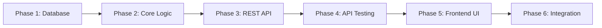

# BiteNest — Full Project Scope & Implementation Roadmap

> **A Practical Strategic Blueprint for End-to-End System Development**  
> *Target Scope: Full-Stack Architecture, Build Order, Testing Phases, and Delivery Milestones*

---

## 1. Executive Summary: What Should You Build First?

When embarking on a data-intensive, algorithmic platform like BiteNest (which requires geospatial distance calculations, multi-vendor transactions, role-based security, and real-time state), a foundational question every engineer must answer is: **"Should I build the frontend or the backend first?"**

### The Three Industry Approaches:

```mermaid
graph TD
    subgraph Frontend-First [Strategy A: Frontend-First]
        A1[Build UI Mockups] --> A2[Hardcode Mock JSON] --> A3[Build Backend to Match UI]
    end
    subgraph Backend-First [Strategy B: Backend-First]
        B1[Design Schema & Tables] --> B2[Build Core Business Logic] --> B3[Expose & Verify APIs] --> B4[Build UI on Real APIs]
    end
    subgraph Contract-First [Strategy C: Contract-First Hybrid]
        C1[Define OpenAPI & DTOs] --> C2[Parallel Backend & Frontend] --> C3[System Integration]
    end
```



1. **Frontend-First (UI-Driven)**:
   - *How it works*: Design visual mockups and interactive components first using static mock JSON objects, then construct backend endpoints to fit the client interface.
   - *Pros*: Provides rapid visual feedback; helpful when client stakeholders are non-technical and want to click through design concepts before investing in backend engineering.
   - *Cons & Risks for BiteNest*: High risk of rework. In systems with spatial constraints (2km proximity thresholds), atomic transactions (dual-restaurant orders), and live kitchen loads, UI-first design frequently invents features that violate relational integrity or require impractical database queries.

2. **Backend-First (Data & Domain-Driven)**:
   - *How it works*: Model the relational schema in 3NF, enforce constraints, code domain business algorithms (Haversine math, knapsack meal plans), expose verified REST endpoints, and then construct the frontend interface to consume those endpoints.
   - *Pros*: Solid foundation; eliminates guesswork regarding available data fields, data types, and status codes. Guarantees business rules are enforced at the database and API layers.
   - *Cons*: Visual feedback is delayed until the backend endpoints and API test suites are functional.

3. **Contract-First / API-First (Industry Gold Standard)**:
   - *How it works*: Define the API data contracts (DTOs, JSON request/response formats, HTTP verbs) upfront before writing full implementation code.
   - *BiteNest Implementation*: We adopt this hybrid approach. We design the schema and DTO contracts first, implement the backend services and automated test suites, and then connect the frontend UI directly to live, verified endpoints.

> [!IMPORTANT]
> **BiteNest Verdict**: For BiteNest, **Backend & Database First** is non-negotiable. Building the frontend before finalizing the database schema leads to severe bugs when handling geographic distances, surplus food reservations, and payment state machines.

---

## 2. The 6-Phase End-to-End Project Lifecycle

Below is the chronological roadmap to build the entire BiteNest system from initial inception to production deployment:



---

### Phase 1: Domain Modeling & Database Foundation (Days 1–2)
*Goal: Establish relational data integrity, normalization, and test data before writing application code.*

- **Step 1.1 — Requirement Decomposition**:
  - Analyze product specifications and extract core entities: Users, Restaurants, MenuItems, Orders, OrderItems, LeftoverItems, Reviews, Notifications.
- **Step 1.2 — Relational ER Modeling & Normalization**:
  - Enforce Third Normal Form (3NF) to remove data duplication and transitive functional dependencies.
  - Define primary keys, foreign keys, and cascading delete rules (`ON DELETE RESTRICT` for audited orders).
- **Step 1.3 — DDL Script Authoring (`sql/01_create_database_and_tables.sql`)**:
  - Write standard SQL table definitions with `utf8mb4` encoding, `DECIMAL(10,2)` for currency values, and spatial indices.
- **Step 1.4 — Realistic Data Seeding (`sql/02_seed_dummy_data.sql`)**:
  - Populate 4 user roles (Admin, Restaurant Owner, Delivery Rider, Customer), 3 distinct restaurants with GPS coordinates, and 18 diverse dishes.
- **Step 1.5 — Query Verification (`sql/03_sample_queries.sql`)**:
  - Test SQL queries for Haversine distance ($\le 2\text{ km}$), kitchen queue load calculations, and leftover expiration sweeps.
- *Phase 1 Exit Criteria*: All SQL scripts execute cleanly in MySQL Workbench / CLI with zero syntax errors.

---

### Phase 2: Backend Core & Business Logic Services (Days 3–5)
*Goal: Implement the application domain layer, EF Core database context, and algorithmic engines.*

- **Step 2.1 — Project Scaffolding & Dependencies**:
  - Create ASP.NET Core Web API project (`BiteNest.Api.csproj`).
  - Install NuGet packages: `Pomelo.EntityFrameworkCore.MySql`, `BCrypt.Net-Next`, `Microsoft.AspNetCore.Authentication.JwtBearer`.
- **Step 2.2 — Model & DbContext Mapping**:
  - Author `Models/Enums.cs` for strongly-typed states (`UserRole`, `OrderStatus`, `OrderType`, `CrowdLevel`).
  - Author `Models/Entities.cs` matching database tables with reverse navigation properties and `[JsonIgnore]`.
  - Configure `Data/ApplicationDbContext.cs` Fluent API, column precision, and composite indexes.
  - Implement `Data/DbInitializer.cs` for automated database seeding on server startup.
- **Step 2.3 — Algorithmic Domain Services (`Services/Services.cs`)**:
  - `AuthService`: BCrypt password hashing (work factor 11) and HMAC-SHA256 JWT generation with role claims.
  - `CombinedDeliveryService`: Spherical Haversine distance formula and bundled delivery fee discount calculations.
  - `QueueStatusService`: Real-time order aggregation and dynamic kitchen prep time weighting.
  - `MealPlannerService`: Dynamic multi-constraint knapsack algorithm matching daily budget and caloric goals.
- *Phase 2 Exit Criteria*: Solution builds with zero compiler errors (`dotnet build`) and seeds database tables on launch.

---

### Phase 3: REST API Layer & Endpoint Hardening (Days 6–7)
*Goal: Expose secure, validated, and documented HTTP endpoints to client applications.*

- **Step 3.1 — Contract Design (DTOs)**:
  - Create request and response records in `DTOs/Dtos.cs` to prevent over-posting vulnerabilities.
- **Step 3.2 — Controller Implementation (`Controllers/Controllers.cs`)**:
  - Construct all 11 REST controllers: `AuthController`, `RestaurantsController`, `MenuItemsController`, `QueueStatusController`, `LeftoverItemsController`, `CombinedDeliveryController`, `MealPlannerController`, `OrdersController`, `ReviewsController`, `AdminController`, `NotificationsController`.
  - Apply dual route attributes (`[Route("api/[controller]")]` and kebab-case) to guarantee seamless frontend routing.
- **Step 3.3 — Middleware Pipeline & Security (`Program.cs`)**:
  - Register JWT Bearer authentication and role authorization policies (`[Authorize(Roles = "...")]`).
  - Configure permissive CORS policy for local development and whitelisted origins for production.
  - Add global exception handling middleware returning RFC 7807 Problem Details.
  - Configure Swagger OpenAPI documentation at `/swagger`.
- *Phase 3 Exit Criteria*: All 28 endpoints appear in Swagger UI and accept properly formatted requests.

---

### Phase 4: Backend Automated Verification & Testing (Days 8–9)
*Goal: Systematically test all endpoints under positive, negative, and edge-case conditions.*

- **Step 4.1 — Incremental "Code -> Test" Execution**:
  - Verify every endpoint using `curl` and Windows PowerShell scripts.
  - Test validation rules: negative prices (400), invalid passwords (401), unauthorized roles (403), missing IDs (404).
- **Step 4.2 — Automated Integration Test Runner (`test_backend_suite.py`)**:
  - Execute automated Python test script testing all 15 core workflows in $< 2$ seconds.
  - Verify atomic transactions during dual-restaurant order placement (ensuring rollbacks if secondary items fail).
- **Step 4.3 — Database Mutation Verification**:
  - Run SQL `SELECT` queries following API calls to verify that inventory decremented and order rows were written.
- *Phase 4 Exit Criteria*: 100% test pass rate across the automated test runner with zero server-side 500 exceptions.

---

### Phase 5: Frontend Interface & Client State (Days 10–13)
*Goal: Build a responsive, accessible single-page application (SPA) consuming the verified backend APIs.*

- **Step 5.1 — Semantic Shell & Design System**:
  - Build `index.html` using clean semantic tags (`<header>`, `<nav>`, `<main>`, `<section>`, `<footer>`).
  - Apply Tailwind CSS utility classes and Material Design 3 styling principles (8px grid, floating action buttons, elevated cards).
  - Ensure mobile responsiveness across phones ($< 640\text{px}$), tablets ($768\text{px}$), and desktops ($1024\text{px}+$).
- **Step 5.2 — Network Client Abstraction (`frontend/js/api.js`)**:
  - Implement centralized `fetch` client handling Bearer token injection, query parameter encoding, and unified error parsing.
- **Step 5.3 — Centralized Reactive State Store (`frontend/js/state.js`)**:
  - Implement state manager holding current user session, cart items, selected filters, and active view tab.
  - Enforce combined delivery cart constraints client-side (maximum of 2 restaurants within 2km).
- **Step 5.4 — Dynamic Component Rendering (`frontend/js/app.js`)**:
  - Render restaurant cards with live kitchen queue badges (Free / Moderate / Busy).
  - Render Leftover Flash Deals with real-time countdown clocks and instant reservation buttons.
  - Render Combined Delivery selector with proximity badges and fee savings indicators.
  - Render interactive Meal Planner wizard and order status timeline.
- *Phase 5 Exit Criteria*: All frontend tabs render dynamically in browser without JavaScript errors in console.

---

### Phase 6: System Integration, Auditing & Deployment (Days 14–15)
*Goal: Perform end-to-end user acceptance testing, conduct security audits, and package for production.*

- **Step 6.1 — End-to-End User Acceptance Testing (UAT)**:
  - Execute complete user flow: Register customer -> Search Italian food -> Check kitchen queue -> Add combined meal from partner burger shop -> Verify discount -> Place order -> Track status -> Leave 5-star rating.
- **Step 6.2 — OWASP API Security & Performance Audit**:
  - Audit for Broken Object Level Authorization (BOLA), parameter tampering, and SQL injection.
  - Run `EXPLAIN ANALYZE` on high-volume queries; ensure covering indexes are active.
- **Step 6.3 — Containerization & Production Packaging**:
  - Write multi-stage `Dockerfile` and `docker-compose.yml` (MySQL + ASP.NET Core + Nginx).
  - Create systemd service daemon and Nginx reverse proxy configuration with TLS/SSL.
  - Configure automated nightly MySQL database backups with 14-day retention.
- *Phase 6 Exit Criteria*: Production deployment complete and verified operational via public domain health checks.

---

## 3. The 4-Level Testing Strategy Matrix

Testing runs continuously throughout every phase of development rather than as a final scramble:

| Testing Level | Phase | Scope & Target | Key Tooling | Primary Failure Detected |
| :--- | :--- | :--- | :--- | :--- |
| **Level 1: Database Integrity** | Phase 1 | DDL, Foreign Keys, Triggers, Views | MySQL Workbench, CLI | Missing foreign key constraints, syntax errors, table lock contention |
| **Level 2: Unit & Service Logic** | Phase 2 | Algorithms, Math, Isolated Services | xUnit, Moq, TestServer | Haversine distance calculation errors, knapsack budget overflow |
| **Level 3: API Integration** | Phase 3–4 | HTTP Endpoints, DTOs, Auth, Statuses | Python Test Runner, Postman | 400 validation failures, expired JWTs, EF Core circular JSON loops |
| **Level 4: End-to-End (E2E)** | Phase 5–6 | Browser UI, Network Latency, UX Flow | DevTools, Playwright | CORS header mismatch, cart state desynchronization, UI button freezes |

---

## 4. Common Antipatterns to Avoid

1. **"The Big Bang Integration"**: Writing 1,000 lines of frontend and 1,000 lines of backend independently before testing them together for the first time. *Remedy*: Connect and test one vertical slice (e.g. Auth) before moving to the next.
2. **"Premature UI Perfectionism"**: Spending days tweaking CSS drop-shadows or button animations while core database tables and business logic do not yet work. *Remedy*: Build functional layout shells first; polish visual styling in Phase 5.
3. **"Trusting the Client"**: Enforcing validation rules (like maximum combined delivery distance or meal budgets) only in JavaScript. *Remedy*: Always re-validate all business constraints on the backend server.
4. **"Ignoring Database Indexes"**: Assuming queries that run in 1ms with 10 test rows will remain fast in production. *Remedy*: Create composite B-tree indexes for foreign keys and frequent query filters during Phase 1.

---

## 5. Master Development Checklist

```text
[✓] Step 1: Design schema and draw Mermaid ER diagram.
[✓] Step 2: Execute 01_create_database_and_tables.sql in MySQL.
[✓] Step 3: Populate 02_seed_dummy_data.sql and verify with 03_sample_queries.sql.
[✓] Step 4: Scaffold ASP.NET Core Web API and configure appsettings.json.
[✓] Step 5: Implement Models (Enums, Entities) and ApplicationDbContext.
[✓] Step 6: Implement business logic services (Auth, Queue, Combined, MealPlanner).
[✓] Step 7: Author DTOs and build all 11 REST API controllers.
[✓] Step 8: Validate endpoints with test_backend_suite.py until 100% passing.
[✓] Step 9: Build responsive frontend UI (index.html, style.css, state.js, api.js, app.js).
[✓] Step 10: Complete end-to-end integration tests, containerize with Docker, and deploy.
```

---
*BiteNest Strategic Roadmap — Engineering Discipline from Database to User Interface.*

---

## 6. Daily Developer Workflow & Environment Orchestration

To maintain maximum velocity during implementation, set up your daily local development environment using this three-terminal workflow:

### Terminal 1: Database Daemon & Docker Container
Run MySQL in a lightweight background container or local service:
```bash
# Start MySQL 8.0 instance
docker start bitenest_mysql_db || docker run -d --name bitenest_mysql_db -p 3306:3306 -e MYSQL_ROOT_PASSWORD=root -e MYSQL_DATABASE=bitenest_db mysql:8.0
```

### Terminal 2: Backend Hot Reload Server (`dotnet watch`)
Run ASP.NET Core with hot reload enabled, so any edit to C# controllers or services automatically recompiles within 1 second:
```bash
cd backend
dotnet watch run
# API listens on http://localhost:5000 with interactive Swagger at http://localhost:5000/swagger
```

### Terminal 3: Frontend Development Server & Test Suite
Serve the frontend Single Page Application using Python's built-in HTTP server or Node `http-server`:
```bash
cd frontend
python3 -m http.server 3000
# Access UI in browser at http://localhost:3000
```

When changing an endpoint or service:
1. Edit the C# service or controller.
2. `dotnet watch` auto-recompiles immediately.
3. Run the automated integration test script in a separate tab: `python3 scripts/test_backend_suite.py`.
4. Once tests pass, refresh the browser to verify the frontend UI reflects the updated API behavior.

---

## 7. Team Parallelization Strategy (Multi-Developer Teams)

If you are building this project as a team of 2 or 3 engineers, parallelize work across phases to avoid blocking dependencies:

```mermaid
gantt
    title Multi-Developer Parallelization Timeline
    dateFormat  YYYY-MM-DD
    section Shared
    Phase 1: DB Schema & ER Modeling       :active, p1, 2026-09-01, 2d
    section Backend Engineer
    Phase 2: EF Core & Domain Engines      :b1, 2026-09-03, 3d
    Phase 3: REST Controllers & JWT        :b2, 2026-09-06, 2d
    Phase 4: Integration Test Suite        :b3, 2026-09-08, 2d
    section Frontend Engineer
    Phase 5A: UI Shell, Tailwind & Layouts :f1, 2026-09-03, 3d
    Phase 5B: Mock API Client & State Store:f2, 2026-09-06, 2d
    Phase 5C: Component Rendering & Views  :f3, 2026-09-08, 2d
    section Team Convergence
    Phase 6: Full Integration & Deploy     :crit, p6, 2026-09-10, 2d
```

- **Engineer 1 (Backend & Database Lead)**: Owns Phases 1, 2, 3, and 4 (MySQL tables, EF Core, business logic services, REST controllers, and automated API test suites).
- **Engineer 2 (Frontend & UI/UX Lead)**: While the backend is being built, Engineer 2 uses the agreed-upon DTO contracts to construct the semantic HTML layout, Tailwind CSS styling, Material Design components, and mock client state (`api.js` returning mock JSON).
- **Convergence (Phase 6)**: Once Phase 4 passes, Engineer 2 switches `api.js` from mock mode to live `http://localhost:5000` endpoints. The system integrates cleanly in hours rather than days because both engineers worked against identical DTO contracts.
