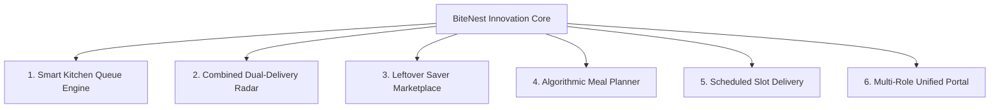
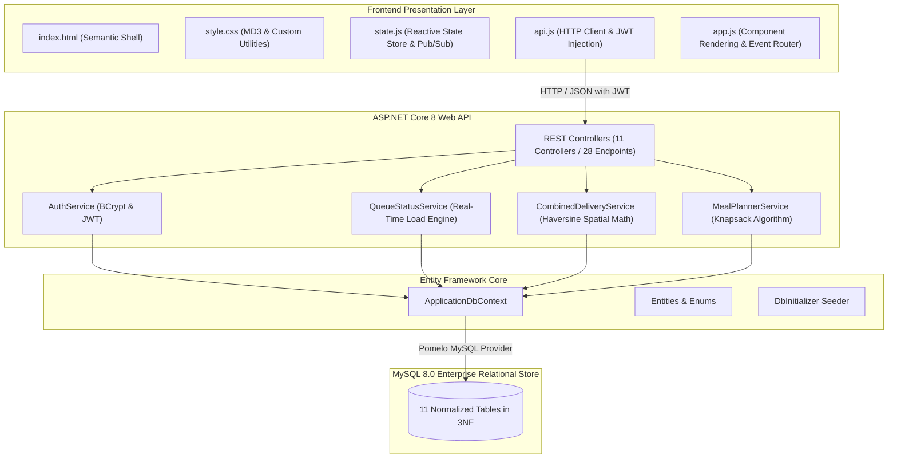

<div align="center">

# 🍲 BiteNest

**Next-Generation Smart Food Ordering & Delivery Platform**  
*Proximity-Based Combined Orders • Live Kitchen Queue Intelligence • Leftover Food Waste Rescue • Algorithmic Meal Planning*

[](https://dotnet.microsoft.com/)
[](https://learn.microsoft.com/en-us/dotnet/csharp/)
[](https://www.mysql.com/)
[](https://tailwindcss.com/)
[](https://m3.material.io/)
[](https://opensource.org/licenses/MIT)

</div>

---

## 📖 Overview

**BiteNest** is an enterprise-grade food delivery ecosystem engineered to solve real-world urban dining challenges: delivery fee inflation, restaurant kitchen congestion, food waste, and personalized nutritional budgeting.

Unlike traditional single-vendor food ordering apps, BiteNest introduces **geospatial proximity algorithms** that allow customers to bundle orders from two nearby restaurants within a 2.0 km radius under a single delivery courier, cutting consumer fees by up to 25% while maximizing courier earnings.

---

## 🚀 The 6 Signature Differentiators



1. **Smart Kitchen Queue Status**: Real-time kitchen load computation (*Free*, *Moderate*, *Busy*) with live dynamic wait time estimates, preventing diner wait frustration.
2. **Combined Dual-Restaurant Delivery**: Uses the spherical **Haversine formula** to pair restaurants within a 2.0 km threshold, allowing users to order from two restaurants (e.g. main course + artisan dessert) in one atomic transaction with a discounted bundled delivery fee ($60 BDT vs $80 BDT).
3. **Leftover Saver Flash Marketplace**: Dedicated portal for restaurants to publish surplus meals at 30% to 66% discounts before closing, backed by live countdown tickers to combat food waste.
4. **Smart Nutritional Meal Planner**: Knapsack optimization engine that synthesizes 1-to-7 day breakfast, lunch, and dinner plans matching specific daily caloric targets and budget constraints.
5. **Preferred Time Slot Delivery**: Advanced scheduling allowing users to lock in meals hours or days ahead with automatic kitchen operating hour validation.
6. **Multi-Role Unified Portal**: Instant in-app switching across **Customer**, **Restaurant Owner**, **Delivery Rider**, and **Administrator** dashboards.

---

## 🏗️ System Architecture

BiteNest follows clean **N-Tier Layered Architecture** with strict separation of concerns:



---

## 🛠️ Technology Stack

| Domain | Technology | Key Packages & Libraries |
| :--- | :--- | :--- |
| **Backend API** | ASP.NET Core 8 / .NET 10 | `Pomelo.EntityFrameworkCore.MySql`, `BCrypt.Net-Next`, `Microsoft.AspNetCore.Authentication.JwtBearer` |
| **Database** | MySQL 8.0 Enterprise | InnoDB Engine, 3NF Normalization, Composite B-Tree Indexes, Spatial Queries |
| **Frontend SPA** | Vanilla ES6+ JavaScript | Centralized State Store, Observer Pattern (Pub/Sub), Zero-Build Toolchain |
| **Styling & UI** | Tailwind CSS & Material Design 3 | Glassmorphism, 8-point Grid System, Micro-interactions, Responsive Layouts |
| **DevOps & Containers** | Docker & Docker Compose | Multi-Stage Builds, Nginx Reverse Proxy, systemd Services |
| **Quality & Testing** | Python 3, Playwright, xUnit | Automated 15-Workflow Integration Suite, Headless Browser Tests |

---

## 📂 Project Directory Structure

```text
Bitenest/
├── backend/                        # ASP.NET Core 8 Web API
│   ├── Controllers/               # 11 REST API Controllers
│   ├── Data/                      # ApplicationDbContext & DbInitializer
│   ├── DTOs/                      # Request & Response Contracts
│   ├── Models/                    # Enums & Domain Entities
│   ├── Services/                  # Core Business & Algorithmic Engines
│   ├── appsettings.json           # Connection strings & JWT config
│   ├── BiteNest.Api.csproj        # NuGet dependencies & C# settings
│   └── Program.cs                 # DI container & middleware pipeline
├── frontend/                       # Modern Single Page Application (SPA)
│   ├── css/
│   │   └── style.css              # Design tokens, scrollbars, animations
│   ├── js/
│   │   ├── state.js               # Reactive centralized state & pub/sub bus
│   │   ├── api.js                 # HTTP fetch client & JWT token injection
│   │   └── app.js                 # DOM rendering, view router & event handlers
│   └── index.html                 # Semantic HTML shell & modal dialogs
├── sql/                            # Database Initialization & Scripts
│   ├── 01_create_database_and_tables.sql  # Complete 3NF DDL schema
│   ├── 02_seed_dummy_data.sql            # Seed data (Users, Restaurants, Dishes)
│   └── 03_sample_queries.sql              # Haversine, Queue & Analytics queries
├── Building-process-docs/          # Master Engineering Handbooks (15,000+ Lines)
│   ├── backend-full-guideline.md  # 10,018-line backend master manual
│   ├── frontend-full-guideline.md # 4,952-line frontend master manual
│   └── full-project-scope-guide.md# 266-line strategic lifecycle guide
├── database-docs/                  # Database architecture & Mermaid ER diagrams
├── docs/                           # Project specifications & analytical docs
├── .gitattributes                  # Cross-platform LF line ending normalization
├── .gitignore                      # Comprehensive Git ignore rules
├── LICENSE                         # MIT Open Source License
└── README.md                       # Master project overview & quickstart
```

---

## ⚡ Quick Start Guide

### Prerequisites
- [.NET SDK 8.0+](https://dotnet.microsoft.com/download)
- [MySQL Server 8.0+](https://dev.mysql.com/downloads/) or [Docker](https://www.docker.com/)
- Python 3.8+ (for automated test runner)

---

### 1. Database Setup
Start a MySQL instance using Docker (recommended) or your local installation:

```bash
# Option A: Run MySQL 8.0 in Docker
docker run -d --name bitenest_mysql \
  -p 3306:3306 \
  -e MYSQL_ROOT_PASSWORD=root \
  -e MYSQL_DATABASE=bitenest_db \
  mysql:8.0

# Option B: Run SQL scripts manually on local MySQL
mysql -u root -p < sql/01_create_database_and_tables.sql
mysql -u root -p bitenest_db < sql/02_seed_dummy_data.sql
```

---

### 2. Run the Backend API
```bash
cd backend

# Restore NuGet dependencies
dotnet restore

# Run the API with hot reload
dotnet run
```
The API will launch at **`http://localhost:5000`**.  
Explore the interactive OpenAPI documentation at **`http://localhost:5000/swagger`**.

---

### 3. Run the Frontend SPA
In a separate terminal, serve the frontend static files:
```bash
cd frontend

# Run using Python's built-in server
python3 -m http.server 3000
```
Open **`http://localhost:3000`** in your browser.

---

## 🧪 Automated Testing Suite

Verify all 15 core business workflows across the backend API in $< 2$ seconds:

```bash
# Run the zero-dependency automated integration test runner
python3 scripts/test_backend_suite.py
```

### Test Coverage Highlights:
- [x] User Registration & BCrypt password hashing
- [x] JWT Bearer Token issuance and claim verification
- [x] Restaurant catalog discovery & category filtering
- [x] Dynamic kitchen queue status calculation
- [x] Leftover surplus food atomic inventory reservation
- [x] Haversine distance verification ($\le 2\text{ km}$ threshold)
- [x] Combined delivery fee quote & customer savings calculation
- [x] Atomic multi-vendor order placement with transaction rollback safety
- [x] Multi-day nutritional meal plan generation (Budget & Calories)
- [x] In-app notification feed and read states

---

## 📚 Master Engineering Documentation

This repository includes over **15,000+ lines** of educational and architectural documentation in the [`Building-process-docs/`](Building-process-docs/) directory:

- 📘 [**Backend Master Handbook**](Building-process-docs/backend-full-guideline.md): 10,018-line step-by-step textbook covering C# runtime, EF Core performance, security, spatial MySQL, all 28 endpoints tested with curl/PowerShell, 55 developer tips, and production Nginx/systemd runbooks.
- 📙 [**Frontend Master Handbook**](Building-process-docs/frontend-full-guideline.md): 4,952-line comprehensive guide covering Vanilla JS SPA architecture, Pub/Sub state management, DOM performance, 40+ tips, and automated Playwright testing.
- 📗 [**Project Strategic Roadmap**](Building-process-docs/full-project-scope-guide.md): 266-line blueprint detailing the 6-phase lifecycle, testing pyramid, and team parallelization timeline.
- 🗄️ [**Database Architecture & ER Diagrams**](database-docs/er-diagram.md): Complete Mermaid ER diagram and relational constraint documentation.

---

## 👥 Default Demo Credentials

| Role | Email | Password | Access Scope |
| :--- | :--- | :--- | :--- |
| **Customer** | `alice.johnson@example.com` | `SecurePassword123!` | Browse, Cart, Combined Order, Meal Plan |
| **Restaurant Owner** | `owner@pastabella.com` | `OwnerPassword123!` | Manage Menus, Kitchen Queue, Leftovers |
| **Delivery Rider** | `rider@speedy.com` | `RiderPassword123!` | Active Delivery Tasks, Dispatch Map |
| **Administrator** | `admin@bitenest.com` | `AdminPassword123!` | Platform Metrics, Global Settings |

---

## 📄 License

This project is licensed under the MIT License — see the [LICENSE](LICENSE) file for details.
