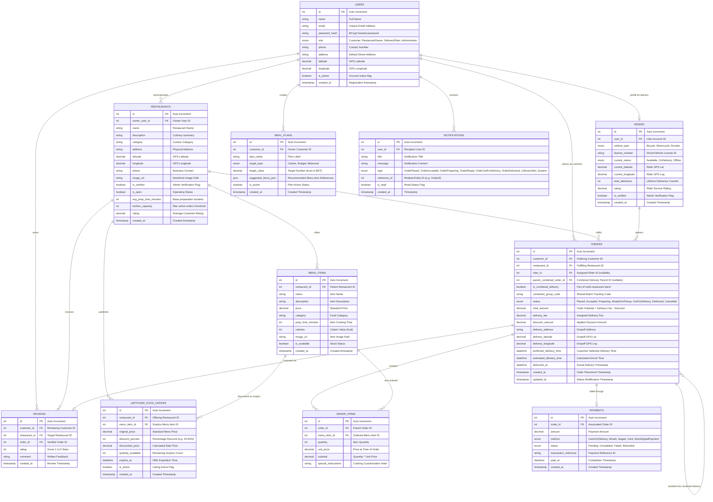

# BiteNest — Database Design & Entity-Relationship (ER) Documentation

This document provides the formal relational database architecture, entity relationships, normal forms analysis, and a comprehensive Mermaid ER diagram for the **BiteNest Smart Food Delivery & Restaurant Management System**.

---

## 1. Entity-Relationship (ER) Diagram

---

## 2. Relational Mapping & Cardinality Rules

| Relationship | Cardinality | Business Constraint & Lifecycle Rule |
|---|---|---|
| **Users $\to$ Restaurants** | $1 : N$ (0..*) | A user with role `RestaurantOwner` owns one or more restaurants. Cascade delete is restricted to preserve financial records. |
| **Users $\to$ Riders** | $1 : 1$ (0..1) | A user with role `DeliveryRider` has exactly one rider record containing vehicle credentials, current GPS location, and dispatch status. |
| **Restaurants $\to$ MenuItems** | $1 : N$ (1..*) | Menu items belong to exactly one restaurant. Deleting a restaurant cascades to its menu items. |
| **Users (Customer) $\to$ Orders** | $1 : N$ (0..*) | A customer can place multiple orders over time. |
| **Restaurants $\to$ Orders** | $1 : N$ (0..*) | A restaurant processes multiple customer orders. |
| **Riders $\to$ Orders** | $0..1 : N$ | An order may have no rider assigned initially (`Placed`, `Preparing`), but is assigned to a rider prior to `ReadyForPickup` / `OutForDelivery`. In **Smart Multi-Restaurant Combined Delivery**, one rider is assigned to multiple sibling orders sharing a `combined_group_code`. |
| **Orders $\to$ OrderItems** | $1 : N$ (1..*) | Each order contains one or more line items. If an order is deleted, line items cascade delete. |
| **Orders $\to$ Payments** | $1 : 1$ | Every order has a corresponding payment ledger tracking transaction method, status, and payment timestamp. |
| **Restaurants & MenuItems $\to$ LeftoverFoodOffers** | $1 : N$ | Surplus items are linked directly to their parent restaurant and menu item. Expired offers are filtered automatically by time check (`expires_at > NOW()`). |
| **Users $\to$ MealPlans** | $1 : N$ | Customers save personalized dietary and budget goal templates. |
| **Users $\to$ Notifications** | $1 : N$ | Real-time and persistent notification logs dispatched on order lifecycle events and leftover flash deals. |

---

## 3. Database Normalization (3NF)

1. **First Normal Form (1NF)**:
   - All attributes contain atomic values.
   - Primary keys uniquely identify every row across all tables.
   - No repeating groups or comma-delimited columns (e.g., `OrderItems` are stored as distinct relational rows rather than concatenated strings in `Orders`).
2. **Second Normal Form (2NF)**:
   - All non-key attributes are fully functionally dependent on the complete primary key.
   - In `OrderItems`, columns like `unit_price` and `quantity` depend on `(order_id, menu_item_id)`.
3. **Third Normal Form (3NF)**:
   - No transitive dependencies exist.
   - Restaurant address, coordinates, and contact info belong exclusively in `Restaurants`, not duplicated inside `Orders`.
   - Customer profile details remain strictly in `Users`.
